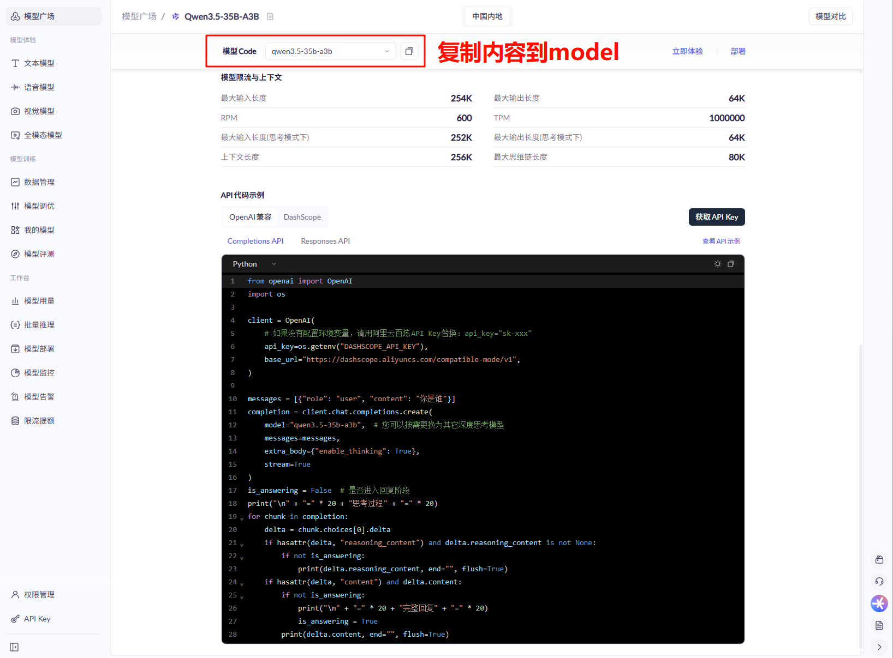

# 模型调用入门

## 统一模型入口

- v0.x版本问题
  - 需要记忆每个厂商的特定类(如ChatOpenAI、ChatDeepSeek等)
  - API接口碎片化，学习成本高
- v1.0改进
  - 引入init_chat_model统一入口
  - 只需修改参数即可切换不同厂商模型
  - 大幅提升多模型切换的便利性

```python
# v0.3
llm = ChatOpenAI(
    model="qwen3.5-35b-a3b",
    # 配置进环境变量
    api_key=os.getenv("QWEN_API_KEY"),
    base_url="https://dashscope.aliyuncs.com/compatible-mode/v1"
)
# v1.0
model = init_chat_model(
    model="qwen3.5-35b-a3b",
    model_provider="openai",
    api_key=os.getenv("QWEN_API_KEY"),
    base_url="https://dashscope.aliyuncs.com/compatible-mode/v1"
)
```

## 大模型服务平台

- 阿里云百炼: https://bailian.console.aliyun.com/
- 百度千帆: https://console.bce.baidu.com/qianfan/overview
- 硅基流动: https://www.siliconflow.cn/
- CloseAI: https://platform.closeai-asia.com/
- OpenRouter: https://openrouter.ai/

## 接入示例



```python
# 1.导入依赖
import os
from dotenv import load_dotenv
from langchain.chat_models import init_chat_model

#通过 python-dotenv 库读取 env 文件中的环境变量，并加载到当前运行的环境中
load_dotenv(encoding='utf-8')

# 2.实例化模型
# 什么是关键字参数 k1=v1 ,k2 = v2
model = init_chat_model(
    model="qwen3.5-35b-a3b",
    model_provider="openai",
    api_key=os.getenv("QWEN_API_KEY"),
    base_url="https://dashscope.aliyuncs.com/compatible-mode/v1"
)

# 3.调用模型
print(model.invoke("你是谁").content)
```

