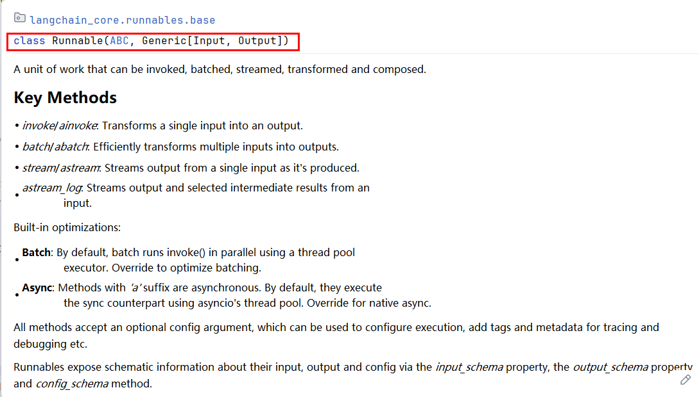
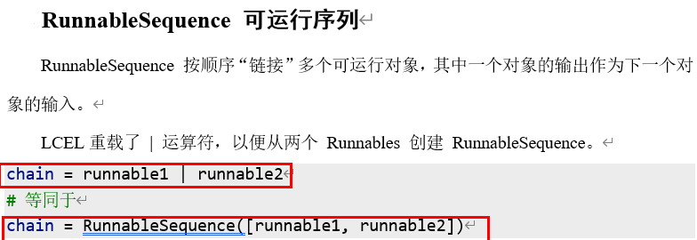

# LCEL 链式调用

## Runnable与LCEL

### Runnable

什么是 Runnable？

- 定位：LangChain 中的抽象基类（ABC）
- 目标：为所有可执行组件提供统一的操作接口
- 核心理念：一切可执行的对象都应该有统一的调用方式

Runnable 是 LangChain 核心抽象接口(定义在 langchain_core.runnables)统一组件调用方式，支持 LCEL 组合，适配同步 / 异步、流式、批量等场景，是构建工作流的基础



一句话概括，就是将多个组件按特定顺序组合起来以便完成复杂任务的一个工作流或管道（Pipeline）

为什么需要统一调用方式？

假设没有统一调用方式，每个组件调用方式不同，组合时需要手动适配：

- 提示词渲染用 .format()
- 模型调用用 .invoke()
- 解析器解析用 .parse()
- 工具调用用 .run()

类似Java里面，定义个调用方法 invoke()、call()、transfer()、doXXX()，五花八门，各自为政......

Runnable 统一调用方式：

统一的调用方式，无论什么组件 都有相同的方法集

- prompt.invoke({"topic": "AI"})        # 提示模板
- model.invoke(prompt_value)            # 语言模型 
- parser.invoke(ai_message)           # 输出解析器
- chain.invoke({"question": "你好"})     # 整个链

 本质：接口统一让组件具备了"即插即用"的能力！

**Runnable 接口**

Runnable 是 LangChain 中所有链的通用接口，用于描述“可以执行的数据流节点”。用于构建所有链（Chain）组件。它代表“一个可以调用（运行）的流程单元”，无论是：单个组件（如 prompt、model）；一个序列流程（如 prompt → model → parser）；并行、多路、多输入多输出的复合结构。只要实现了 Runnable 接口，它就可以像函数一样` .invoke()`，或用管道符 `|` 组合。

在Runnable接口中定义了以下核心方法：

- invoke(input)：同步执行，处理单个输入，最常用的方法
- batch(inputs)：批量执行，处理多个输入，提升处理效率
- stream(input)：流式执行，逐步返回结果，经典的使用场景是大模型是一点点输出的，进行流式输出
- ainvoke(input)：异步执行，用于高并发场景

### LCEL

什么是 LCEL

- 全称：LangChain Expression Language
- 定位：专门用于组合 Runnable 组件的声明式语法
- 核心操作符：管道符 `|`

核心思想：使用管道操作符 `|`  将多个Runnable对象，像拼积木一样组合起来。

典型的 LCEL 链式写法

```python
chain = prompt | model | output_parser
```

Chain 本身也是 Runnable，可以通过标准方法invoke继续调用它

```python
result = chain.invoke({"topic": "编程"})
```

一句话概括，通过 LCEL（`|` 运算符、RunnableSequence、RunnableParallel 等）快速拼接多个 Runnable 为复杂工作流，支持条件分支、并行执行等

## Chain结构

我们称使用 LCEL 创建的 Runnable 为“链”，“链”本身就是 Runnable。

Chain结构主要由三部分构成

> 提示词模板+大模型+结果结构化解析器

管道运算符，LCEL 最具特色的语法符号。多个 Runnable 对象可以通过 `|` 串联起来，形成清晰的数据处理链

公式：

> propmt | model | parser

链式调用基础用法案例代码

### RunnableSequence-顺序链



```python
"""
顺序链
LangChain 的一个典型链条由Prompt、Model、OutputParser （可没有）组成，
然后可以通过 链（Chain） 把它们顺序组合起来，让一个任务的输出成为下一个任务的输入
意思等价于Linux里面的管道符
"""

from langchain.chat_models import init_chat_model
from langchain_core.output_parsers import StrOutputParser
from langchain_core.prompts import ChatPromptTemplate
from loguru import logger
import os
from dotenv import load_dotenv

load_dotenv()

# 创建聊天提示模板，包含系统角色设定和用户问题输入
chat_prompt = ChatPromptTemplate.from_messages(
    [
        ("system", "你是一个{role}，请简短回答我提出的问题"),
        ("human", "请回答:{question}"),
    ]
)

# 使用具体参数实例化提示模板并记录日志
prompt = chat_prompt.invoke(
    {"role": "AI助手", "question": "什么是LangChain，简洁回答100字以内"}
)
logger.info(prompt)

# 初始化模型
model = init_chat_model(
    model="mimo-v2.5-pro",
    model_provider="openai",
    api_key=os.getenv("XIAOMI_API_KEY"),
    base_url="https://token-plan-cn.xiaomimimo.com/v1",
)


# 调用模型获取原始响应并记录日志
result = model.invoke(prompt)
logger.info(f"********>模型原始输出:\n{result}")

# 创建字符串输出解析器，用于处理模型输出
parser = StrOutputParser()

# 解析模型输出为结构化结果并记录日志
response = parser.invoke(result)
logger.info(f"解析后的结构化结果:\n{response}")
# 记录解析结果的数据类型
logger.info(f"结果类型: {type(response)}")


print()
print("*" * 60)
print()


# 构建处理链：提示模板 -> 模型 -> 输出解析器
chain = chat_prompt | model | parser

# 执行处理链并记录最终结果及数据类型
# (chat_prompt.invoke | model.invoke | parser.invoke)  -> chain.invoke
result_chain = chain.invoke(
    {"role": "AI助手", "question": "什么是LangChain，简洁回答100字以内"}
)
logger.info(f"Chain执行结果:\n {result_chain}")
logger.info(f"Chain执行结果类型: {type(result_chain)}")

print()

print(type(chain))  # <class 'langchain_core.runnables.base.RunnableSequence'>
```

### RunnableBranch-分支链

RunnableBranch 使用条件分支判断 (条件，Runnable) 对列表和默认分支进行初始化。就是if-else if-else对输入进行操作时，选择第一个计算结果为 True 的条件，并在输入上运行相应的 Runnable。如果没有条件为 True，则在输入上运行默认分支。

```python
"""
分支链
在LangChain中提供了类RunnableBranch来完成LCEL中的条件分支判断，它可以根据输入的不同采用不同的处理逻辑，
具体示例如下
会根据用户输入中是否包含英语、韩语等关键词，来选择对应的提示词进行处理。根据判断结果，
再执行不同的逻辑分支
"""

from langchain.chat_models import init_chat_model
from langchain_core.output_parsers import StrOutputParser
from langchain_core.prompts import ChatPromptTemplate
from loguru import logger
from langchain_core.runnables import RunnableBranch
import os
from dotenv import load_dotenv

load_dotenv()

# 构建提示词
english_prompt = ChatPromptTemplate.from_messages(
    [("system", "你是一个英语翻译专家，你叫小英"), ("human", "{query}")]
)

japanese_prompt = ChatPromptTemplate.from_messages(
    [("system", "你是一个日语翻译专家，你叫小日"), ("human", "{query}")]
)

korean_prompt = ChatPromptTemplate.from_messages(
    [("system", "你是一个韩语翻译专家，你叫小韩"), ("human", "{query}")]
)


def determine_language(inputs):
    """判断语言种类"""
    query = inputs["query"]
    if "日语" in query:
        return "japanese"
    elif "韩语" in query:
        return "korean"
    else:
        return "english"


# 初始化模型
model = init_chat_model(
    model="mimo-v2.5-pro",
    model_provider="openai",
    api_key=os.getenv("XIAOMI_API_KEY"),
    base_url="https://token-plan-cn.xiaomimimo.com/v1",
)

# 创建字符串输出解析器，用于处理模型输出
parser = StrOutputParser()
# 创建一个可运行的分支链，根据输入文本的语言类型选择相应的处理流程
# 返回值：RunnableBranch对象，可根据输入动态选择执行路径的可运行链
chain = RunnableBranch(
    (lambda x: determine_language(x) == "japanese", japanese_prompt | model | parser),
    (lambda x: determine_language(x) == "korean", korean_prompt | model | parser),
    (english_prompt | model | parser),
)

# 测试查询
test_queries = [
    {"query": '请你用韩语翻译这句话:"见到你很高兴"'},
    {"query": '请你用日语翻译这句话:"见到你很高兴"'},
    {"query": '请你用英语翻译这句话:"见到你很高兴"'},
]

for query_input in test_queries:
    # 判断使用哪个提示词
    lang = determine_language(query_input)
    logger.info(f"检测到语言类型: {lang}")

    # 根据语言类型选择对应的提示词并格式化
    if lang == "japanese":
        chatPromptTemplate = japanese_prompt
    elif lang == "korean":
        chatPromptTemplate = korean_prompt
    else:
        chatPromptTemplate = english_prompt

    # print(query_input) # {'query': '请你用英语翻译这句话:"见到你很高兴"'}

    # 格式化提示词并打印
    formatted_messages = chatPromptTemplate.format_messages(**query_input)
    logger.info("格式化后的提示词:")
    for msg in formatted_messages:
        logger.info(f"[{msg.type}]: {msg.content}")

    # 执行链
    result = chain.invoke(query_input)
    logger.info(f"输出结果: {result}\n")
```

### RunnableSerializable-串行链

子链叠加串行，假如我们需要多次调用大模型，将多个步骤串联起来实现功能

```python
"""
RunnableSerializable-串行链
子链叠加串行，假如我们需要多次调用大模型，将多个步骤串联起来实现功能
"""

from langchain.chat_models import init_chat_model
from langchain_core.output_parsers import StrOutputParser
from langchain_core.prompts import ChatPromptTemplate
from loguru import logger
import os
from dotenv import load_dotenv

load_dotenv()

model = init_chat_model(
    model="mimo-v2.5-pro",
    model_provider="openai",
    api_key=os.getenv("XIAOMI_API_KEY"),
    base_url="https://token-plan-cn.xiaomimimo.com/v1",
)


# 子链1提示词
prompt1 = ChatPromptTemplate.from_messages(
    [
        ("system", "你是一个知识渊博的计算机专家，请用中文简短回答"),
        ("human", "请简短介绍什么是{topic}"),
    ]
)
# 子链1解析器
parser1 = StrOutputParser()
# 子链1：生成内容
chain1 = prompt1 | model | parser1

result1 = chain1.invoke({"topic": "langchain"})
logger.info(result1)

# 子链2提示词
prompt2 = ChatPromptTemplate.from_messages(
    [("system", "你是一个翻译助手，将用户输入内容翻译成英文"), ("human", "{input}")]
)
# 子链2解析器
parser2 = StrOutputParser()
# 子链2：翻译内容
chain2 = prompt2 | model | parser2


# 组合成一个复合 Chain，使用 lambda 函数将chain1执行结果content内容添加input键作为参数传递给chain2
full_chain = chain1 | (lambda content: {"input": content}) | chain2

# 调用复合链
result = full_chain.invoke({"topic": "langchain"})
logger.info(result)
```

### RunnableParallel-并行链

在 Langchain 中，创建并行链（Parallel Chains），是指同时运行多个子链（Chain），并在它们都完成后汇总结果。

这在以下场景中非常有用： 

- 同时问多个问题并聚合结果
- 多个 model 同时工作取最优答案
- 多路径推理、多模态处理（如图片+文字）

```python
"""
RunnableParallel-并行链

在 Langchain 中，创建并行链（Parallel Chains），是指同时运行多个子链（Chain），并在它们都完成后汇总结果。
**作用**：同时执行多个 Runnable，合并结果
"""

from langchain.chat_models import init_chat_model
from langchain_core.output_parsers import StrOutputParser
from langchain_core.prompts import ChatPromptTemplate
from langchain_core.runnables import RunnableParallel
from loguru import logger
import os
from dotenv import load_dotenv

load_dotenv()

model = init_chat_model(
    model="mimo-v2.5-pro",
    model_provider="openai",
    api_key=os.getenv("XIAOMI_API_KEY"),
    base_url="https://token-plan-cn.xiaomimimo.com/v1",
)

# 并行链1提示词
prompt1 = ChatPromptTemplate.from_messages(
    [
        ("system", "你是一个知识渊博的计算机专家，请用中文简短回答"),
        ("human", "请简短介绍什么是{topic}"),
    ]
)
# 并行链1解析器
parser1 = StrOutputParser()
# 并行链1：生成中文结果
chain1 = prompt1 | model | parser1

# 并行链2提示词
prompt2 = ChatPromptTemplate.from_messages(
    [
        ("system", "你是一个知识渊博的计算机专家，请用英文简短回答"),
        ("human", "请简短介绍什么是{topic}"),
    ]
)
# 并行链2解析器
parser2 = StrOutputParser()

# 并行链2：生成英文结果
chain2 = prompt2 | model | parser2

# 创建并行链,用于同时执行多个语言处理链
parallel_chain = RunnableParallel({"chinese": chain1, "english": chain2})

# 调用复合链
result = parallel_chain.invoke({"topic": "langchain"})
logger.info(result)


# 打印并行链的ASCII图形表示，LangGraph提前预告
parallel_chain.get_graph().print_ascii()
```

### RunnableLambda-函数链

函数转可执行链， 将普通Python函数融入Runnable流程

RunnableLambda 是 LangChain 的一个包装器，它可以把一个普通的 Python 函数（lambda 或 def） 转换为一个 可执行的链（Runnable）。然后我们就可以像对待模型、Prompt、Parser 一样，把它与其他组件用 `|` 运算符连接

 ```python
"""
RunnableLambda-函数链
将普通Python函数融入Runnable流程.
"""

from langchain.chat_models import init_chat_model
from langchain_core.output_parsers import StrOutputParser
from langchain_core.prompts import ChatPromptTemplate
from langchain_core.runnables import RunnableLambda
from loguru import logger
import os
from dotenv import load_dotenv

load_dotenv()

model = init_chat_model(
    model="mimo-v2.5-pro",
    model_provider="openai",
    api_key=os.getenv("XIAOMI_API_KEY"),
    base_url="https://token-plan-cn.xiaomimimo.com/v1",
)


# 一个简单的打印函数，调试用
def debug_print(x):
    logger.info(f"中间结果:{x}")
    return {"input": x}


# 子链1提示词
prompt1 = ChatPromptTemplate.from_messages(
    [
        ("system", "你是一个知识渊博的计算机专家，请用中文简短回答"),
        ("human", "请简短介绍什么是{topic}"),
    ]
)
# 子链1解析器
parser1 = StrOutputParser()
# 子链1：生成内容
chain1 = prompt1 | model | parser1

# 子链2提示词
prompt2 = ChatPromptTemplate.from_messages(
    [("system", "你是一个翻译助手，将用户输入内容翻译成英文"), ("human", "{input}")]
)
# 子链2解析器
parser2 = StrOutputParser()

# 子链2：翻译内容
chain2 = prompt2 | model | parser2
# 创建一个可运行的调试节点，用于打印中间结果
debug_node = RunnableLambda(debug_print)

# 构建完整的处理链，将chain1、调试打印和chain2串联起来
full_chain = chain1 | debug_print | chain2

# 调用复合链
result1 = full_chain.invoke({"topic": "langchain"})
logger.info(f"最终结果111:{result1}")


# 构建完整的处理链，将chain1、调试打印和chain2串联起来
# RunnableLambda(debug_print) 和 debug_print 其实效果是一样的，一个是显式包装，一个是隐式包装
full_chain = chain1 | debug_node | chain2

# 调用复合链
result2 = full_chain.invoke({"topic": "langchain"})
logger.info(f"最终结果222:{result2}")
 ```

