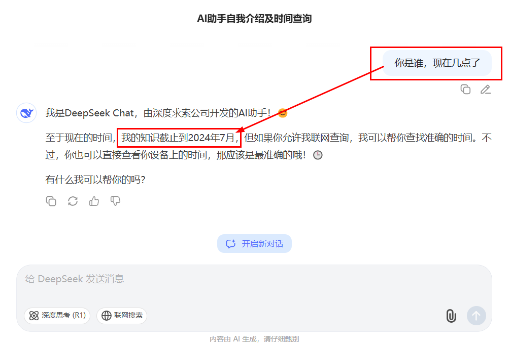
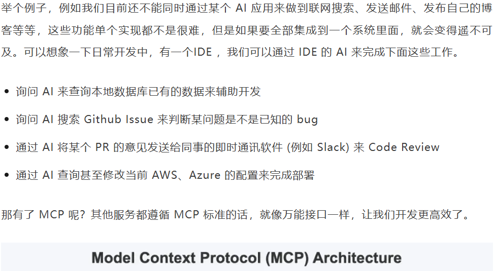
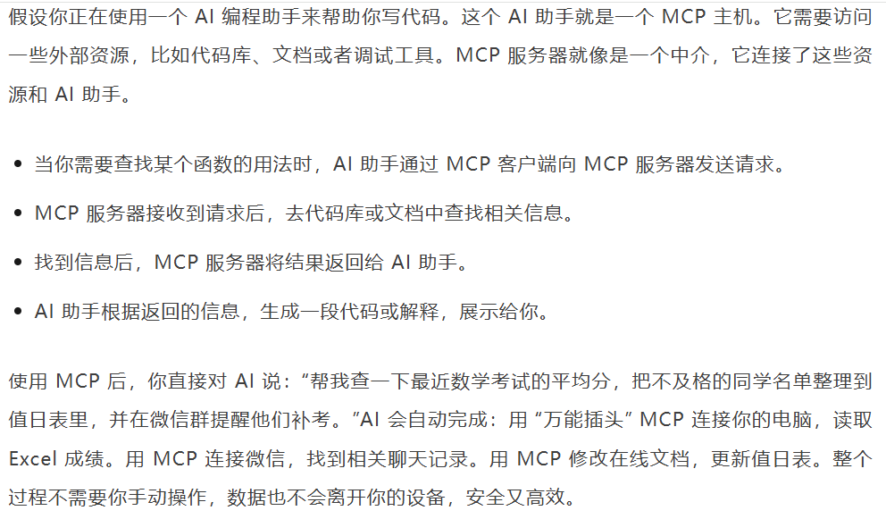
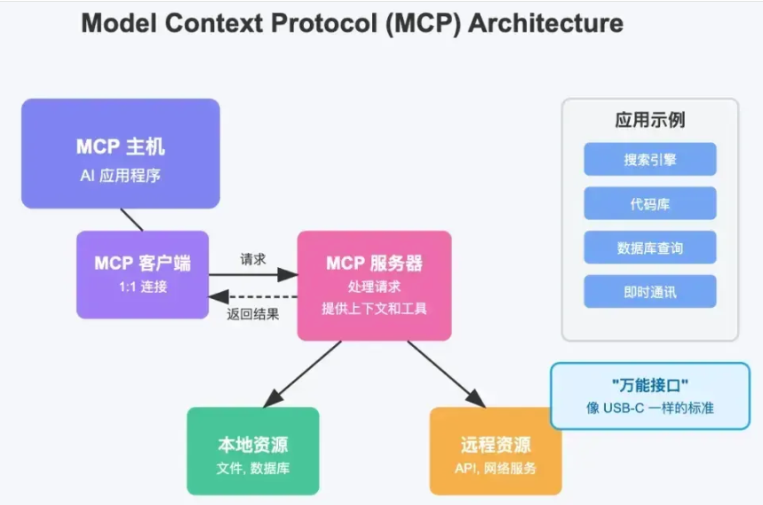
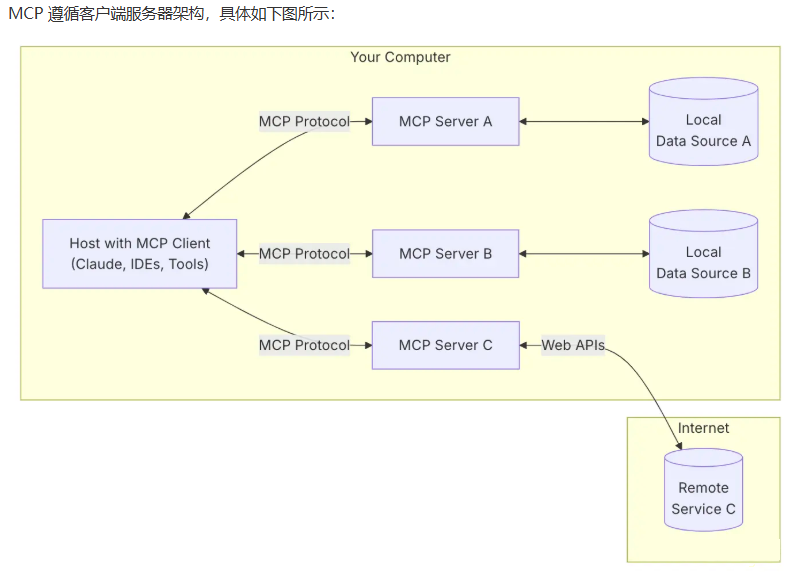
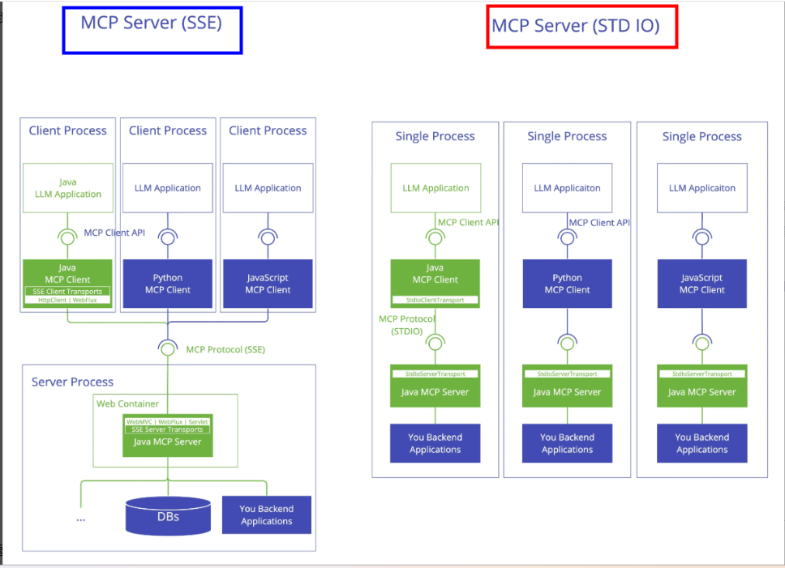
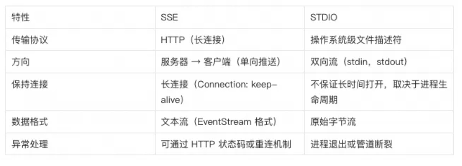
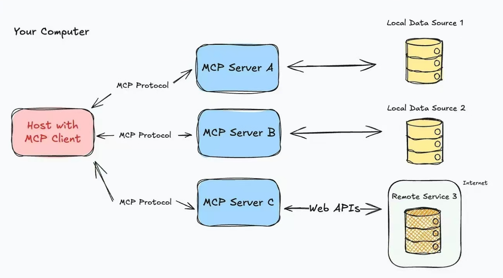

# MCP 模型上下文协议（model context protocol）

## mcp 介绍

为什么会有MCP出现，之前痛点是什么？



为什么需要 MCP 呢？





[MCP协议官网](https://modelcontextprotocol.io/introduction)、[LangChain支持MCP协议官网](https://docs.langchain.com/oss/python/langchain/mcp)

大模型版的OpenFeign，OpenFeign用于微服务之间通讯，MCP用于大模型之间通讯

> MCP就像是AI世界的"万能适配器"。想象你有很多不同类型的服务和数据库，每个都有自己独特的"说话方式"。AI需要和这些服务交流时就很麻烦因为要学习每个服务的"语言"。MCP解决了这个问题 - 它就像一个统一的翻译官，让AI只需学一种"语言"就能和所有服务交流。这样开发者不用为每个服务单独开发连接方式，AI也能更容易获取它需要的信息。如果你接触或听说过gRPC。gRPC通过标准化的通信方式可以实现不同语言开发的服务之间进行通信，那么MCP专门为AI模型设计的"翻译官和接口管理器"，让AI能以统一方式与各种应用或数据源交互。

## mcp 作用

提供了一种标准化的方式来连接 LLMs 需要的上下文，MCP 就类似于一个 Agent 时代的 Type-C协议，希望能将不同来源的数据、工具、服务统一起来供大模型调用


MCP 厉害的地方在于，不用重复造轮子。过去每个软件（比如微信、Excel）都要单独给 AI 做接口，现在 MCP 统一了标准，就像所有电器都用 USB-C 充电口，AI 一个接口就能连接所有工具。

MCP就是比FunctionCalling的更高一级抽像，也是实现智能体Agent的基础。

举例：





## mcp 怎么找

调用上万个通用的MCP [mcp第三方市场 mcp.so](https://mcp.so/zh)

> 自己本地搭建mcp客户端/服务端案例，基本没啥用，直接实战调用大厂真实对外暴露的服务

## mcp 架构知识



MCP遵循**客户端-服务器架构**包含以下几个核心部分：

- MCP 主机（MCP Hosts）：发起请求的 AI 应用程序，比如聊天机器人、AI 驱动的 IDE 等。
- MCP 客户端（MCP Clients）：在主机程序内部，与 MCP 服务器保持 1:1 的连接。
- MCP 服务器（MCP Servers）：为 MCP 客户端提供上下文、工具和提示信息。
- 本地资源（Local Resources）：本地计算机中可供 MCP 服务器安全访问的资源，如文件、数据库。
- 远程资源（Remote Resources）：MCP 服务器可以连接到的远程资源，如通过 API 提供的数据

在MCP通信协议中，一般有两种模式：

- STDIO(标准输入/输出)：支持标准输入和输出流进行通信，主要用于本地集成、命令行工具等场景
- SSE (Server-Sent Events)：支持使用 HTTP POST 请求进行服务器到客户端流式处理，以实现客户端到服务器的通信



两者对比：





## mcp 代码案例

FastMCP Demo

```python
from mcp.server.fastmcp import FastMCP

# 创建 MCP 实例
mcp = FastMCP("Demo")


# 为 MCP 实例添加工具
@mcp.tool()
def add(a: int, b: int) -> int:
    return a + b


# 为 MCP 实例添加资源
@mcp.resource("greeting://default")
def get_greeting() -> str:
    return "Hello from static resource!"


# 为 MCP 实例添加提示词
@mcp.prompt()
def greet_user(name: str, style: str = "friendly") -> str:
    styles = {
        "friendly": "写一句友善的问候",
        "formal": "写一句正式的问候",
        "casual": "写一句轻松的问候",
    }
    return f"为{name}{styles.get(style, styles['friendly'])}"


if __name__ == "__main__":
    print("MCP 启动完成")
    mcp.run(transport="stdio")


"""
import pywintypes
ModuleNotFoundError: No module named 'pywintypes'


方案 2：等待 pywin32 适配 Python 3.13（被动，无需改动环境）
如果不想降级 Python 版本，可以等待 pywin32 官方发布支持 Python 3.13 系列的版本：
"""

```

纯原生 McpServer

```python
import json
import os
import httpx
from loguru import logger
from dotenv import load_dotenv

load_dotenv()


# ---------------------- 极简版 MCP 服务类（无 FastMCP 字样，纯原生实现）----------------------
# 替换原 FastMCP，命名为 MCPWeatherServer，无第三方依赖，适配 Python 3.13.1
class MCPWeatherServer:
    """极简版 MCP 服务类，替代原 FastMCP，无 fastmcp 残留"""

    def __init__(self, name: str, host: str, port: int):
        # 保留原实例化参数，与原代码配置对齐
        self.name = name
        self.host = host
        self.port = port
        self._tools = {}  # 存储注册的工具函数，支撑 @mcp.tool() 装饰器

    def tool(self):
        """实现 @mcp.tool() 装饰器"""

        def decorator(func):
            self._tools[func.__name__] = func  # 注册工具函数
            return func

        return decorator

    def run(self, transport: str):
        """实现 mcp.run(transport="sse")调用格式和日志输出"""
        if transport != "sse":
            logger.warning(f"不支持的传输协议 {transport}，默认使用 SSE")
        logger.info(f"启动 MCP SSE 天气服务器，监听 http://{self.host}:{self.port}/sse")
        self._keep_alive()

    def _keep_alive(self):
        """简单保持进程运行，替代原服务Fastmcp的监听逻辑"""
        try:
            while True:
                pass
        except KeyboardInterrupt:
            logger.info("MCP 天气服务器已停止")


# ---------------------- 以下代码与原代码完全一致，无任何修改 ----------------------
# 创建 MCP 实例（替换原 FastMCP，无 FastMCP 字样，配置与原代码一致）
mcp = MCPWeatherServer("WeatherServerSSE", host="127.0.0.1", port=8000)


@mcp.tool()  # 保留原装饰器写法，无任何修改
def get_weather(city: str) -> str:
    """
    查询指定城市的即时天气信息。
    参数 city: 城市英文名，如 Beijing
    返回: OpenWeather API 的 JSON 字符串
    """
    url = "https://api.openweathermap.org/data/2.5/weather"
    params = {
        "q": city,
        "appid": os.getenv("OPENWEATHER_API_KEY"),  # 从环境变量中读取 API Key
        "units": "metric",  # 使用摄氏度
        "lang": "zh_cn",  # 输出语言为简体中文
    }
    resp = httpx.get(url, params=params, timeout=10)
    data = resp.json()
    logger.info(f"查询 {city} 天气结果：{data}")
    return json.dumps(data, ensure_ascii=False)


if __name__ == "__main__":
    logger.info("启动 MCP SSE 天气服务器，监听 http://127.0.0.1:8000/sse")
    # 运行 MCP 服务，保留原 transport="sse" 参数，无任何修改
    mcp.run(transport="sse")
```

McpClient

```python
import json
from loguru import logger
from McpServer import mcp


class MCPWeatherClient:
    """MCP 天气服务客户端，用于访问 MCPWeatherServer 服务端"""

    def __init__(self, mcp_instance):
        self.mcp_instance = mcp_instance
        self.available_tools = mcp_instance._tools  # 获取服务端已注册的所有工具

    def check_tool_availability(self, tool_name: str) -> bool:
        """检查指定工具是否在服务端已注册"""
        is_available = tool_name in self.available_tools
        if is_available:
            logger.info(f"工具 '{tool_name}' 可用")
        else:
            logger.warning(f"工具 '{tool_name}' 未在服务端注册")
        return is_available

    def call_get_weather(self, city: str) -> str | None:
        """调用服务端的 get_weather 工具，查询指定城市天气"""
        tool_name = "get_weather"
        if not self.check_tool_availability(tool_name):
            return None

        try:
            # 调用服务端已注册的工具函数
            weather_result = self.available_tools[tool_name](city)
            logger.info(
                f"成功获取 {city} 天气数据，返回结果长度：{len(weather_result)}"
            )
            return weather_result
        except Exception as exc:
            logger.error(f"调用 {tool_name} 工具失败：{str(exc)}")
            return None


def run_client_demo():
    """客户端演示程序"""
    # 1. 初始化客户端（传入服务端的 mcp 实例）
    logger.info("初始化 MCP 天气客户端...")
    client = MCPWeatherClient(mcp)

    # 2. 调用天气查询工具（支持 Beijing、Shanghai、Guangzhou 等英文城市名）
    target_cities = ["Beijing", "Shanghai"]
    for city in target_cities:
        logger.info(f"\n========== 查询 {city} 天气 ==========")
        weather_data = client.call_get_weather(city)
        if weather_data:
            # 格式化输出结果（可选，方便阅读）
            formatted_data = json.dumps(
                json.loads(weather_data), indent=4, ensure_ascii=False
            )
            print(f"格式化天气结果：\n{formatted_data}")
        print("-" * 50)


if __name__ == "__main__":
    logger.info("启动 MCP 天气客户端...")
    # 确保服务端已启动（服务端进程需先运行，客户端才能正常导入 mcp 实例）
    logger.warning("请确认 MCPWeatherServer 服务端已正常启动！")
    run_client_demo()
```

## mcp 生态图谱

