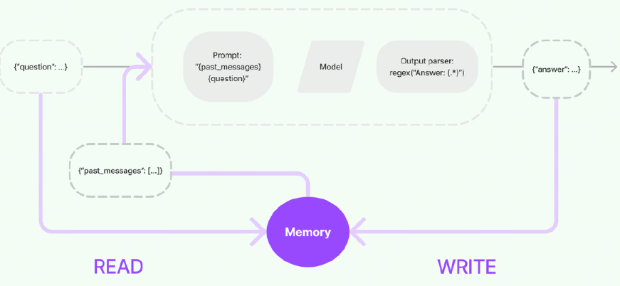
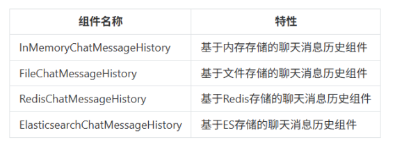
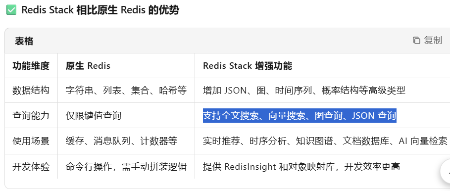
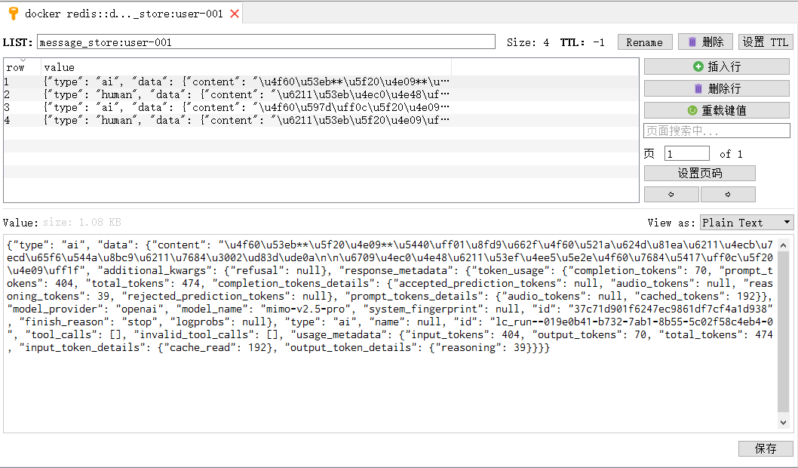

# 记忆缓存

[官方文档](https://docs.langchain.com/oss/python/langchain/short-term-memory)

记忆缓存是聊天系统中的一个重要组件，用于存储和管理对话的上下文信息。它的主要作用是让AI助手能够”记住”之前的对话内容，从而提供连贯和个性化的回复。

一个案例，在第一个问题中告诉模型你是谁，在第二个问题中问我是谁，模型回答不上来，因为没有记忆上个提问

```python
from langchain_core.output_parsers import StrOutputParser
from langchain_core.prompts import PromptTemplate
from langchain.chat_models import init_chat_model
import os
from dotenv import load_dotenv

load_dotenv()

# 设置本地模型
llm = init_chat_model(
    model="mimo-v2.5-pro",
    model_provider="openai",
    api_key=os.getenv("XIAOMI_API_KEY"),
    temperature=0.0,
    base_url="https://token-plan-cn.xiaomimimo.com/v1",
)

prompt = PromptTemplate.from_template("请回答我的问题：{question}")
# 创建字符串输出解析器
parser = StrOutputParser()

# 构建链式调用
chain = prompt | llm | parser

# 执行链式调用
print(chain.invoke({"question": "我叫张三，你叫什么?"}))

print(chain.invoke({"question": "你知道我是谁吗?"}))

"""
你好，张三！我叫通义千问（Qwen），是阿里云研发的超大规模语言模型。很高兴认识你！😊
我不知道你是谁。我是一个AI助手，没有能力识别或获取用户的身份信息。如果你有任何问题需要帮助，我会很乐意为你提供支持！

解释：
我们刚刚在本地程序，前一轮对话告诉大语言模型的信息，下一轮就被“遗忘了”。
但如果我们使用使用 Qwen 聊天时，它能记住多轮对话中的内容，这Qwen网页版实现了历史记忆功能
"""
```

**memory实现原理：**

实现这个记忆功能，就需要额外的模块去保存我们和模型对话的上下文信息，然后在下一次请求时，把所有的历史信息都输入给模型，让模型输出最终结果。

一个记忆组件要实现的三个最基本功能： 

1. 读取记忆组件保存的历史对话信息
2. 写入历史对话信息到记忆组件
3. 存储历史对话消息

在LangChain中，提供这个功能的模块就称为 Memory(记忆) ，用于存储用户和模型交互的历史信息。

给大语言模型添加记忆功能的方法如下： 

1. 在链执行前，将历史消息从记忆组件读取出来，和用户输入一起添加到提示词中，传递给大语言模型。
2. 在链执行完毕后，将用户的输入和大语言模型输出，一起写入到记忆组件中
3. 下一次调用大语言模型时，重复这个过程。



## 实现类介绍 v0.3 和 v1.0+

ConversationChain 是 LangChain 早期用于简化对话管理的类，内部集成了内存（如 ConversationBufferMemory）和提示模板，适合快速构建简单对话应用。然而，它存在以下问题： 

- 灵活性不足：提示模板和内存管理逻辑较为固定，难以支持复杂对话流程。
- 与新 API 不兼容：未针对现代聊天模型（如支持工具调用的模型）优化。
- 架构过时：LangChain 0.3.x 开始推崇基于 LangChain Expression Language（LCEL）和 Runnable 的模块化设计，ConversationChain 不符合这一理念。


RunnableWithMessageHistory 是 LangChain 推荐的替代方案，优势包括： LangChain 中所有可串联的组件（Prompt、Model、Parser、RunnableLambda 等）都继承自Runnable基类

- 模块化：允许自由组合提示模板、模型和内存管理逻辑。
- 灵活性：支持自定义对话历史存储（如内存、数据库）和复杂对话流程。
- 兼容性：与 LCEL 和现代聊天模型无缝集成。
- 长期支持：在 LangChain 0.3.x 中稳定，且不会在 1.0 中移除。

> 官方建议：
>
> - 简单聊天：BaseChatMessageHistory 与 RunnableWithMessageHistory 配合使用
> - 复杂场景：用 LangGraph persistence（Checkpointer + Content Blocks + 记忆中间件）

### BaseChatMessageHistory 

是用来保存聊天消息历史的抽象基类

属性：

- `List[BaseMessage]`：用来接收和读取历史消息的只读属性

方法：

- `add_messages`：批量添加消息，默认实现是每个消息都去调用一次add_message
- `add_message`：单独添加消息，实现类必须重写这个方法，否则会抛出异常
- `clear()`：清空所有消息，实现类必须重写这个方法

常用的消息历史组件以及它们的特性：



InMemoryChatMessageHistory

```python
from langchain.chat_models import init_chat_model
from langchain_core.chat_history import InMemoryChatMessageHistory
from loguru import logger
import os
from dotenv import load_dotenv

load_dotenv()

# 设置本地模型，不使用深度思考
llm = init_chat_model(
    model="mimo-v2.5-pro",
    model_provider="openai",
    api_key=os.getenv("XIAOMI_API_KEY"),
    base_url="https://token-plan-cn.xiaomimimo.com/v1",
)


# 创建内存聊天历史记录实例，用于存储对话消息
history = InMemoryChatMessageHistory()

# 添加用户消息到聊天历史记录
history.add_user_message("我叫张三，我的爱好是学习")

# 调用语言模型处理聊天历史中的消息
ai_message = llm.invoke(history.messages)

# 记录并输出AI回复的内容
logger.info(f"第一次回答\n{ai_message.content}")

# 将AI回复添加到聊天历史记录中
history.add_message(ai_message)

# 添加新的用户消息到聊天历史记录
history.add_user_message("我叫什么？我的爱好是什么？")

# 再次调用语言模型处理更新后的聊天历史
ai_message2 = llm.invoke(history.messages)

# 记录并输出第二次AI回复的内容
logger.info(f"第二次回答\n{ai_message2.content}")

# 将第二次AI回复添加到聊天历史记录中
history.add_message(ai_message2)

# 遍历并输出所有聊天历史记录中的消息内容
for message in history.messages:
    logger.info(message.content)
```

## 内存版 RunnableWithMessageHistory

v1：

```python
"""
可持续记忆（RunnableWithMessageHistory）
"""

from langchain_core.output_parsers import StrOutputParser
from langchain_core.prompts import ChatPromptTemplate, MessagesPlaceholder
from langchain_core.runnables import RunnableWithMessageHistory, RunnableConfig
from langchain.chat_models import init_chat_model
from langchain_core.chat_history import InMemoryChatMessageHistory
from loguru import logger
import os
from dotenv import load_dotenv

load_dotenv()

# 设置本地模型
llm = init_chat_model(
    model="mimo-v2.5-pro",
    model_provider="openai",
    api_key=os.getenv("XIAOMI_API_KEY"),
    base_url="https://token-plan-cn.xiaomimimo.com/v1",
)

# 定义 Prompt
prompt = ChatPromptTemplate.from_messages(
    [
        # 用于插入历史消息
        MessagesPlaceholder(variable_name="history"),
        ("human", "{input}"),
    ]
)

parser = StrOutputParser()
# 构建处理链：将提示词模板、语言模型和输出解析器组合
chain = prompt | llm | parser
# 创建内存聊天历史记录实例，用于存储对话历史
history = InMemoryChatMessageHistory()
# 创建带消息历史的可运行对象，用于处理带历史记录的对话
runnable = RunnableWithMessageHistory(
    chain,
    get_session_history=lambda session_id: history,
    input_messages_key="input",  # 指定输入键
    history_messages_key="history",  # 指定历史消息键
)
# 清空历史记录
history.clear()
# 配置运行时参数，设置会话ID
config = RunnableConfig(configurable={"session_id": "user-001"})

logger.info(runnable.invoke({"input": "我叫张三，我爱好学习。"}, config))
logger.info(runnable.invoke({"input": "我叫什么？我的爱好是什么？"}, config))
```

v2:

```python
"""
可持续记忆（RunnableWithMessageHistory）
"""

from langchain.chat_models import init_chat_model
from langchain_core.chat_history import InMemoryChatMessageHistory  # 内存型消息记录
from langchain_core.runnables.history import RunnableWithMessageHistory
from langchain_core.prompts import ChatPromptTemplate, MessagesPlaceholder
from langchain_core.output_parsers import StrOutputParser
import os
from dotenv import load_dotenv

load_dotenv()

# 设置本地模型
llm = init_chat_model(
    model="mimo-v2.5-pro",
    model_provider="openai",
    api_key=os.getenv("XIAOMI_API_KEY"),
    base_url="https://token-plan-cn.xiaomimimo.com/v1",
)


# 定义全局的“会话存储”，用来保存每个 session 的聊天历史
#    （真实项目中可改为 Redis、SQLite 等）
store = {}


def get_session_history(session_id: str):
    """
    根据 session_id 获取对应的历史消息对象。
    如果不存在则创建一个新的 InMemoryChatMessageHistory。
    """
    if session_id not in store:
        store[session_id] = InMemoryChatMessageHistory()
    return store[session_id]


# 定义 Prompt 模板
#     - system: 给模型设定角色
#     - MessagesPlaceholder: 历史消息将注入这里
#     - human: 当前用户输入
prompt = ChatPromptTemplate.from_messages(
    [
        ("system", "你是一个友好的中文助理，会根据上下文回答问题。"),
        MessagesPlaceholder("history"),
        ("human", "{question}"),
    ]
)


# 构建基本链：Prompt → LLM → 输出解析
memory_chain = prompt | llm | StrOutputParser()

# -----------------------------------------------------
# 将链包装为支持记忆的版本
with_history = RunnableWithMessageHistory(
    memory_chain,  # 原始链
    get_session_history,  # 获取历史函数
    input_messages_key="question",  # 对应 prompt 输入的 key
    history_messages_key="history",  # 对应 MessagesPlaceholder 的变量名
)

# -----------------------------------------------------
# 模拟一个会话，用 session_id 区分不同用户
config = {"configurable": {"session_id": "user-001"}}

# 第一次提问：告诉模型“我叫张三”
print("用户：我叫张三。")
print("AI：", with_history.invoke({"question": "我叫张三。"}, config))

# 第二次提问：让模型回忆前面的对话
print("\n 用户：我叫什么？")
print("AI：", with_history.invoke({"question": "我叫什么？"}, config))
```

## 持久化版 RedisChatMessageHistory

将客户和大模型的对话问答保存进Redis进行持久化记忆留存

[文档](https://python.langchain.ac.cn/docs/integrations/memory/redis_chat_message_history/)

用redisStack作为存储

RedisStack是什么?

Redis Stack 是 Redis Labs推出的一个**"增强版 Redis"，不是Redis的替代品，而是在原生Redis 基础上的功能扩展包**，专为构建现代实时应用而设计



RedisStack核心组件：

- RediSearch：提供全文搜索能力，支持复杂的文本搜索、聚合和过滤，以及向量数据的存储和检索
- RedisJSON：原生支持JSON数据的存储、索引I和查询，可高效存储和操作嵌套的JSON文档。
- RedisGraph：支持图数据模型，使用Cypher查询语言进行图遍历查询。
- RedisBloom:支持 Bloom、Cuckoo、Count-Min Sketch等概率数据结构。

一句话总结：

**RedisStack = 原生Redis + 搜索 + 图 + 时间序列 + JSON + 概率结构 + 可视化工具 + 开发框架支持**

RedisStack安装

```bash
docker run -d --name redis-stack-server -p 26379:6379 redis/redis-stack-server
```

python3 + langchain1.0+，以 redis 作为保存库所对应版本

检测redis是否已经安装

```python
# pip install redis==5.3.1

# 尝试导入 redis 包
import redis

# 验证包版本（无报错即为导入成功）
print(redis.__version__)

# 极简 redis 导入测试脚本
try:
    # 导入 redis 包
    import redis
    print("✅ redis 包导入成功！")
    print(f"✅ redis 包版本：{redis.__version__}")
except ModuleNotFoundError:
    print("❌ 未找到 redis 包，请先安装！")
except Exception as e:
    print(f"❌ redis 包导入异常：{e}")

"""
5.3.1
✅ redis 包导入成功！
✅ redis 包版本：5.3.1
"""
```

RedisChatMessageHistory 示例代码

```python
from langchain.chat_models import init_chat_model
from langchain_community.chat_message_histories import RedisChatMessageHistory
from langchain_core.runnables.history import RunnableWithMessageHistory
from langchain_core.prompts import ChatPromptTemplate, MessagesPlaceholder
from langchain_core.runnables import RunnableConfig
import os
import redis  # 导入原生redis库，pip install redis==5.3.1
from loguru import logger
from dotenv import load_dotenv

load_dotenv()

REDIS_URL = "redis://localhost:6389"
# 创建原生Redis客户端,decode_responses 控制 Redis 返回数据的类型：False 返字节串，True 返字符串
redis_client = redis.Redis.from_url(REDIS_URL, decode_responses=True)

# 设置本地模型
llm = init_chat_model(
    model="mimo-v2.5-pro",
    model_provider="openai",
    api_key=os.getenv("XIAOMI_API_KEY"),
    base_url="https://token-plan-cn.xiaomimimo.com/v1",
)

# 创建提示模板
prompt = ChatPromptTemplate.from_messages(
    [MessagesPlaceholder("history"), ("human", "{question}")]
)


def get_session_history(session_id: str) -> RedisChatMessageHistory:
    """获取或创建会话历史（使用 Redis）"""
    # 创建 Redis 历史对象
    history = RedisChatMessageHistory(
        session_id=session_id,
        url=REDIS_URL,
        # ttl=3600  # 注释：关闭自动过期，避免重启后数据被清理
    )

    return history


# 创建带历史的链
chain = RunnableWithMessageHistory(
    prompt | llm,
    get_session_history,
    input_messages_key="question",
    history_messages_key="history",
)

# 配置
# session_id 就是登录大模型的各自帐户，类似登录手机号码，各不相同
config = RunnableConfig(configurable={"session_id": "user-001"})

# 主循环
print("开始对话（输入 'quit' 退出）")
while True:
    question = input("\n输入问题：")
    if question.lower() in ["quit", "exit", "q"]:
        break

    response = chain.invoke({"question": question}, config)
    logger.info(f"AI回答:{response.content}")

    # 等同于redis-cli的SAVE命令，强制写入dump.rdb
    redis_client.save()
```

对话存入到了redis中

