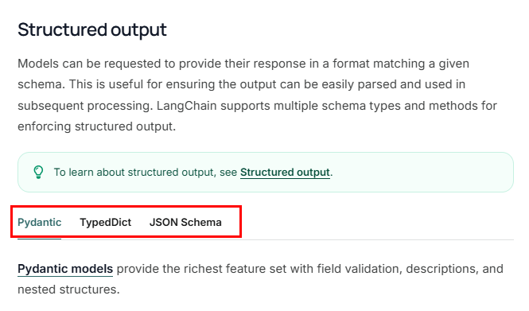
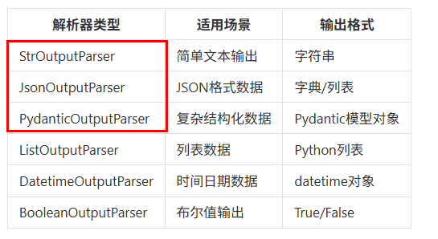
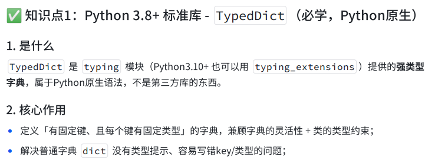
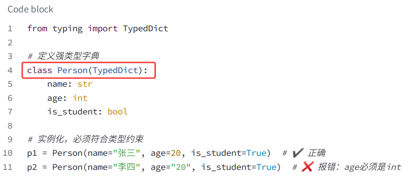
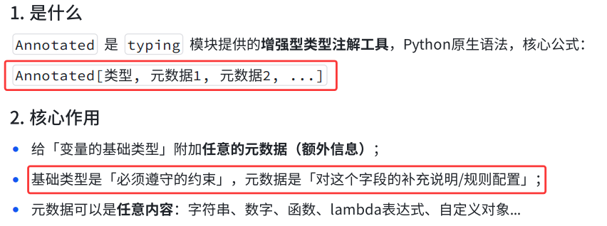
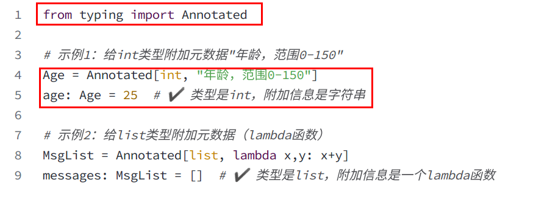

# Parser 输出解析器

[官方文档](https://docs.langchain.com/oss/python/langchain/models#structured-output)

 [api 接口方法](https://reference.langchain.com/python/langchain-core/output_parsers)

## 为什么需要输出解析器

语言模型返回的内容通常都是字符串的格式（文本格式），但在实际AI应用开发过程中，往往希望大模型可以返回更直观、更格式化的内容，以确保应用能够顺利进行后续的逻辑处理。

此时，LangChain提供的输出解析器就派上用场了。输出解析器（Output Parser）负责获取 model 的输出并将其转换为更合适的格式。这在应用开发中极其重要。



## 什么是输出解析器

输出解析器是LangChain框架中的重要组件，它的作用是将大语言模型的原始输出内容解析为如JSON、XML、YAML等结构化数据。

在LangChain中，输出解析器位于模型和最终数据输出之间，作为数据处理的中间层。通过输出解析器，可以实现如下目的：

- 指定格式输出：将模型的文本输出转换指定格式
- 数据校验：确保输出内容符合预期的格式和类型
- 错误处理：当解析失败时，进行错误修复和重试
- 输出格式提示词：生成对应格式要求的提示词，如要生成JSON的具体描述，可以通过提示词传递给大模型，达到返回特定格式数据的目的

## 输出解析器分类



## 输出解析器的两大方法

1. parse：将大模型输出的内容，格式化成指定的格式返回

```python
"""
JsonOutputParser，即JSON输出解析器，
是一种用于将大模型的自由文本输出转换为结构化JSON数据的工具。

本案例是：指定提示词指明返回 json 格式
"""

from langchain_core.output_parsers import JsonOutputParser
from langchain_core.prompts import ChatPromptTemplate
import os
from langchain.chat_models import init_chat_model
from loguru import logger
from dotenv import load_dotenv

load_dotenv()

# 创建聊天提示模板，包含系统角色设定和用户问题输入
chat_prompt = ChatPromptTemplate.from_messages(
    [
        (
            "system",
            "你是一个{role}，请简短回答我提出的问题，结果返回json格式，q字段表示问题，a字段表示答案。",
        ),
        ("human", "请回答:{question}"),
    ]
)

# 使用指定的角色和问题生成具体的提示内容
prompt = chat_prompt.invoke(
    {"role": "AI助手", "question": "什么是LangChain，简洁回答20字以内"}
)
logger.info(prompt)

# 初始化模型
model = init_chat_model(
    model="mimo-v2.5-pro",
    model_provider="openai",
    api_key=os.getenv("XIAOMI_API_KEY"),
    base_url="https://token-plan-cn.xiaomimimo.com/v1",
)

# 调用模型获取回答结果
result = model.invoke(prompt)
logger.info(f"模型原始输出:\n{result}")

print("*" * 60)


# 创建JSON输出解析器实例
parser = JsonOutputParser()
# 调用解析器处理结果数据，将输入转换为JSON格式的响应
response = parser.invoke(result)
logger.info(
    f"解析后的结构化结果:\n{response}"
)  # 解析后的结构化结果: {'q': '什么是LangChain？', 'a': 'LangChain是用于构建大语言模型应用的开发框架。'}
logger.info("\n")
# 打印类型
logger.info(f"结果类型: {type(response)}")  # <class 'dict'>
```

2. get_format_instructions() ：它会返回一段清晰的格式说明字符串，告诉 model 希望输出成什么格式（比如 JSON，或者特定格式）

```python
"""
JsonOutputParser，即JSON输出解析器，
是一种用于将大模型的自由文本输出转换为结构化JSON数据的工具。

本案例是：借助JsonOutputParser的get_format_instructions() ，
生成格式说明，指导模型输出JSON 结构
"""

from langchain_core.output_parsers import JsonOutputParser
from langchain_core.prompts import ChatPromptTemplate
import os
from langchain.chat_models import init_chat_model
from loguru import logger
from pydantic import BaseModel, Field
from dotenv import load_dotenv

load_dotenv()


class Person(BaseModel):
    """
    定义一个新闻结构化的数据模型类
    属性:
        time (str): 新闻发生的时间
        person (str): 新闻涉及的人物
        event (str): 发生的具体事件
    """

    time: str = Field(description="时间")
    person: str = Field(description="人物")
    event: str = Field(description="事件")


# 创建JSON输出解析器，用于将model输出解析为Person对象
parser = JsonOutputParser(pydantic_object=Person)

# 获取格式化指令，告诉model如何输出符合要求的JSON格式
format_instructions = parser.get_format_instructions()

# 创建聊天提示模板，定义系统角色和用户输入格式
chat_prompt = ChatPromptTemplate.from_messages(
    [
        ("system", "你是一个AI助手，你只能输出结构化JSON数据。"),
        ("human", "请生成一个关于{topic}的新闻。{format_instructions}"),
    ]
)

# 格式化提示词，填入具体主题和格式化指令
prompt = chat_prompt.format_messages(
    topic="小米su7跑车", format_instructions=format_instructions
)

# 记录格式化后的提示词信息
logger.info(prompt)


# 初始化大语言模型实例
model = init_chat_model(
    model="mimo-v2.5-pro",
    model_provider="openai",
    api_key=os.getenv("XIAOMI_API_KEY"),
    base_url="https://token-plan-cn.xiaomimimo.com/v1",
)


# 调用大语言模型获取响应结果
result = model.invoke(prompt)

# 记录模型返回的结果
logger.info(f"模型原始输出:\n{result}")


# 使用解析器将模型输出解析为结构化数据
response = parser.invoke(result)
logger.info(
    f"解析后的结构化结果:\n{response}"
)  # 解析后的结构化结果: {'time': '2024年3月28日', 'person': '雷军', 'event': '小米SU7跑车在北京国家会议中心正式发布，作为小米首款电动汽车，搭载了先进的智能驾驶系统和双电机四驱动力，零百加速仅需2.78秒，标志着小米正式进军高端电动汽车市场。'}

# 打印类型
logger.info(f"结果类型: {type(response)}")
```

## 常用输出解析器用法

### 字符串解析器StrOutputParser

是LangChain中最简单的输出解析器，它可以简单地将任何输入转换为字符串。从结果中提取content字段转换为字符串输出。

```python
"""
字符串解析器StrOutputParser
它是LangChain中最简单的输出解析器，它可以简单地将任何输入转换为字符串。
从结果中提取content字段转换为字符串输出。
"""

from langchain_core.output_parsers import StrOutputParser
from langchain_core.prompts import ChatPromptTemplate
import os
from langchain.chat_models import init_chat_model
from loguru import logger
from dotenv import load_dotenv

load_dotenv()

# 创建聊天提示模板，包含系统角色设定和用户问题输入
chat_prompt = ChatPromptTemplate.from_messages(
    [
        ("system", "你是一个{role}，请简短回答我提出的问题"),
        ("human", "请回答:{question}"),
    ]
)

# 使用指定的角色和问题生成具体的提示内容
prompt = chat_prompt.invoke(
    {"role": "AI助手", "question": "什么是LangChain，简洁回答100字以内"}
)
logger.info(prompt)

# 初始化聊天模型
model = init_chat_model(
    model="mimo-v2.5-pro",
    model_provider="openai",
    api_key=os.getenv("XIAOMI_API_KEY"),
    base_url="https://token-plan-cn.xiaomimimo.com/v1",
)

# 调用模型获取回答结果
result = model.invoke(prompt)
logger.info(f"模型原始输出:\n{result}")
# 创建字符串输出解析器，用于解析模型返回的结果
parser = StrOutputParser()

# 打印解析后的结构化结果
response = parser.invoke(result)
logger.info(f"解析后的结构化结果:\n{response}")
logger.info("\n")
# 打印类型
logger.info(
    f"结果类型: {type(response)}"
)  # 结果类型: <class 'langchain_core.messages.base.TextAccessor'>
```

### Json解析器JsonOutputParser

即JSON输出解析器，是一种用于将大模型的自由文本输出转换为结构化JSON数据的工具

实现方式：(代码示例参考 **输出解析器的两大方法**)

1. 用户自己通过提示词指明返回Json格式

2. 借助JsonOutputParser的get_format_instructions() ，生成格式说明指导模型输出JSON 结构

## TypedDict 和 Annotated

Python3.8+标准库- TypedDict





```python
from typing import Annotated, TypedDict

Age = Annotated[int, "年龄，范围0-150"]


class Person(TypedDict):
    name: str
    age: int
    age2: Age


p = Person(name="z3", age=111, age2=188)
print(p)

# p = Person(name="z3",age="1111")
# print(p)

"""
一、核心原因 1：Annotated 本身不具备运行时校验能力
typing.Annotated的设计目的并不是在程序运行时对数据进行合法性校验（比如范围、格式检查），它的核心作用是：
为类型添加元数据（附加描述信息）：你这里的"年龄，范围0-150"就是元数据，仅用于说明、文档生成、静态分析工具识别等场景，不会被 Python 解释器在运行时解析和执行校验逻辑。
保留原始类型特性：Annotated[int, "年龄，范围0-150"]本质上还是int类型，Python 运行时只会校验它是否是int类型（这里 188 是合法int），不会关心附加的元数据内容。
简单说：Annotated只是给类型 “加注释”，不是给类型 “加校验规则”。

二、核心原因 2：Python 的类型提示（Type Hints）是静态的、仅供参考的（装饰性）
"""
```

Python3.9+标准库- Annotated





```python
from typing import Annotated
from pydantic import BaseModel, Field, ValidationError

# 用Annotated结合Field设置范围约束，兼具注释和运行时校验能力
Age = Annotated[int, Field(ge=0, le=150, description="年龄，范围0-150")]


class Person(BaseModel):
    name: str
    age: int
    age2: Age


try:
    p = Person(name="z3", age=11, age2=188)
    print(p)
except ValidationError as e:
    print("数据校验失败：")
    print(e)
```

## 输出解析器进阶用法

TypedDict

```python
import os
from typing import TypedDict, Annotated
from langchain.chat_models import init_chat_model
from dotenv import load_dotenv

load_dotenv()

llm = init_chat_model(
    model="mimo-v2.5-pro",
    model_provider="openai",
    api_key=os.getenv("XIAOMI_API_KEY"),
    base_url="https://token-plan-cn.xiaomimimo.com/v1",
)


class Animal(TypedDict):
    animal: Annotated[str, "动物"]
    emoji: Annotated[str, "表情"]


class AnimalList(TypedDict):
    animals: Annotated[list[Animal], "动物与表情列表"]  # List<Animal>


messages = [{"role": "user", "content": "任意生成三种动物，以及他们的 emoji 表情"}]

llm_with_structured_output = llm.with_structured_output(AnimalList)
resp = llm_with_structured_output.invoke(messages)
print(resp)
```

Pydantic

```python
"""
PydanticOutputParser 是 LangChain 输出解析器体系中最常用、最强大的结构化解析器之一。
它与 JsonOutputParser 类似，但功能更强 —— 能直接基于 Pydantic 模型 定义输出结构，
并利用其类型校验与自动文档能力。
对于结构更复杂、具有强类型约束的需求，PydanticOutputParser 则是最佳选择。
它结合了Pydantic模型的强大功能，提供了类型验证、数据转换等高级功能
"""

import os
from langchain.chat_models import init_chat_model
from langchain_core.output_parsers import PydanticOutputParser
from langchain_core.prompts import ChatPromptTemplate
from loguru import logger
from pydantic import BaseModel, Field, field_validator
from dotenv import load_dotenv

load_dotenv()


class Product(BaseModel):
    """
    产品信息模型类，用于定义产品的结构化数据格式

    属性:
        name (str): 产品名称
        category (str): 产品类别
        description (str): 产品简介，长度必须大于等于10个字符
    """

    name: str = Field(description="产品名称")
    category: str = Field(description="产品类别")
    description: str = Field(description="产品简介")

    @field_validator("description")
    def validate_description(cls, value):
        """
        验证产品简介字段的长度
        参数:
            value (str): 待验证的产品简介文本
        返回:
            str: 验证通过的产品简介文本
        异常:
            ValueError: 当产品简介长度小于10个字符时抛出
        """
        if len(value) < 10:
            raise ValueError("产品简介长度必须大于等于10")
        return value


# 创建Pydantic输出解析器实例，用于解析模型输出为Product对象
parser = PydanticOutputParser(pydantic_object=Product)

# 获取格式化指令，用于指导模型输出符合Product模型的JSON格式
format_instructions = parser.get_format_instructions()

# 创建聊天提示模板，包含系统消息和人类消息
prompt_template = ChatPromptTemplate.from_messages(
    [
        ("system", "你是一个AI助手，你只能输出结构化的json数据\n{format_instructions}"),
        ("human", "请你输出标题为：{topic}的新闻内容"),
    ]
)

# 格式化提示消息，填充主题和格式化指令
prompt = prompt_template.format_messages(
    topic="小米Yu7", format_instructions=format_instructions
)

# 记录格式化后的提示消息
logger.info(prompt)

# 创建模型
model = init_chat_model(
    model="mimo-v2.5-pro",
    model_provider="openai",
    api_key=os.getenv("XIAOMI_API_KEY"),
    base_url="https://token-plan-cn.xiaomimimo.com/v1",
)

# 调用模型获取结果
result = model.invoke(prompt)

# 记录模型返回的结果
logger.info(f"模型原始输出:\n{result.content}")

# 使用解析器将模型结果解析为Product对象
response = parser.invoke(result)

# 打印解析后的结构化结果
logger.info(f"解析后的结构化结果:\n{response}")

# 打印类型
logger.info(f"结果类型: {type(response)}")
```

