# PromptTemplate 提示词模板和模型调用方法

[提示词样例](https://api-docs.deepseek.com/zh-cn/prompt-library/)

## Prompt

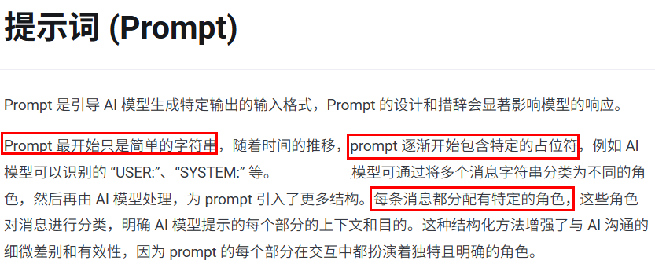

 先从最简单的API调用说起

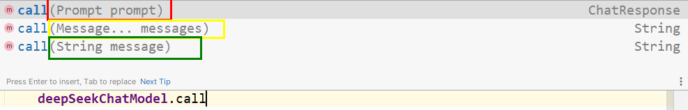

可以近似的理解

> Prompt > Message > String Question

Prompt演化历程:

1. 简单纯字符串提问问题。最初的Prompt只是简单的文本字符串。
2. 占位符(Prompt Template)。引入占位符(如`{it}`)以动态插入内容。
3. 多角色消息：将消息分为不同角色（如用户、助手、系统等），设置功能边界，增强交互的复杂性和上下文感知能力；langchain4j；springAI；langchain。这些也称为Prompt 中的四大角色（Role）

## 一些内置的消息类型

### SpringAI

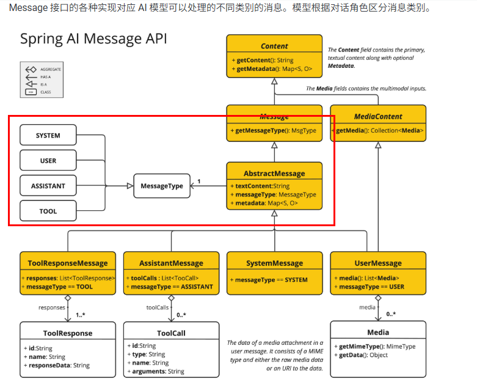

- system：设定AI行为边界/角色/定位。指导AI的行为和响应方式，设置AI如何解释和回复输入的
- user：用户原始提问输入。代表用户的输入他们向AI提出的问题、命令或陈述。
- assistant：AI返回的响应信息，定义为”助手角色”消息。用它可以确保上下文能够连贯的交互。记忆对话，积累回答。
- tool：桥接外部服务，可以进行函数调用如，支付/数据查询等操作，类似调用第3方util工具类，后面章节详细介绍

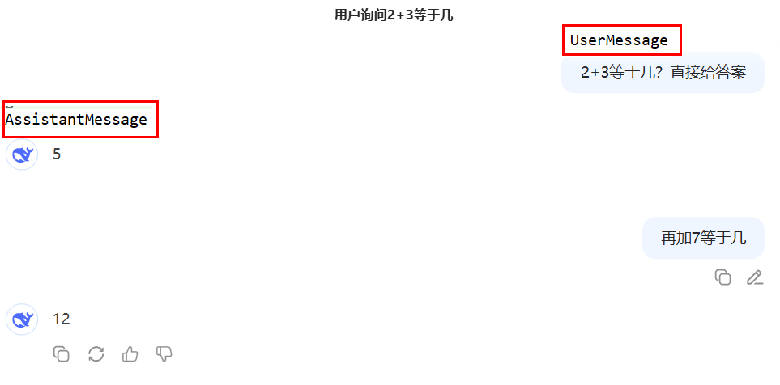

总结

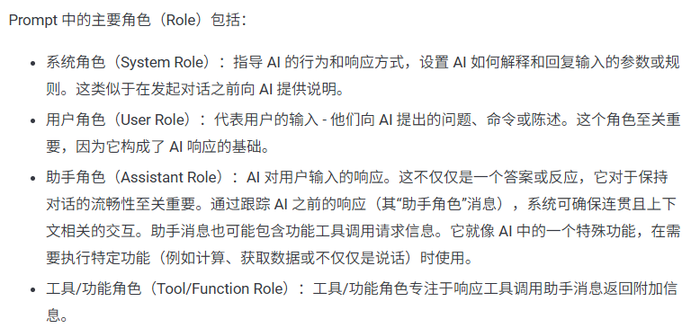

### LangChain

[官方文档](https://docs.langchain.com/oss/python/langchain/messages)

- SystemMessage：系统消息，type为"system"，告诉大模型当前的背景是什么，应该如何做，并不是所有模型提供商都支持这个消息类型

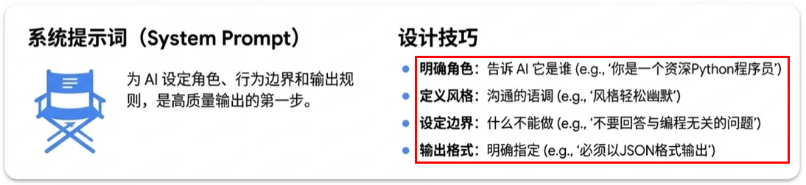

- HumanMessage：人类消息，type为"user"，表示来自用户输入。
- AIMessage：表示模型输出的内容类型，type为"ai"，这可以是文本，也可以是调用工具的请求。
- ToolMessage(v1.0+)/FunctionMessage(v0.3)：工具消息，type为"tool"，用于函数调用结果的消息类型

总结

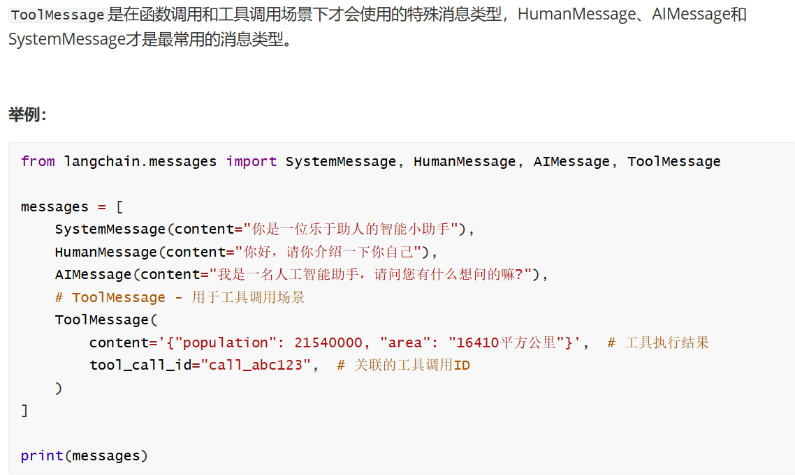

```python
from langchain.messages import SystemMessage, HumanMessage, AIMessage, ToolMessage

messages = [
    SystemMessage(content="你是一位乐于助人的智能小助手"),
    HumanMessage(content="你好，请你介绍一下你自己"),
    AIMessage(content="我是一名人工智能助手，请问您有什么想问的嘛?"),
    # ToolMessage - 用于工具调用场景
    ToolMessage(
        tool_call_id="call_abc123",  # 关联的工具调用ID
        content='{"population": 21540000, "area": "16410平方公里"}',  # 工具执行结果
    )
]

print(messages)
```

### LangChain v0.3 和 v1.0 对比

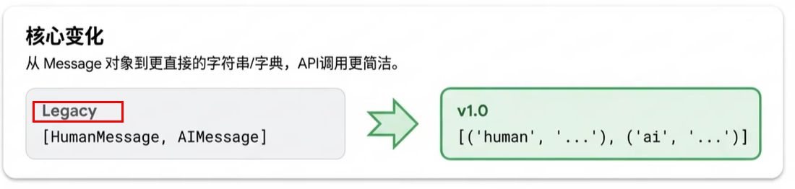

## 模型调用方法

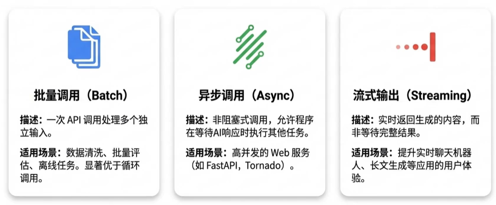

- 普通调用
  - invoke： 普通调用，处理单条输入，等待LLM完全推理完成后再返回调用结果
  - ainvoke： LangChain 提供 ainvoke() 异步调用接口，用于在 异步环境（async/await） 中高效并行地执行模型推理。它的核心作用是：让你同时调用多个模型请求而不阻塞主线程 ------特别适合大批量请求或 Web 服务场景（如 FastAPI）
- 流式调用
  - stream：流式响应，是一种逐步返回大模型生成结果的技术，生成一点返回一点，允许服务器将响应内容分批次实时传输给客户端，而不是等待全部内容生成完毕后再一次性返回
  - astream：异步流式响应
- 批处理
  - batch：处理批量输入，一次性向模型提交多个输入并并行处理，从而显著提升吞吐量
  - abatch：异步处理批量输入

invoke:

```python
# 1.导入依赖
import os
from dotenv import load_dotenv
from langchain.chat_models import init_chat_model
from langchain.messages import HumanMessage, SystemMessage

# 通过 python-dotenv 库读取 env 文件中的环境变量，并加载到当前运行的环境中
load_dotenv()

# List<Messages>

# 2.实例化模型
model = init_chat_model(
    model="qwen-plus",
    model_provider="openai",
    api_key=os.getenv("QWEN_API_KEY"),
    base_url="https://dashscope.aliyuncs.com/compatible-mode/v1",
)

# 构建消息列表
messages = [
    SystemMessage(
        content="你是一个法律助手，只回答法律问题，超出范围的统一回答，非法律问题无可奉告"
    ),
    HumanMessage(content="简单介绍下广告法，一句话告知20字以内"),
    # HumanMessage(content="2+3等于几?")
]

# 3.调用模型
response = model.invoke(messages)  # ainvoke
print(
    f"响应类型：{type(response)}"
)  # 响应类型：<class 'langchain_core.messages.ai.AIMessage'>
# 打印结果
print(response.content)  # 规范广告活动，保护消费者权益。
print(
    response.content_blocks
)  # [{'type': 'text', 'text': '规范广告活动，保护消费者权益。'}]
```

ainvoke：

```python
# 1.导入依赖
import os
from dotenv import load_dotenv
from langchain.chat_models import init_chat_model
import asyncio
from langchain.messages import HumanMessage, SystemMessage


# 通过 python-dotenv 库读取 env 文件中的环境变量，并加载到当前运行的环境中
load_dotenv()

# 2.实例化模型
model = init_chat_model(
    model="qwen-plus",
    model_provider="openai",
    api_key=os.getenv("QWEN_API_KEY"),
    base_url="https://dashscope.aliyuncs.com/compatible-mode/v1",
)


async def main():
    # 异步调用一条请求
    response = await model.ainvoke("解释一下LangChain是什么，简洁回答20字以内")
    print(
        f"响应类型：{type(response)}"
    )  # 响应类型：<class 'langchain_core.messages.ai.AIMessage'>
    print(
        response.content_blocks
    )  # [{'type': 'text', 'text': 'LangChain是用于构建LLM应用的开源框架。'}]


async def gatherMain():
    response = await asyncio.gather(
        model.ainvoke("解释一下LangChain是什么，简洁回答20字以内"),
        model.ainvoke("解释一下SpringAI是什么，简洁回答20字以内"),
        model.ainvoke("解释一下LangChain4j是什么，简洁回答20字以内"),
    )
    print(response[0].content, response[1].content, response[2].content)


# 4.运行异步函数
if __name__ == "__main__":
    asyncio.run(main())
    asyncio.run(gatherMain())

"""
LangChain 提供 ainvoke() 异步调用接口，用于在 异步环境（async/await） 中高效并行地执行模型推理。
它的核心作用是：让你同时调用多个模型请求而不阻塞主线程 —— 特别适合大批量请求或 Web 服务场景（如 FastAPI）
"""
```

stream:

```python
# 1.导入依赖
import os
from dotenv import load_dotenv
from langchain.chat_models import init_chat_model
from langchain.messages import HumanMessage, SystemMessage

# 通过 python-dotenv 库读取 env 文件中的环境变量，并加载到当前运行的环境中
load_dotenv()

# 2.实例化模型
model = init_chat_model(
    model="qwen-plus",
    model_provider="openai",
    api_key=os.getenv("QWEN_API_KEY"),
    base_url="https://dashscope.aliyuncs.com/compatible-mode/v1",
)

# 构建消息列表
messages = [
    SystemMessage(content="你叫小问，是一个乐于助人的AI人工助手"),
    HumanMessage(content="你是谁"),
]

# 3.流式调用大模型
response = model.stream(messages)
print(f"响应类型：{type(response)}")
# 流式打印结果
for chunk in response:
    # 刷新缓冲区 (无换行符，缓冲区未刷新，内容可能不会立即显示)
    print(chunk.content, end="", flush=True)
print("\n")
```

astream:

```python
# 1.导入依赖（新增 asyncio 用于运行异步程序）
import os
import asyncio
from dotenv import load_dotenv
from langchain.chat_models import init_chat_model
from langchain.messages import HumanMessage, SystemMessage

# 通过 python-dotenv 库读取 env 文件中的环境变量，并加载到当前运行的环境中
load_dotenv()

# 2.实例化模型
model = init_chat_model(
    model="qwen-plus",
    model_provider="openai",
    api_key=os.getenv("QWEN_API_KEY"),
    base_url="https://dashscope.aliyuncs.com/compatible-mode/v1",
)

# 构建消息列表
messages = [
    SystemMessage(content="你叫小问，是一个乐于助人的AI人工助手"),
    HumanMessage(content="你是谁"),
]


# 3.异步流式调用大模型（定义异步函数）
async def async_stream_call():
    # astream 返回异步生成器，无需 await 修饰，直接赋值
    response = model.astream(messages)
    print(f"响应类型：{type(response)}")  # 响应类型：<class 'async_generator'>

    # 异步遍历异步生成器（必须使用 async for，不可用普通 for）
    async for chunk in response:
        # 刷新缓冲区，实现流式打印（无换行、即时输出）
        print(chunk.content, end="", flush=True)
    print("\n")


# 4.运行异步函数
if __name__ == "__main__":
    asyncio.run(async_stream_call())
```

batch:

```python
# 1.导入依赖
import os
from dotenv import load_dotenv
from langchain.chat_models import init_chat_model
from langchain.messages import HumanMessage, SystemMessage

# 通过 python-dotenv 库读取 env 文件中的环境变量，并加载到当前运行的环境中
load_dotenv()

# 2.实例化模型
model = init_chat_model(
    model="qwen-plus",
    model_provider="openai",
    api_key=os.getenv("QWEN_API_KEY"),
    base_url="https://dashscope.aliyuncs.com/compatible-mode/v1",
)

# 问题列表
questions = [
    "什么是redis?简洁回答，字数控制在20以内",
    "Python的生成器是做什么的？简洁回答，字数控制在20以内",
    "解释一下Docker和Kubernetes的关系?简洁回答，字数控制在20以内",
]

# 批量调用大模型 model.batch()
response = model.batch(questions)
print(f"响应类型：{type(response)}")
print()
for q, r in zip(questions, response):
    print(f"问题：{q}\n回答：{r.content}\n")
```

abatch:

```python
# 1.导入依赖（新增 asyncio 用于运行异步程序）
import os
import asyncio
from dotenv import load_dotenv
from langchain.chat_models import init_chat_model
from langchain.messages import HumanMessage, SystemMessage

# 通过 python-dotenv 库读取 env 文件中的环境变量，并加载到当前运行的环境中
load_dotenv()

# 2.实例化模型
model = init_chat_model(
    model="qwen-plus",
    model_provider="openai",
    api_key=os.getenv("QWEN_API_KEY"),
    base_url="https://dashscope.aliyuncs.com/compatible-mode/v1",
)

questions = [
    "什么是redis?简洁回答，字数控制在20以内",
    "Python的生成器是做什么的？简洁回答，字数控制在20以内",
    "解释一下Docker和Kubernetes的关系?简洁回答，字数控制在20以内",
]


# 3.异步批量调用大模型（定义异步函数封装异步操作）
# abatch() 是异步方法，需要基于 async/await 语法构建异步程序，并用 asyncio 驱动运行
async def async_batch_call():
    # 调用 model.abatch() 异步批量处理请求，需用 await 修饰（关键）
    response = await model.abatch(questions)
    print(f"响应类型：{type(response)}")

    # 遍历结果并格式化输出（与原来的同步版本格式一致）
    for q, r in zip(questions, response):
        print(f"问题：{q}\n回答：{r.content}\n")


# 4.运行异步函数
if __name__ == "__main__":
    asyncio.run(async_batch_call())
```

总结

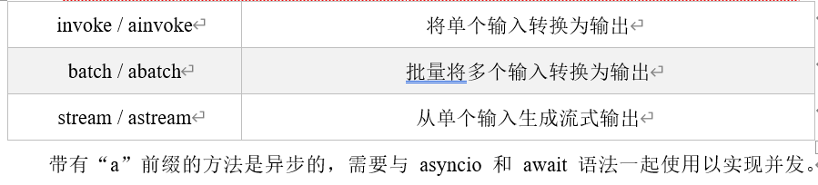

## PromptTemplate提示词模板

python 占位符简单示例：

```python
def hello(name:str) -> None:
    print(f"你好：{name}")

# {name} 可以动态传入
    
if __name__ == '__main__':
    hello("li4")
```

### 提示词模板是什么

在与大语言模型交互时，通常不会直接将用户的原始输入直接传递给大模型，而是会先进行一系列包装、组织和格式化操作。

这样做的目的是：更清晰地表达用户意图，更好地利用模型能力，这套结构化的提示词构建方式，就是 LangChain 中的 提示词模板（PromptTemplate）。

在应用开发中，一个关键的考量是提示词不能是一成不变的。其原因在于，应用开发需要适应多变的用户需求和场景。固定的提示词限制了模型的灵活性和适用范围。所以，prompt template 是一个模板化的字符串，可以用来生成特定的提示（prompts）。

你可以将变量插入到模板中，从而创建出不同的提示。这对于重复生成相似格式的提示非常有用

### 提示词模板分类

- PromptTemplate：文本生成模型提示词模板，用字符串拼接变量生成提示词
- ChatPromptTemplate：聊天模型提示词模板，适用于如 gpt-3.5-turbo、gpt-4 等聊天模型。消息模板包括：
  - ChatMessagePromptTemplate
  - SystemMessagePromptTemplate
  - HumanMessagePromptTemplate
  - AIMessagePromptTemplate
- FewShotPromptTemplate：(了解)
  - 少样本学习提示词模板， 构建一个Prompt其中包含多个示例，可以自动将这些示例格式化并插入到主Prompt 中形成样本提示模板，通过在给模型的最终输入中筛入一些示例，来教模型如何回答
- PipelinePrompt(了解)：管道提示词模板，用于把几个提示词组合在一起使用

### 常用模板和核心方法

#### PromptTemplate文本提示词模板

PromptTemplate 针对文本生成模型的提示词模板，也是LangChain提供的最基础的模板，通过格式化字符串生成提示词，在执行invoke时将变量格式化到提示词模板中

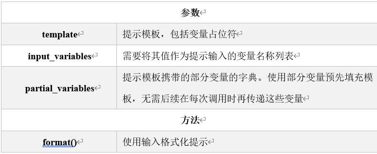

主要参数：

- template：定义提示词模板的字符串，其中包含文本和变量占位符（如{name}） ；
- input_variables： 列表，指定了模板中使用的变量名称，在调用模板时被替换；
- partial_variables：字典，用于定义模板中一些固定的变量名。这些值不需要再每次调用时被替换。

函数方法：

- format()：给input_variables变量赋值，并返回提示词。利用format() 进行格式化时就一定要赋值，否则会报错。当在template中未设置input_variables，则会自动忽略。

创建提示词PromptTemplate：

- 使用构造方法

```python
import os
from langchain.chat_models import init_chat_model

# 方式1：使用构造方法实例化提示词模板
from langchain_core.prompts import PromptTemplate
from dotenv import load_dotenv

load_dotenv()  # 加载环境变量

# 创建一个PromptTemplate对象，用于生成格式化的提示词模板
# 该模板包含两个变量：role（角色）和question（问题）
template = PromptTemplate(
    template="你是一个专业的{role}工程师，请回答我的问题给出回答，我的问题是：{question}",
    input_variables=["role", "question"],
)

# 使用模板格式化具体的提示词内容
# 将role替换为"python开发"，question替换为"冒泡排序怎么写？"
prompt = template.format(
    role="python开发", question="冒泡排序怎么写,只要代码其它不要，简洁"
)

# 输出格式化后的提示词内容
print(
    prompt
)  # 你是一个专业的python开发工程师，请回答我的问题给出回答，我的问题是：冒泡排序怎么写,只要代码其它不要，简洁


model = init_chat_model(
    model="qwen-plus",
    model_provider="openai",
    api_key=os.getenv("QWEN_API_KEY"),
    base_url="https://dashscope.aliyuncs.com/compatible-mode/v1",
)
result = model.invoke(prompt)
print(result.content)
print("\n\n")


# 使用构造方法实例化提示词模板
template = PromptTemplate(
    template="请评价{product}的优缺点，包括{aspect1}和{aspect2}。",
    input_variables=["product", "aspect1", "aspect2"],
)

# 使用模板生成提示词带有关键字参数的用法
prompt_1 = template.format(product="智能手机", aspect1="电池续航", aspect2="拍照质量")
prompt_2 = template.format(product="笔记本电脑", aspect1="处理速度", aspect2="便携性")

print(prompt_1)  # 请评价智能手机的优缺点，包括电池续航和拍照质量。
print(prompt_2)  # 请评价笔记本电脑的优缺点，包括处理速度和便携性。
```

- 使用 from_template方法

```python
# 方式2：使用 from_template 方法实例化提示词模板
from langchain_core.prompts import PromptTemplate

# 创建一个PromptTemplate对象，用于生成格式化的提示词模板
# 模板包含两个占位符：{role}表示角色，{question}表示问题
template = PromptTemplate.from_template(
    "你是一个专业的{role}工程师，请回答我的问题给出回答，我的问题是：{question}"
)

# 使用指定的角色和问题参数来格式化模板，生成最终的提示词字符串
# role: 工程师角色描述
# question: 具体的技术问题
prompt = template.format(role="python开发", question="快速排序怎么写？")

# 输出生成的提示词
print(
    prompt
)  # 你是一个专业的python开发工程师，请回答我的问题给出回答，我的问题是：快速排序怎么写？

print("\n\n")


# 使用 from_template 方法实例化提示词模板
template = PromptTemplate.from_template("请给我一个关于{topic}的{type}解释。")
# 使用模板生成提示
prompt = template.format(topic="量子力学", type="详细")
print(prompt)  # 请给我一个关于量子力学的详细解释。
```

- 部分提示词模板(partial_variables)：允许你预先固定部分变量，而保留其他变量在后续动态填充。例如：先预设系统参数，然后等用户输入后再补齐提示词模板

```python
# 方式3：部分提示词模板(partial_variables),实例化过程中指定 partial_variables 参数
from langchain_core.prompts import PromptTemplate
from datetime import datetime
import time

# 1 实例化过程中指定 partial_variables 参数
# 创建一个包含时间变量的模板，时间变量使用partial_variables预设为当前时间,然后格式化问题生成最终提示词
template1 = PromptTemplate.from_template(
    "现在时间是：{time},请对我的问题给出答案，我的问题是：{question}",
    partial_variables={"time": datetime.now().strftime("%Y-%m-%d %H:%M:%S")}
)

prompt1 = template1.format(question="今天是几号？")
print(prompt1)

time.sleep(2)  # 程序暂停 2 秒，期间不执行任何代码

# 2 使用 partial 方法指定默认值
template2 = PromptTemplate.from_template("现在时间是：{time},请对我的问题给出答案，我的问题是：{question}")
# 使用 partial 方法指定默认值
partial = template2.partial(time=datetime.now().strftime("%Y-%m-%d %H:%M:%S"))
prompt2 = partial.format(question="今天是几号？")
print(prompt2)


template3 = PromptTemplate(
    template="{foo} {bar}",
    input_variables=["foo", "bar"],
    partial_variables={"foo": "hello"},  # 预先定义部分变量foo值为hello
)

prompt = template3.format(foo="li4",bar="world")
print(prompt)  # li4 world

prompt = template3.format(bar="world")
print(prompt)  # hello world
```

- 组合提示词模板：通过将多个子提示（Prompt）按一定逻辑顺序或层级组合起来，形成一个复杂任务的整体 Prompt。例如实现多消息对话、多阶段任务、多输入源组合等场景

```python
"""
组合提示词模板

通过将多个子提示（Prompt）按一定逻辑顺序或层级组合起来，形成一个复杂任务的整体 Prompt。
例如实现多消息对话、多阶段任务、多输入源组合等场景。
尤其在，AI产品，你一言我一语，构建最后提示词，有用
"""

from langchain_core.prompts import PromptTemplate

# 创建一个PromptTemplate模板，用于生成介绍某个主题的提示词
# 该模板包含两个占位符：topic（主题）和length（字数限制）
# template1 = PromptTemplate.from_template("请用一句话介绍{topic}，要求通俗易懂,内容不超过{length}个字")
template1 = (
    PromptTemplate.from_template("请用一句话介绍{topic}，要求通俗易懂\n")
    + "内容不超过{length}个字"
)
# 使用format方法填充模板中的占位符，生成具体的提示词
prompt1 = template1.format(topic="LangChain", length=100)
print(prompt1)  # 请用一句话介绍LangChain，要求通俗易懂 内容不超过100个字

# 分别创建两个独立的PromptTemplate模板
prompt_a = PromptTemplate.from_template("请用一句话介绍{topic}，要求通俗易懂\n")
prompt_b = PromptTemplate.from_template("内容不超过{length}个字")
# 将两个模板进行拼接组合
prompt_all = prompt_a + prompt_b
# 填充组合后模板的占位符，生成最终的提示词
prompt2 = prompt_all.format(topic="LangChain", length=200)
print(prompt2)  # 请用一句话介绍LangChain，要求通俗易懂 内容不超过200个字
```

提示词主要方法：

- 上述的代码示例中，我们使用了format方法，除了format方法外还有invoke()和partial()方法也可格式化提示词模板

- 分类：

  - format：格式化提示词模板为字符串

    ```python
    from langchain_core.prompts import PromptTemplate
    
    # 创建一个PromptTemplate对象，用于生成格式化的提示词模板
    # 模板包含两个占位符：{role}表示角色，{question}表示问题
    template = PromptTemplate.from_template(
        "你是一个专业的{role}工程师，请回答我的问题给出回答，我的问题是：{question}"
    )
    
    # 使用指定的角色和问题参数来格式化模板，生成最终的提示词字符串
    # role: 工程师角色描述
    # question: 具体的技术问题
    prompt = template.format(role="python开发", question="二分查找算法怎么写？")
    
    # 输出生成的提示词
    print(
        prompt
    )  # 你是一个专业的python开发工程师，请回答我的问题给出回答，我的问题是：二分查找算法怎么写？
    print(type(prompt))  # <class 'str'>
    ```

  - invoke：格式化提示词模板为PromptValue，返回的是一个 PromptValue 对象，可以用 .to_string() 或 .to_messages() 查看内容

  ```python
  """
  invoke() 是 LangChain Expression Language（LCEL 的统一执行入口，用于执行任意可运行对象（Runnable ）。返回的是一个 PromptValue 对象，
  可以用 .to_string() 或 .to_messages() 查看内容
  """
  
  from langchain_core.prompts import PromptTemplate
  
  # 创建一个PromptTemplate对象，用于生成格式化的提示词模板
  # 模板中包含两个占位符：{role}表示角色，{question}表示问题
  template = PromptTemplate.from_template(
      "你是一个专业的{role}工程师，请回答我的问题给出回答，我的问题是：{question}"
  )
  
  # 使用invoke方法填充模板中的占位符，生成具体的提示词
  # 参数：字典类型，包含role和question两个键值对
  # 返回值：PromptValue对象，包含了格式化后的提示词
  prompt = template.invoke({"role": "python开发", "question": "冒泡排序怎么写？"})
  
  # 打印PromptValue对象及其类型
  print(
      prompt
  )  # text='你是一个专业的python开发工程师，请回答我的问题给出回答，我的问题是：冒泡排序怎么写？'
  print(type(prompt))  # <class 'langchain_core.prompt_values.StringPromptValue'>
  print()
  
  # 将PromptValue对象转换为字符串并打印
  # to_string()方法将PromptValue转换为可读的字符串格式
  print(
      prompt.to_string()
  )  # 你是一个专业的python开发工程师，请回答我的问题给出回答，我的问题是：冒泡排序怎么写？
  print(type(prompt.to_string()))  # <class 'str'>
  print()
  
  print(
      prompt.to_messages()
  )  # [HumanMessage(content='你是一个专业的python开发工程师，请回答我的问题给出回答，我的问题是：冒泡排序怎么写？', additional_kwargs={}, response_metadata={})]
  print(type(prompt.to_messages()))  # <class 'list'>
  ```

  - partial：格式化提示词模板为一个新的提示词模板，可以继续进行格式化

  ```python
  """
  partial()方法可以格式化部分变量，并且继续返回一个模板，通常在部分提示词模板场景下使用
  """
  
  from langchain_core.prompts import PromptTemplate
  
  # 创建模板对象，定义提示词模板格式
  # 模板包含两个占位符：role（角色）和 question（问题）
  template = PromptTemplate.from_template(
      "你是一个专业的{role}工程师，请回答我的问题给出回答，我的问题是：{question}"
  )
  
  # 使用partial方法固定role参数为"python开发"
  # 返回一个新的模板对象，其中role参数已被绑定
  partial = template.partial(role="python开发")
  
  # 打印partial对象及其类型信息
  print(
      partial
  )  # input_variables=['question'] input_types={} partial_variables={'role': 'python开发'} template='你是一个专业的{role}工程师，请回答我的问题给出回答，我的问题是：{question}'
  print(type(partial))  # <class 'langchain_core.prompts.prompt.PromptTemplate'>
  print()
  
  # 使用format方法填充question参数，生成最终的提示词字符串
  # 此时所有占位符都已填充完毕，返回完整的提示词文本
  prompt = partial.format(question="冒泡排序怎么写？")
  
  # 输出生成的提示词
  print(
      prompt
  )  # 你是一个专业的python开发工程师，请回答我的问题给出回答，我的问题是：冒泡排序怎么写
  print(type(prompt))  # <class 'str'>
  ```

#### ChatPromptTemplate对话提示词模板

ChatPromptTemplate 是 LangChain 中专门用于**结构化聊天对话提示**的核心组件，它比普通 `PromptTemplate` 更适合处理多角色、多轮次的对话场景。为与现代聊天模型的交互提供了一种上下文丰富和会话友好的方式

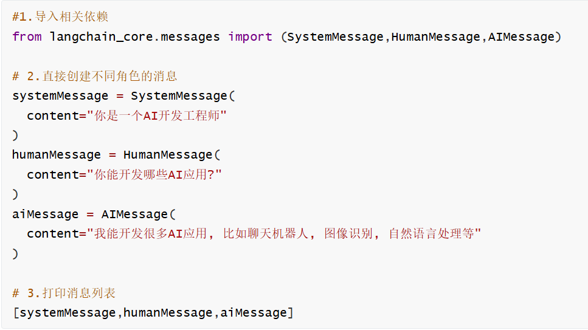

参数类型：列表参数格式是tuple类型（ role :str,content :str 组合最常用）

元组的格式为：(role: str | type, content: str | list[dict] | list[object])

其中 role 是：字符串（如 “system” 、“human” 、“ai” ）

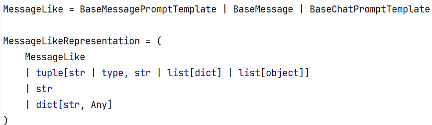

创建提示词ChatPromptTemplate：

- 使用构造方法

```python
"""
使用ChatPromptTemplate构造方法直接实例化
实例化时需要传入messages: Sequence[MessageLikeRepresentation]
messages 参数支持如下格式：
- tuple 构成的列表，格式为[(role, content)]
- dict 构成的列表，格式为[{“role”:... , “content”:...}]
- Message 类构成的列表
"""

from langchain_core.prompts import ChatPromptTemplate
import os
from langchain.chat_models import init_chat_model
from dotenv import load_dotenv

load_dotenv()  # 加载环境变量

chatPromptTemplate = ChatPromptTemplate(
    [
        ("system", "你是一个AI开发工程师，你的名字是{name}。"),
        ("human", "你能帮我做什么?"),
        ("ai", "我能开发很多{thing}。"),
        ("human", "{user_input}"),
    ]
)

prompt = chatPromptTemplate.format_messages(
    name="小谷AI", thing="AI", user_input="7 + 5等于多少"
)
print(prompt)

llm = init_chat_model(
    model="qwen-plus",
    model_provider="openai",
    api_key=os.getenv("QWEN_API_KEY"),
    base_url="https://dashscope.aliyuncs.com/compatible-mode/v1",
)
print()
print("======================")

result = llm.invoke(prompt)
print(result)
print(result.content)
```

- 调用from_messages(常用)

```python
"""
from_messages
作用：将模板变量替换后，直接生成消息列表（List[BaseMessage]），
一般包含：SystemMessage``HumanMessage``AIMessage
常用场景：用于手动查看或调试 Prompt 的最终“消息结构”或者自己拼接进 Chain。

实例化时需要传入messages: Sequence[MessageLikeRepresentation]
messages 参数支持如下格式：
- tuple 构成的列表，格式为[(role, content)]
template = ChatPromptTemplate(
    [
        ("system", "你是一个AI开发工程师，你的名字是{name}。"),
        ("human", "你能帮我做什么?"),
        ("ai", "我能开发很多{thing}。"),
        ("human", "{user_input}"),
    ]
)
- dict 构成的列表，格式为[{“role”:... , “content”:...}]
chat_prompt = ChatPromptTemplate(
    [
        {"role": "system", "content": "你是AI助手，你的名字叫{name}。"},
        {"role": "user", "content": "请问：{question}"}
    ]
)
- Message 类构成的列表
"""

import os
from langchain.chat_models import init_chat_model
from langchain_core.prompts import ChatPromptTemplate
from dotenv import load_dotenv

load_dotenv()  # 加载环境变量

# 创建聊天提示模板，包含系统角色设定和用户问题格式
# 系统消息定义了AI助手的角色，人类消息定义了用户问题的格式
chat_prompt = ChatPromptTemplate.from_messages(
    [("system", "你是一个{role}，请回答我提出的问题"), ("human", "请回答:{question}")]
)

# 格式化聊天提示模板，填充角色和问题参数
# 参数role: 指定AI助手的角色身份
# 参数question: 用户提出的具体问题
# 返回值: 格式化后的消息列表
# prompt_value = chat_prompt.format_messages(role="python开发工程师", question="冒泡排序怎么写")
prompt_value = chat_prompt.format_messages(
    **{"role": "python开发工程师", "question": "堆排序怎么写"}
)
# 打印格式化后的提示消息
print(prompt_value)

print()
# 使用指定的角色和问题参数填充模板，生成具体的提示内容
# role: 指定AI扮演的角色
# question: 用户提出的具体问题
prompt_value2 = chat_prompt.invoke(
    {"role": "python开发工程师", "question": "堆排序怎么写"}
)
# 输出生成的提示内容
print(prompt_value2.to_string())

print()

prompt_value3 = chat_prompt.format(
    **{"role": "python开发工程师", "question": "快速排序怎么写"}
)
# 输出生成的提示内容
print(prompt_value3)


llm = init_chat_model(
    model="qwen-plus",
    model_provider="openai",
    api_key=os.getenv("QWEN_API_KEY"),
    base_url="https://dashscope.aliyuncs.com/compatible-mode/v1",
)
print()
print("======================")

result = llm.invoke(prompt_value)
print(result)
print(result.content)
```

ChatPromptTemplate实例化参数类型：前面说了ChatPromptTemplate的两种创建方式。我们看到不管使用构造方法，参数类型都是列表类型。参数除了是列表类型，列表的元素可以是字符串、字典、字符串构成的元组、消息类型、提示词模板类型、消息提示词模板类型等

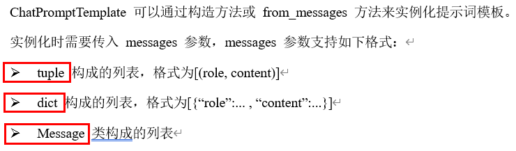

- tuple

```python
from langchain_core.prompts import ChatPromptTemplate


chatPromptTemplate = ChatPromptTemplate(
    [
        ("system", "你是一个AI开发工程师，你的名字是{name}。"),
        ("human", "你能帮我做什么?"),
        ("ai", "我能开发很多{thing}。"),
        ("human", "{user_input}"),
    ]
)

prompt = chatPromptTemplate.format_messages(
    name="小谷AI", thing="AI", user_input="7 + 5等于多少"
)
print(prompt)
```

- 列表参数格式是dict类型

```python
"""
列表参数格式是dict类型
dict 构成的列表，格式为[{“role”:... , “content”:...}]
chat_prompt = ChatPromptTemplate(
    [
        {"role": "system", "content": "你是AI助手，你的名字叫{name}。"},
        {"role": "user", "content": "请问：{question}"}
    ]
)
"""

from langchain_core.prompts import ChatPromptTemplate

# 创建聊天提示模板，用于构建AI助手的对话上下文
# 该模板包含两个消息：AI助手的自我介绍和用户问题
chat_prompt = ChatPromptTemplate.from_messages(
    [
        {"role": "system", "content": "你是AI助手，你的名字叫{name}。"},
        {"role": "user", "content": "请问：{question}"},
    ]
)

# 格式化聊天提示模板，填充具体的助手名称和问题内容
# 参数name: AI助手的名字
# 参数question: 用户提出的问题
# 返回值: 格式化后的消息列表
message = chat_prompt.format_messages(name="小问", question="什么是LangChain")

# 打印格式化后的消息内容
print(message)
```

- message类型：System/Human/AIMessage 是 langchain 中用于构建不同角色的一个类。它通常用于创建聊天消息的一部分，特别是当你构建一个多轮对话的 prompt 模板时，区分系统、AI、和人类消息

```python
"""
message 类型

System/Human/AIMessage 是 langchain 中用于构建不同角色的一个类。
它通常用于创建聊天消息的一部分，特别是当你构建一个多轮对话的 prompt 模板时，区分系统、AI、和人类消息
"""

from langchain_core.messages import SystemMessage, HumanMessage
from langchain_core.prompts import ChatPromptTemplate

# 创建聊天提示模板，用于构建AI助手的对话上下文
# 该模板包含两个消息：AI助手的自我介绍和用户问题
chat_prompt = ChatPromptTemplate(
    [
        SystemMessage(content="你是AI助手，你的名字叫{name}。"),
        HumanMessage(content="请问：{question}"),
    ]
)

# 格式化聊天提示模板，填充具体的助手名称和问题内容
# 参数name: AI助手的名字
# 参数question: 用户提出的问题
# 返回值: 格式化后的消息列表
message = chat_prompt.format_messages(name="Fan", question="什么是LangChain")

# 打印格式化后的消息内容
print(message)
```

MessagesPlaceholder消息占位符提示词模板：如果我们不确定消息何时生成，也不确定要插入几条消息，比如在提示词中添加聊天历史记忆这种场景，可以在ChatPromptTemplate添加MessagesPlaceholder占位符，在调用invoke时，在占位符处插入消息

- 显式使用MessagesPlaceholder

```python
"""
如果我们不确定消息何时生成，也不确定要插入几条消息，比如在提示词中添加聊天历史记忆这种场景，
可以在ChatPromptTemplate添加MessagesPlaceholder占位符，在调用invoke时，在占位符处插入消息。

显式使用MessagesPlaceholder
"""

from langchain_core.messages import HumanMessage, AIMessage
from langchain_core.prompts import ChatPromptTemplate, MessagesPlaceholder

# 构建一个 ChatPromptTemplate，包含多种消息类型：
prompt = ChatPromptTemplate.from_messages(
    [
        # 添加一条系统消息，设定 AI 的角色或行为准则
        (
            "system",
            "你是一个资深的Python应用开发工程师，请认真回答我提出的Python相关的问题",
        ),
        # 插入 memory 占位符，用于填充历史对话记录（如多轮对话上下文）
        MessagesPlaceholder("memory"),
        # 添加一条用户问题消息，用变量 {question} 表示
        ("human", "{question}"),
    ]
)

# 调用 prompt.invoke 来格式化整个 Prompt 模板
# 传入的参数中：
# - memory：是一组历史消息，表示之前的对话内容（多轮上下文）
# - question：是当前用户的问题
prompt_value = prompt.invoke(
    {
        "memory": [
            # 用户第一轮说的话
            HumanMessage("我的名字叫Fan，是一名程序员"),
            # AI 第一轮的回应
            AIMessage("好的，Fan你好"),
        ],
        # 当前问题：结合上下文，测试模型是否记住了用户名字
        "question": "请问我的名字叫什么？",
    }
)

# 打印生成的完整 prompt 文本，格式化后的聊天记录
print(prompt_value.to_string())
# System: 你是一个资深的Python应用开发工程师，请认真回答我提出的Python相关的问题
# Human: 我的名字叫Fan，是一名程序员
# AI: 好的，Fan你好
# Human: 请问我的名字叫什么？
```

- 隐式使用MessagesPlaceholder

```python
"""
"placeholder" 是 ("placeholder", "{memory}") 的简写语法，
等价于 MessagesPlaceholder("memory")。

隐式使用MessagesPlaceholder
"""

from langchain_core.messages import HumanMessage, AIMessage
from langchain_core.prompts import ChatPromptTemplate

# 使用 ChatPromptTemplate 构建一个多角色对话提示模板
prompt = ChatPromptTemplate.from_messages(
    [
        # 占位符，用于插入对话“记忆”内容，即之前的聊天记录（历史上下文）
        ("placeholder", "{memory}"),
        # 系统消息，用于设定 AI 的角色 —— 是一个资深的 Python 应用开发工程师
        (
            "system",
            "你是一个资深的Python应用开发工程师，请认真回答我提出的Python相关的问题",
        ),
        # 用户当前提问，使用变量 {question} 进行动态填充
        ("human", "{question}"),
    ]
)

# 使用 invoke 方法传入上下文变量，生成格式化后的对话 prompt 内容
prompt_value = prompt.invoke(
    {
        # memory：是之前的对话上下文，会被插入到 {memory} 的位置
        "memory": [
            # 用户第一轮对话
            HumanMessage("我的名字叫亮仔，是一名程序员"),
            # AI 第一轮回答
            AIMessage("好的，亮仔你好"),
        ],
        # 当前的问题，将替换模板中的 {question}
        "question": "请问我的名字叫什么？",
    }
)
# 使用 .to_string() 将格式化后的对话链转换成纯文本字符串，方便查看输出
print(prompt_value.to_string())
# Human: 我的名字叫亮仔，是一名程序员
# AI: 好的，亮仔你好
# System: 你是一个资深的Python应用开发工程师，请认真回答我提出的Python相关的问题
# Human: 请问我的名字叫什么？
```

### 外部加载Prompt

可以将 prompt 保存为 JSON 或者 YAML 等格式的文件，通过读取指定路径的格式化文件，获取相应的 prompt。这样方便对 prompt 进行管理和维护

外部有 `prompt.json` 和 `prompt.yaml` 文件，读取文件中的prompt内容

prompt.json

```json
{
    "_type": "prompt",
    "input_variables": ["name", "what"],
    "template": "请{name}讲一个{what}的故事"
}
```

prompt.yaml

```yaml
_type: "prompt"
input_variables: [ "name", "what" ]
template: "请{name}讲一个{what}的故事"
```

```python
# 方式1：外部加载Prompt,将 prompt 保存为 JSON
from langchain_core.prompts import load_prompt
from pathlib import Path

prompt_file = Path(__file__).parent / "prompt.json"

template = load_prompt(prompt_file, encoding="utf-8")
print(template.format(name="张三", what="搞笑的"))
# 请张三讲一个搞笑的的故事

# load_prompt在新版LangChain中将被弃用，改成序列化和反序列化使用 dumpd() / dumps() 和 load() / loads() 来实现
```

```python
import warnings

warnings.filterwarnings(
    "ignore", message="Core Pydantic V1 functionality isn't compatible with Python 3.14"
)

# 方式2：外部加载Prompt,将 prompt 保存为 yaml
from langchain_core.prompts import load_prompt
from pathlib import Path

prompt_file = Path(__file__).parent / "prompt.yaml"

template = load_prompt(prompt_file, encoding="utf-8")
print(template.format(name="年轻人", what="滑稽"))
# 请年轻人讲一个滑稽的故事
```

