# RAG 检索增强生成

## 什么是 RAG (Retrieval-Augmented Generation) 检索增强生成

[官方文档](https://docs.langchain.com/oss/python/integrations/retrievers)

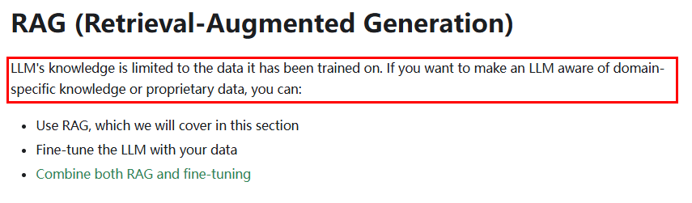

LLM 的知识仅限于它所接受的训练数据。如果你想让一个 LLM 了解特定领域的知识或专有数据，你可以:

- 使用RAG技术
- 根据你的数据对LLM模型进行微调
- RAG和模型微调相结合

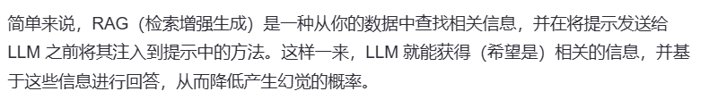

幻觉就是已读不回、已读乱回、似是而非。

核心设计理念：

RAG技术就像给AI大模型装上了「实时百科大脑」，为了让大模型获取足够的上下文，以便获得更加广泛的信息源，通过先查资料后回答的机制，让AI摆脱传统模型的”知识遗忘和幻觉回复”困境。

> 类似考试时有不懂的，给你准备了小抄。

作用：

通过引入外部知识源来增强LLM的输出能力，传统的LLM通常基于其训练数据生成响应，但这些数据可能过时或不够全面。RAG允许模型在生成答案之前，从特定的知识库中检索相关信息，从而提供更准确和上下文相关的回答。

### 使用

RAG 流程分为两个不同的阶段：索引和检索

- index
- Retrieval

#### index

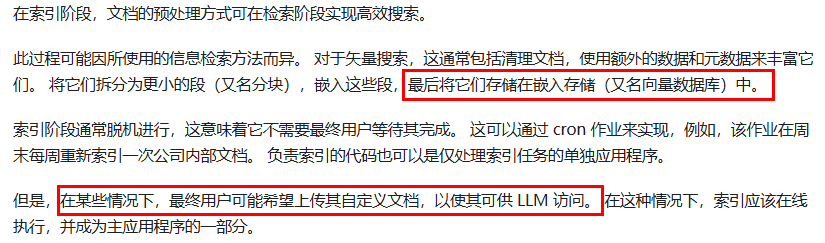

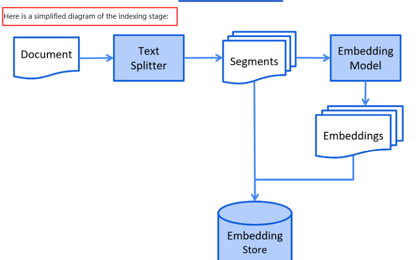

#### Retrieval

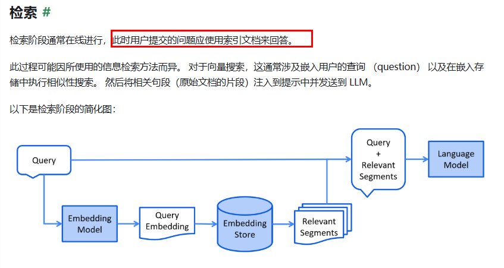

## RAG 文本处理核心知识

### LangChain组件

LangChain 框架提供了丰富的组件帮助我们搭建 RAG 应用，核心组件的介绍：

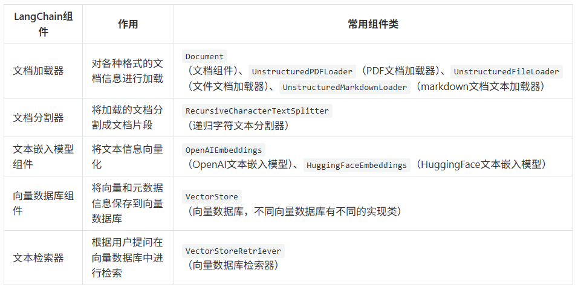

### RAG 标准流程

1. 在RAG准备阶段，LangChain通过文档加载器对各种格式的文档进行加载，转换为LangChain中的文档对象
2. 对文档对象进行分割，根据分割规则，分割成文档片段
3. 将文档片段通过文本嵌入模型组件，转换为向量，通过向量数据库组件，保存到向量数据库
4. 在RAG的使用阶段，用户首先提出问题，使用文本嵌入模型组件，将提问文本转换为向量数据，通过向量数据库检索器组件，进行相似性检索，返回关联的文本片段
5. 将相关的文档片段内容渲染到提示词模板中，作为提问问题的上下文传递给大模型，在上下文里做“阅读-理解-整合-生成”，最后把整理好的答案返回给用户
6. 总结：RAG的核心卖点正是让生成模型利用检索到的外部知识再做一次深加工，从而给出连贯、准确且带引用的回答

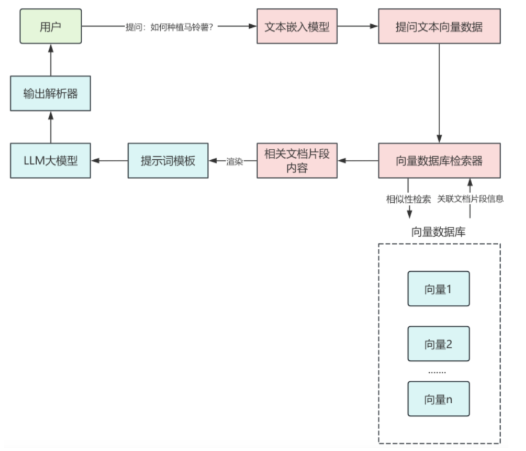

### 文档加载器

[官方文档](https://docs.langchain.com/oss/python/integrations/document_loaders)

用于将各种格式的文档转换为Document对象

常用的LangChain文档加载器

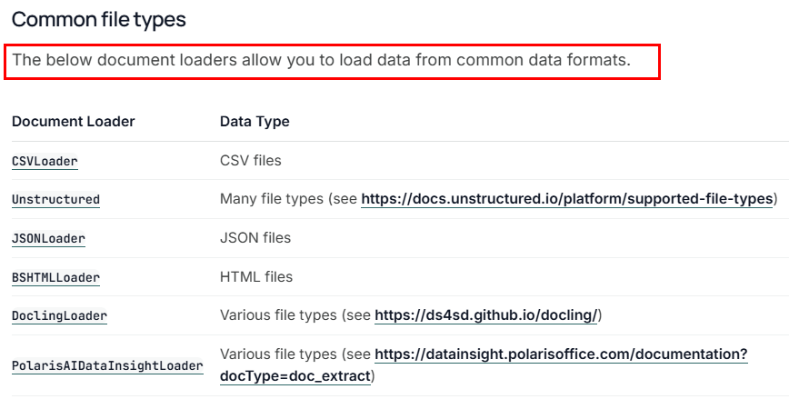

每一个文档加载器都有自己特定的参数和方法，但它们有一个统一的load()方法来完成文档的加载，load()方法会返回一个Document类的对象列表，因为这些文档加载器都继承自BaseLoader基类

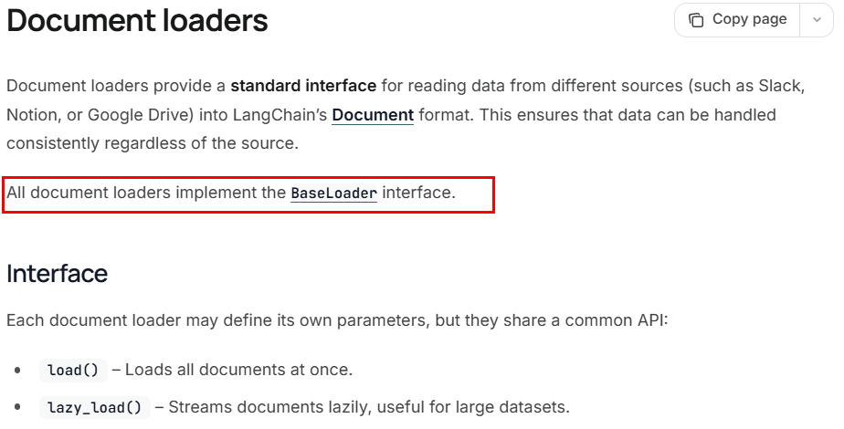

代码继承关系

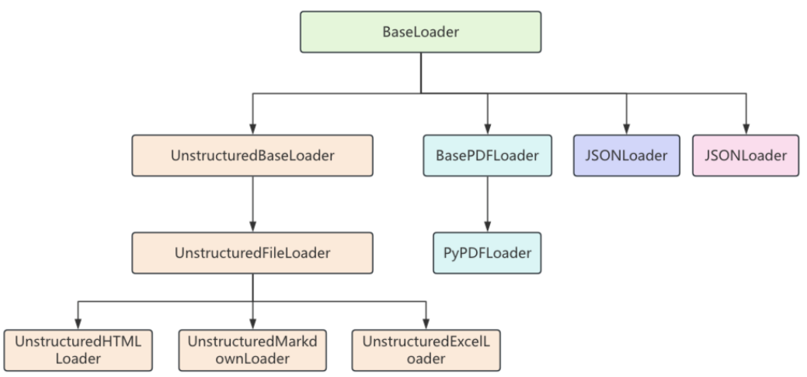

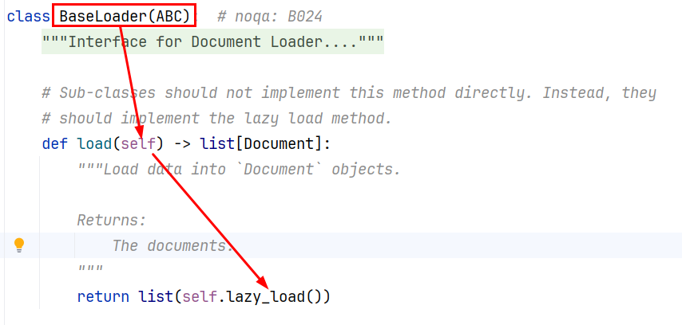

Document文档类：文档加载器无论从什么来源进行文档加载，最终都是为了将文档信息解析为Document对象，Document类中，主要包含两个重要属性：

- page_content：表示文档的内容，类型是字符串
- metadata ：与文档本身无关的元数据信息。可以保存文档 ID、文件名等任意信息，类型是字典

```python
Document(
	metadata={'source': 'assets/sample.txt'}, 
	page_content='LangChain 是一个用于构建基于大语言模型（LLM）应用的开发框架，旨在帮助开发者更高效地集成、管理和增强大语言模型的能力，构建端到端的应用程序。它提供了一套模块化工具和接口，支持从简单的文本生成到复杂的多步骤推理任务。'
)
```

案例：

#### 加载文本TEXT

```python
from langchain_community.document_loaders import TextLoader
from pathlib import Path

# 返回List[Document]
file_path = Path(__file__).parent / "assets/sample.txt"  # 文件路径
encoding = "utf-8"  # 文件编码方式

docs = TextLoader(file_path, encoding).load()

print(docs)
# [Document(metadata={'source': 'asset/sample.txt'}, page_content='...')]
```

#### 加载CSV

```python
from langchain_community.document_loaders.csv_loader import CSVLoader
from pathlib import Path

file_path = Path(__file__).parent / "assets/sample.csv"

# 加载所有列
docs = CSVLoader(
    file_path=file_path,  # 文件路径
).load()  # 返回List[Document]

print(docs)

# 加载部分列
docs = CSVLoader(
    file_path=file_path,  # 文件路径
    metadata_columns=["title", "author"],  # 将指定列作为元数据
    content_columns=["content"],  # 将指定列作为内容
).load()  # 返回List[Document]

print(docs)
```

#### 加载JSON

```python
# pip install jq / uv add jq
from langchain_community.document_loaders import JSONLoader
from pathlib import Path

file_path = Path(__file__).parent / "assets/sample.json"

# 提取所有字段
docs = JSONLoader(
    file_path=file_path,  # 文件路径
    jq_schema=".",  # 提取所有字段
    text_content=False,  # 提取内容是否为字符串格式
).load()

print(docs)
```

#### 加载Markdown

```python
# pip install unstructured[md]
from langchain_community.document_loaders import UnstructuredMarkdownLoader
from pathlib import Path

file_path = Path(__file__).parent / "assets/sample.md"

docs = UnstructuredMarkdownLoader(
    # 文件路径
    file_path=file_path,
    # 加载模式:
    #   single 返回单个Document对象
    #   elements 按标题等元素切分文档
    mode="elements",
).load()

print(docs)
```

#### 加载Doc/Docx

```python
# pip install langchain_community unstructured[docx]
# pip install -U unstructured
# pip install python-docx
# pip install regex==2026.1.14
from langchain_community.document_loaders import UnstructuredWordDocumentLoader
from pathlib import Path

file_path = Path(__file__).parent / "assets/alibaba-more.docx"

docs = UnstructuredWordDocumentLoader(
    # 文件路径
    file_path=file_path,
    # 加载模式:
    #   single 返回单个Document对象
    #   elements 按标题等元素切分文档
    mode="single",
).load()

# print(type(docs))
print(docs)
```

#### 加载PDF

```python
from langchain_community.document_loaders import PyPDFLoader
from pathlib import Path

file_path = Path(__file__).parent / "assets/sample.pdf"

docs = PyPDFLoader(
    # 文件路径，支持本地文件和在线文件链接，如"https://arxiv.org/pdf/alg-geom/9202012"
    file_path=file_path,
    # 提取模式:
    #   plain 提取文本
    #   layout 按布局提取
    extraction_mode="plain",
).load()

print(docs)
```

### 文档分割器

[官方文档](https://docs.langchain.com/oss/python/integrations/splitters)

为什么需要分割？文档太大，一口吞不下；文档太大，Token太费钱+有限制。

LangChain提供了多种文本分割器，常用切分策略

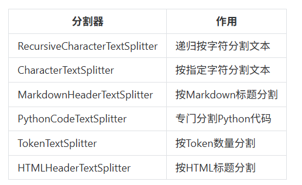

大部分文本分割器都继承自TextSplitter基类，该基类定义了分割文本的核心方法：

- split_text()：将文本字符串分割成字符串列表
- split_documents()：将Document对象列表分割成更小文本片段的Document对象列表
- create_documents()：通过字符串列表创建Document对象

RecursiveCharacterTextSplitter(递归字符文本切分器)

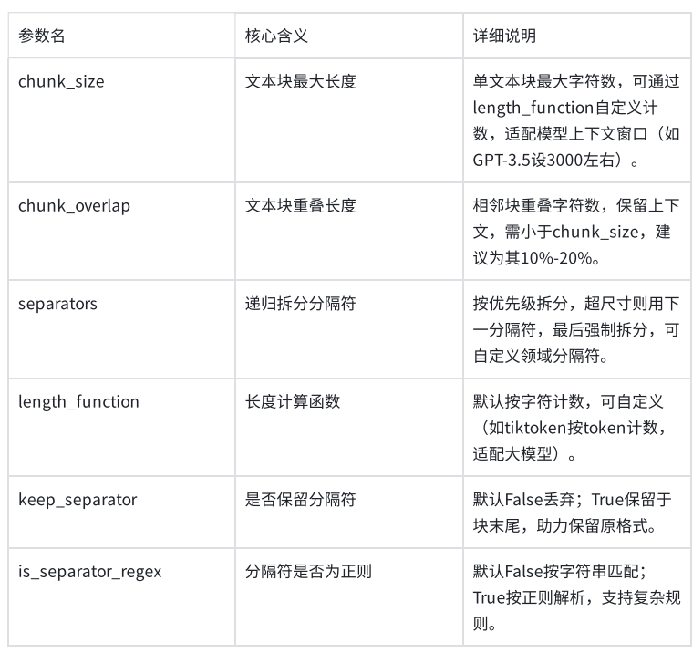

#### split_text

将文本字符串分割成字符串列表

```python
"""
使用split_text()方法进行文本分割
RecursiveCharacterTextSplitter中指定的
chunk_size=100,块大小为100，
chunk_overlap=30, 片段重叠字符数为30，
length_function=len，计算长度的函数使用len，# 可选：默认为字符串长度，可自定义函数来实现按 token 数切分
"""

from langchain_text_splitters import RecursiveCharacterTextSplitter

# 1.分割文本内容
content = (
    "大模型RAG（检索增强生成）是一种结合生成模型与外部知识检索的技术，通过从大规模文档或数据库中检索相关信息，"
    "辅助生成模型以提升回答的准确性和相关性。其核心流程包括用户输入查询、系统检索相关知识、"
    "生成模型基于检索结果生成内容，并输出最终答案。RAG的优势在于能够弥补生成模型的知识盲区，"
    "提供更准确、实时和可解释的输出，广泛应用于问答系统、内容生成、客服、教育和企业领域。"
    "然而，其也面临依赖高质量知识库、可能的响应延迟、较高的维护成本以及数据隐私等挑战。"
)


# 2.定义递归文本分割器
# 使用RecursiveCharacterTextSplitter创建文本分割器，设置块大小为100，重叠长度为30,
# length_function=len就是指定使用 Python 内置的len()函数来计算文本长度，也是这个分割器的默认值
# 比如，print(len("大模型RAG技术"))  # 输出8，因为统计的是字符个数（中文字符、字母、符号各算1个）
# 遵循 “重叠后向前取有效内容、且不生成过小碎片” 的核心分割逻辑，不会让最后一个片段的有效内容只剩扣除重叠后的少量字符
# 原始文本 → split_text → 第一次分割成字符串块 → create_documents → 对字符串块二次分割 → 内容丢失有可能
text_splitter = RecursiveCharacterTextSplitter(
    chunk_size=100, chunk_overlap=30, length_function=len
)

# 3.分割文本
# 将原始文本内容分割成多个文本块
splitter_texts = text_splitter.split_text(content)

# 4.转换为文档对象
# 将分割后的文本块转换为文档对象列表
splitter_documents = text_splitter.create_documents(splitter_texts)
print(f"原始文本大小：{len(content)}")
print(f"分割文档数量：{len(splitter_documents)}")
for splitter_document in splitter_documents:
    print(
        f"文档片段大小：{len(splitter_document.page_content)},文档内容：{splitter_document.page_content}"
    )


"""
原始文本大小：225

分割文档数量：3

文档片段大小：100,文档内容：大模型RAG（检索增强生成）是一种结合生成模型与外部知识检索的技术，通过从大规模文档或数据库中检索相关信息，辅助生成模型以提升回答的准确性和相关性。其核心流程包括用户输入查询、系统检索相关知识、生成模

文档片段大小：100,文档内容：相关性。其核心流程包括用户输入查询、系统检索相关知识、生成模型基于检索结果生成内容，并输出最终答案。RAG的优势在于能够弥补生成模型的知识盲区，提供更准确、实时和可解释的输出，广泛应用于问答系统、内容

文档片段大小：85,文档内容：区，提供更准确、实时和可解释的输出，广泛应用于问答系统、内容生成、客服、教育和企业领域。然而，其也面临依赖高质量知识库、可能的响应延迟、较高的维护成本以及数据隐私等挑战。
"""

"""
验证总字符的逻辑（并非简单相加）
同学们可能会疑惑：100+100+85=285，比原始 225 多了 60，why?
这是因为重叠部分被重复计算了，实际原始文本的有效内容被完整覆盖，且无丢失：
第 1 块和第 2 块的重叠：30 字符（重复计算 1 次）
第 2 块和第 3 块的重叠：30 字符（重复计算 1 次）
总重复计算：60 字符 → 285 - 60 = 225（和原始文本长度一致）

这正是分割器设计chunk_overlap的目的：
以 “重复计算重叠部分” 为代价，保证每个文本块的语义完整性，避免分割切断上下文。
"""
```

```python
from langchain_text_splitters import RecursiveCharacterTextSplitter
from langchain_core.documents import Document

# 原始文本内容
content = (
    "大模型RAG（检索增强生成）是一种结合生成模型与外部知识检索的技术，通过从大规模文档或数据库中检索相关信息，"
    "辅助生成模型以提升回答的准确性和相关性。其核心流程包括用户输入查询、系统检索相关知识、"
    "生成模型基于检索结果生成内容，并输出最终答案。RAG的优势在于能够弥补生成模型的知识盲区，"
    "提供更准确、实时和可解释的输出，广泛应用于问答系统、内容生成、客服、教育和企业领域。"
    "然而，其也面临依赖高质量知识库、可能的响应延迟、较高的维护成本以及数据隐私等挑战。"
)

# 定义递归文本分割器
text_splitter = RecursiveCharacterTextSplitter(
    chunk_size=100, chunk_overlap=30, length_function=len
)

# 核心：先调用split_text分割为字符串列表
splitter_texts = text_splitter.split_text(content)
# 手动转换为Document对象，保证内容完整
splitter_documents = [Document(page_content=text) for text in splitter_texts]

# 拼接所有分割后的内容（剔除重叠部分）验证完整性
full_content = ""
for text in splitter_texts:
    if full_content:
        full_content += text[30:]  # 剔除重叠的30个字符后拼接
    else:
        full_content += text

# 打印验证结果
print(f"原始文本大小：{len(content)}，原始内容：\n{content}\n")
print(f"分割文档数量：{len(splitter_documents)}\n")
for idx, splitter_document in enumerate(splitter_documents, 1):
    print(
        f"第{idx}个文档 - 大小：{len(splitter_document.page_content)}, 内容：{splitter_document.page_content}\n"
    )

# 最终完整性验证
print(f"拼接后文本大小：{len(full_content)}")
print(f"是否与原始文本完全一致：{full_content == content}")
print(f"拼接后完整内容：\n{full_content}")
```

#### split_documents

将Document对象列表分割成更小文本片段的Document对象列表

```python
"""
分割文档对象
RecursiveCharacterTextSplitter不仅可以分割纯文本，还可以直接分割Document对象
"""

# pip install python-magic-bin
from langchain_text_splitters import RecursiveCharacterTextSplitter
from langchain_unstructured import UnstructuredLoader
from pathlib import Path

file_path = Path(__file__).parent / "rag.txt"

# 1.创建文档加载器，进行文档加载
loader = UnstructuredLoader(file_path)
documents = loader.load()

# 2.定义递归文本分割器
# 创建RecursiveCharacterTextSplitter实例，用于将文档分割成指定大小的文本块
# chunk_size: 每个文本块的最大字符数为100
# chunk_overlap: 相邻文本块之间的重叠字符数为30
# length_function: 使用len函数计算文本长度
text_splitter = RecursiveCharacterTextSplitter(
    chunk_size=100, chunk_overlap=30, length_function=len
)

# 3.分割文本
# 使用文本分割器将加载的文档分割成多个较小的文档片段
splitter_documents = text_splitter.split_documents(documents)

# 输出分割后的文档信息
print(f"分割文档数量：{len(splitter_documents)}")

for splitter_document in splitter_documents:
    print(f"文档片段：{splitter_document.page_content}")
    print(
        f"文档片段大小：{len(splitter_document.page_content)}, 文档元数据：{splitter_document.metadata}"
    )
```

## AI智能运维助手小案例

先实现一个简单的向量存储到redis的案例

```python
from langchain_redis import RedisConfig, RedisVectorStore
from langchain_community.embeddings import DashScopeEmbeddings
import os
from dotenv import load_dotenv

load_dotenv()

# 初始化 Embedding 模型
# 1. 初始化阿里千问 Embedding 模型
embeddingsModel = DashScopeEmbeddings(
    model="text-embedding-v3",
    dashscope_api_key=os.getenv("QWEN_API_KEY"),
)

# ========== 存储数据 ==========
# 定义待处理的文本数据列表
texts = [
    "我喜欢吃苹果",
    "苹果是我最喜欢吃的水果",
    "我喜欢用苹果手机",
]
# query_result = embeddings.embed_query(texts)
# print(query_result)


# 获取文本向量
# 使用embedding模型将文本转换为向量表示
embeddings = embeddingsModel.embed_documents(texts)

# 打印结果
# 遍历并打印每个文本及其对应的向量信息
for i, vec in enumerate(embeddings, 1):
    print(f"文本 {i}: {texts[i - 1]}")
    print(f"向量长度: {len(vec)}")
    print(f"前5个向量值: {vec[:10]}\n")

# 定义每条文本对应的元数据信息
metadata = [{"segment_id": "1"}, {"segment_id": "2"}, {"segment_id": "3"}]

# 配置Redis连接参数和索引名称
config = RedisConfig(
    index_name="newsgroups",
    redis_url="redis://localhost:6389",
)

# 创建Redis向量存储实例
vector_store = RedisVectorStore(embeddingsModel, config=config)

# 将文本和元数据添加到向量存储中
ids = vector_store.add_texts(texts, metadata)

# 打印前5个存储记录的ID
print(ids[0:5])
```

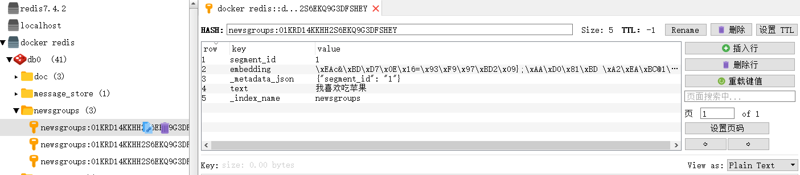

查询结果：

```python
from langchain_redis import RedisConfig, RedisVectorStore
from langchain_community.embeddings import DashScopeEmbeddings
import os
from dotenv import load_dotenv

load_dotenv()

# 初始化 Embedding 模型
# 1. 初始化阿里千问 Embedding 模型
embeddingsModel = DashScopeEmbeddings(
    model="text-embedding-v3",  # 支持 v1 或 v2
    dashscope_api_key=os.getenv("QWEN_API_KEY"),  # 从环境变量读取
)

# 2. 创建Redis向量存储实例
vector_store = RedisVectorStore(
    embeddingsModel,
    config=RedisConfig(index_name="newsgroups", redis_url="redis://localhost:6389"),
)

# ========== 查询数据 ==========
# 定义查询文本
query = "我喜欢吃什么？"

# 3. 将查询语句向量化，并在Redis中做相似度检索
results = vector_store.similarity_search_with_score(query, k=3)

print("=== 查询结果 ===")
for i, (doc, score) in enumerate(results, 1):
    similarity = 1 - score  #  score 是距离，可以转成相似度
    print(f"结果 {i}:")
    print(f"内容: {doc.page_content}")
    print(f"元数据: {doc.metadata}")
    print(f"相似度: {similarity:.4f}")

# 结果 1:
# 内容: 我喜欢吃苹果
# 元数据: {'segment_id': '1'}
# 相似度: 0.7424
# 结果 2:
# 内容: 苹果是我最喜欢吃的水果
# 元数据: {'segment_id': '2'}
# 相似度: 0.6670
# 结果 3:
# 内容: 我喜欢用苹果手机
# 元数据: {'segment_id': '3'}
# 相似度: 0.5940
```

### AI智能运维助手

需求说明：某系统涉及后续自动化维护，需要根据响应码让大模型启动自迭代/自维护模式。AI智能运维助手，通过提供的错误编码，给出异常解释辅助运维人员更好的定位问题和维护系统。

使用LangChain+阿里百炼嵌入模型text-embedding-v3+向量数据库RedisStack+DeepSeek来实现RAG功能。

```python
# pip install unstructured
# pip install docx2txt
# pip install python-docx
from langchain.chat_models import init_chat_model
import os

from langchain_community.document_loaders import Docx2txtLoader
from langchain_core.prompts import PromptTemplate
from langchain_text_splitters import CharacterTextSplitter
from langchain_core.runnables import RunnablePassthrough
from langchain_community.embeddings import DashScopeEmbeddings
from langchain_community.vectorstores import Redis
from dotenv import load_dotenv

load_dotenv()

# 没有使用RAG，直接查询大模型，可能出现歧义
"""llm = init_chat_model(
    model="qwen-plus",
    model_provider="openai",
    api_key=os.getenv("QWEN_API_KEY"),
    base_url="https://dashscope.aliyuncs.com/compatible-mode/v1"
)
response=llm.invoke("00000是什么意思")
print(response.content)"""

llm = init_chat_model(
    model="qwen-plus",
    model_provider="openai",
    api_key=os.getenv("QWEN_API_KEY"),
    base_url="https://dashscope.aliyuncs.com/compatible-mode/v1",
)

prompt_template = """
    请使用以下提供的文本内容来回答问题。仅使用提供的文本信息，
    如果文本中没有相关信息，请回答"抱歉，提供的文本中没有这个信息"。

    文本内容：
    {context}

    问题：{question}

    回答：
    "
"""

prompt = PromptTemplate(
    template=prompt_template, input_variables=["context", "question"]
)

# 1. 初始化阿里千问 Embedding 模型
embeddings = DashScopeEmbeddings(
    model="text-embedding-v3",
    dashscope_api_key=os.getenv("QWEN_API_KEY"),
)

# 4. 加载文档
# 4.1 TextLoader 无法处理 .docx 格式文件，专门用于加载纯文本文件的（如 .txt）
# loader = TextLoader("alibaba-more.docx", encoding="utf-8")

# 4.2 LangChain提供了Docx2txtLoader专门用于加载.docx文件，先通过pip install docx2txt
loader = Docx2txtLoader("alibaba-java.docx")  # 直接传入文件路径即可
documents = loader.load()

# 5. 分割文档
text_splitter = CharacterTextSplitter(
    chunk_size=1000, chunk_overlap=0, length_function=len
)
texts = text_splitter.split_documents(documents)

print(f"文档个数:{len(texts)}")

# 6. 创建向量存储
# 连接到 Redis 并存入向量（自动调用 embeddings 嵌入）
vector_store = Redis.from_documents(
    documents=documents,
    embedding=embeddings,
    redis_url="redis://localhost:6389",
    index_name="my_index3",  # 向量索引名称
)

retriever = vector_store.as_retriever(search_kwargs={"k": 2})

# 8. 创建Runnable链
rag_chain = {"context": retriever, "question": RunnablePassthrough()} | prompt | llm

# 9. 提问
question = "00000和A0001分别是什么意思"
result = rag_chain.invoke(question)
print("\n问题:", question)
print("\n回答:", result.content)

# 文档个数:1
# 问题: 00000和A0001分别是什么意思
# 回答: 00000 的意思是“一切 ok”，表示正确执行后的返回。
# A0001 的意思是“用户端错误”，属于一级宏观错误码。
```

