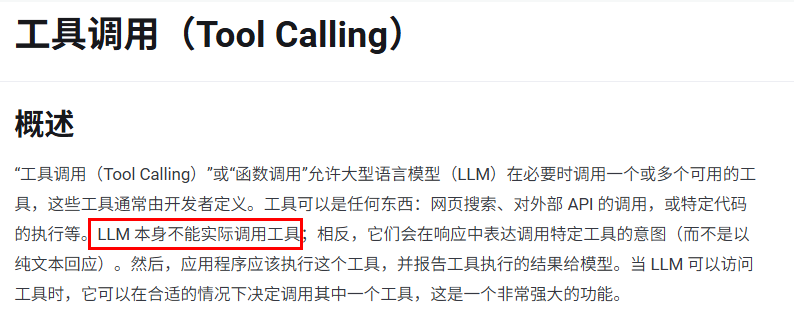
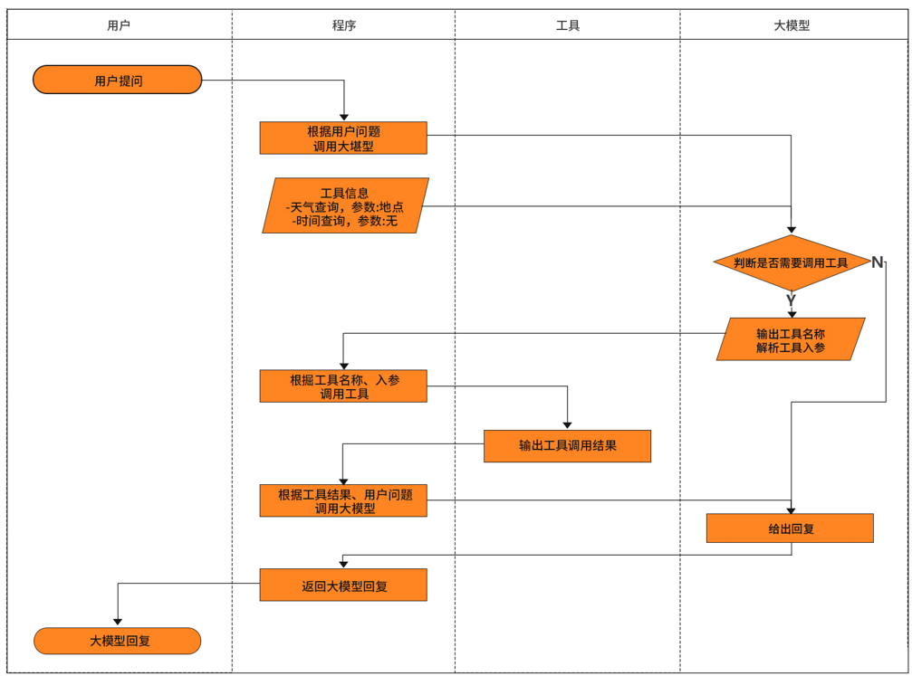
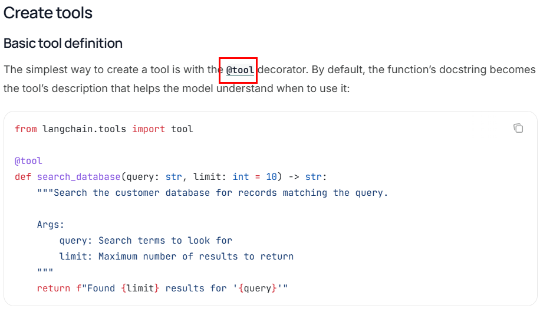
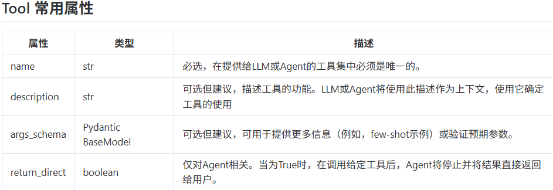
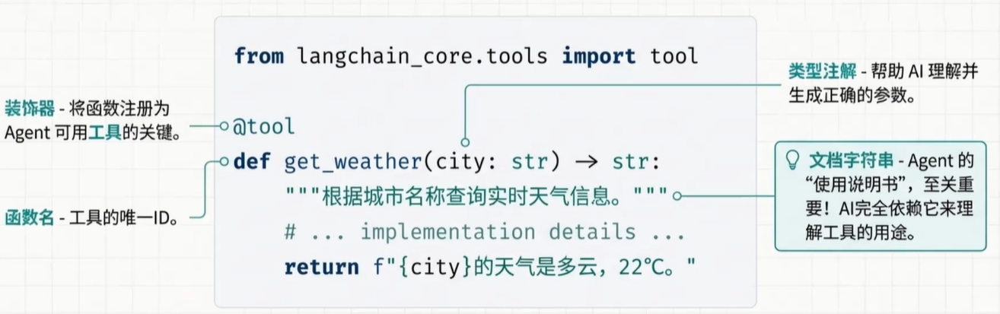
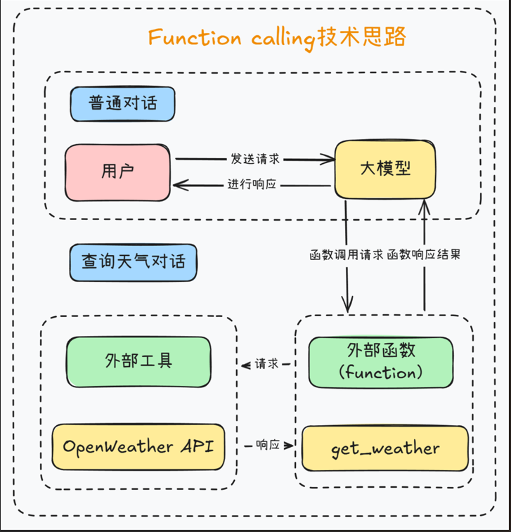

# Tools（Function calling）工具调用

如果不调用tools，虽然大模型具备强大的语言理解和生成能力，但它本质上是静态的、不可交互的

- 不具备访问数据库、调用 API 的能力
- 不能执行代码或文件操作
- 无法实时访问互联网或动态数据等

一些官方文档：[LangChain](https://docs.langchain.com/oss/python/langchain/tools)、[LangChain内置工具列表](https://docs.langchain.com/oss/python/integrations/tools)、[SpringAI](https://docs.spring.io/spring-ai/reference/api/tools.html)、[SpringAI Alibba](https://java2ai.com/docs/1.0.0.2/tutorials/basics/tool-calling/?spm=5176.29160081.0.0.2856aa5cgvn0gm)



> 一句话总结：LLM的外部utils工具类

Tools 是什么？

通过 Tool（工具）机制，可以让模型具备“调用外部函数”的能力，使其能够与外部系统、API 或自定义函数交互，从而完成仅靠文本生成无法实现的任务

提示：ToolCalling(也称为FunctionCalling)它允许大模型与一组API或工具进行交互，将 LLM 的智能与外部工具或 API无缝连接，从而增强大模型其功能。LLM本身并不执行函数,它只是指示应该调用哪个函数以及如何调用

## Tools 作用

1. 访问实时数据：比如查天气，需要打开联网搜索功能。
2. 执行某种工具类/辅助类操作：大语言模型(LLMs)不仅仅是文本生成的能手,它们还能触发并调用第3方函数，比如发邮件/查询微信/调用支付宝/查看顺丰快递单据号等等......

## Tools 工作流程



## 自定义Tool

1. 使用@tool装饰器



2. Tool常用属性





案例，定义一个两数相加的tool：

```python
from langchain.tools import tool


@tool
def add_number(a: int, b: int) -> int:
    """两个整数相加"""
    return a + b


result = add_number.invoke({"a": 1, "b": 12})
print(result)

print()

print(f"{add_number.name=}\n{add_number.description=}\n{add_number.args=}")
# add_number.name='add_number'
# add_number.description='两个整数相加'
# add_number.args={'a': {'title': 'A', 'type': 'integer'}, 'b': {'title': 'B', 'type': 'integer'}}
```

可以使用Pydantic对类型进行约束

```python
from langchain.tools import tool

"""
使用@tool装饰器
装饰器默认使用函数名称作为工具名称，但可以通过参数name_or_callable 来覆盖此设置。
同时，装饰器将使用函数的文档字符串作为工具的描述，因此函数必须提供文档字符串
"""

"""
需求：
定义了一个名为add_number的工具函数，用于执行两个整数相加操作。主要功能包括：

使用Pydantic定义参数模型FieldInfo，指定两个整数参数a和b
通过@tool装饰器将函数注册为LangChain工具，绑定参数schema
打印工具的元信息（名称、参数、描述等）并调用工具执行加法运算并输出结果
"""
from langchain_core.tools import tool
from loguru import logger
from pydantic import BaseModel, Field

# 使用Pydantic定义参数模型FieldInfo，指定两个整数参数a和b
"""
public class FieldInfo {
    private final int a;//第1个参数
    private final int b;//第2个参数
    public FieldInfo(int a, int b) {
        this.a = a;
        this.b = b;
    }
    //=====getter=====
}
"""


class FieldInfo(BaseModel):
    """
    定义加法运算所需的参数信息
    """

    a: int = Field(description="第1个参数")
    b: int = Field(description="第2个参数")


# 通过args_schema定义参数信息，也可以定义name、description、return_direct参数
@tool(args_schema=FieldInfo)
def add_number(a: int, b: int) -> int:
    return a + b


# 打印工具的基本信息
logger.info(f"name = {add_number.name}")
logger.info(f"args = {add_number.args}")
logger.info(f"description = {add_number.description}")
logger.info(f"return_direct = {add_number.return_direct}")

# 调用工具执行加法运算
res = add_number.invoke({"a": 1, "b": 2})
logger.info(res)
```

## 天气助手案例

### tool calling 原理

在发送信息给大模型的时候，携带着“工具”列表，这些工具列表代表着大模型能使用的工具。当大模型遇到用户提出的问题时，会先思考是否应该调用工具解决问题，如果需要调用工具，和普通消息不同，这种情况下会返回“function_call”类型的消息，请求方根据返回结果调用对应的工具得到工具输出，然后将之前的信息加上工具输出的信息一起发送给大模型，让大模型整合起来综合判断给出结果。



需求：实现了一个天气查询功能。通过调用OpenWeather API获取指定城市的实时天气数据，并将结果以自然语言形式输出。

主要步骤包括构建请求、发送HTTP请求、解析JSON响应并格式化为易读的中文描述

登录https://home.openweathermap.org/api_keys，免费获取API Key，并写入.env文件中，方便后续进行天气查询。

定义工具

```python
from langchain_core.tools import tool
import json
import os
import httpx
from dotenv import load_dotenv

load_dotenv()


@tool
def get_weather(loc):
    """
    查询即时天气函数

    :param loc: 必要参数，字符串类型，用于表示查询天气的具体城市名称。
                注意，中国的城市需要用对应城市的英文名称代替，例如如果需要查询北京市天气，
                则 loc 参数需要输入 'Beijing'/'shanghai'。
    :return: OpenWeather API 查询即时天气的结果。具体 URL 请求地址为：
             https://home.openweathermap.org/users/sign_in。
             返回结果对象类型为解析之后的 JSON 格式对象，并用字符串形式进行表示，
             其中包含了全部重要的天气信息。
    """
    # Step 1. 构建请求 URL
    url = "https://api.openweathermap.org/data/2.5/weather"

    # Step 2. 设置查询参数，包括城市名、API Key、单位和语言
    params = {
        "q": loc,
        "appid": os.getenv("OPENWEATHER_API_KEY"),
        "units": "metric",  # 使用摄氏度
        "lang": "zh_cn",  # 输出语言为简体中文
    }

    # Step 3. 发送 GET 请求获取天气数据
    response = httpx.get(url, params=params, timeout=30)

    # Step 4. 解析响应内容为 JSON 并序列化为字符串返回
    data = response.json()
    # print(json.dumps(data))
    return json.dumps(data)


# 测试
# result = get_weather.invoke("shanghai")
result = get_weather.invoke("shenzhen")
print(result)
```

大模型调用 Tool

```python
import os
from langchain_core.output_parsers import JsonOutputKeyToolsParser, StrOutputParser
from langchain_core.prompts import PromptTemplate
from langchain_openai import ChatOpenAI
from loguru import logger
from QueryWeatherTool import get_weather
from dotenv import load_dotenv

load_dotenv()

# 初始化大语言模型实例
llm = ChatOpenAI(
    model="mimo-v2.5-pro",
    api_key=os.getenv("XIAOMI_API_KEY"),
    base_url="https://token-plan-cn.xiaomimimo.com/v1",
)

# 将模型与工具绑定，使其能够调用 get_weather 工具
llm_with_tools = llm.bind_tools([get_weather])

# 创建解析器，用于提取工具调用结果中的 JSON 数据
parser = JsonOutputKeyToolsParser(key_name=get_weather.name, first_tool_only=True)

# 构建工具调用链：模型 -> 解析器 -> 调用天气工具
get_weather_chain = llm_with_tools | parser | get_weather
# print(get_weather_chain.invoke("你好， 请问北京的天气怎么样？"))
# 定义输出提示模板，将 JSON 天气数据转换为自然语言描述
output_prompt = PromptTemplate.from_template(
    """你将收到一段 JSON 格式的天气数据{weather_json}，请用简洁自然的方式将其转述给用户。
    以下是天气 JSON 数据：
    请将其转换为中文天气描述，例如：
    “北京现在天气：多云，气温 28℃，体感有点闷热（约 32℃），湿度 75%，微风（东南风 2 米/秒），
    能见度很好，大约 10 公里。建议穿短袖短裤。适合做户外运动。"
    """
)

# 创建字符串输出解析器
output_parser = StrOutputParser()

# 构建最终输出链：提示模板 -> 模型 -> 输出解析器
output_chain = output_prompt | llm | output_parser

# 构建完整的处理链：天气查询链 ->将天气数据包装为字典格式 -> 输出链
full_chain = get_weather_chain | (lambda x: {"weather_json": x}) | output_chain

# 执行完整链路，查询上海天气并打印结果
result = full_chain.invoke("请问深圳今天的天气如何？")
logger.info(result)
```

## Pydantic知识补充

Pydantic = “类型注解 + 自动校验 + 转换”神器，让 Python 在运行时也能享受“静态类型”的安全感。

```python
from pydantic import BaseModel, ValidationError, StrictInt


class User(BaseModel):
    # id: int
    id: StrictInt  # 改用严格整数类型，拒绝类型转换
    name: str
    age: int = 0  # 可给默认值


try:
    # 自动把字符串转成 int
    # u = User(id="41", name="z3") #  自动把字符串转成 int，可以通融。id: int
    u = User(id=42, name="z3")  # 传错类型就报错 id: StrictInt
except ValidationError as e:
    print(e)
print(u.id, type(u.id))  # 42 <class 'int'>

print()
print()


try:
    User(id="abc", name="Bob")  # 传错类型就报错 id: StrictInt
except ValidationError as e:
    print(e)
"""
1 validation error for User
id
  value is not a valid integer (type=type_error.integer)
"""
```

