# 向量化和向量数据库

## 向量化及存储

### 什么是向量

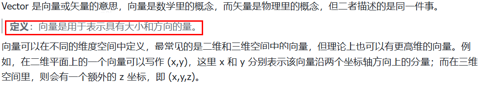

### 文本视频图片向量化

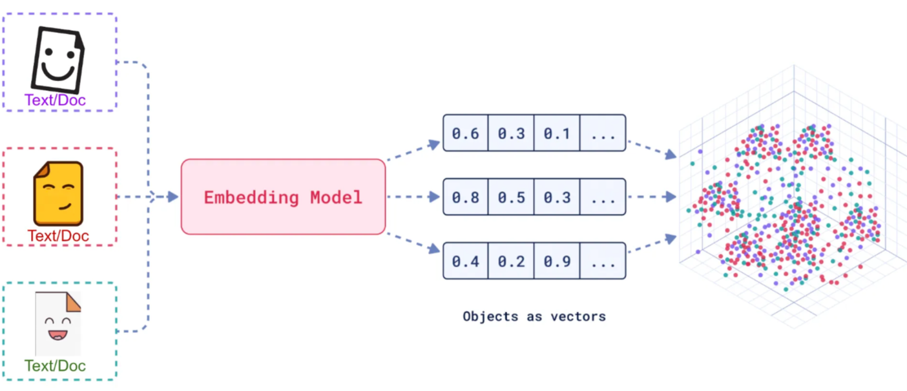

[官网-嵌入模型 (Embedding Model)](https://docs.langchain.com/oss/python/integrations/text_embedding)、[Top integrations](https://docs.langchain.com/oss/python/integrations/text_embedding#top-integrations)

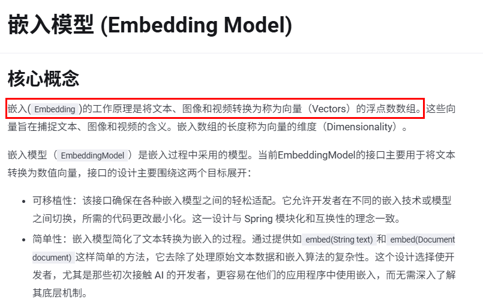

案例1：

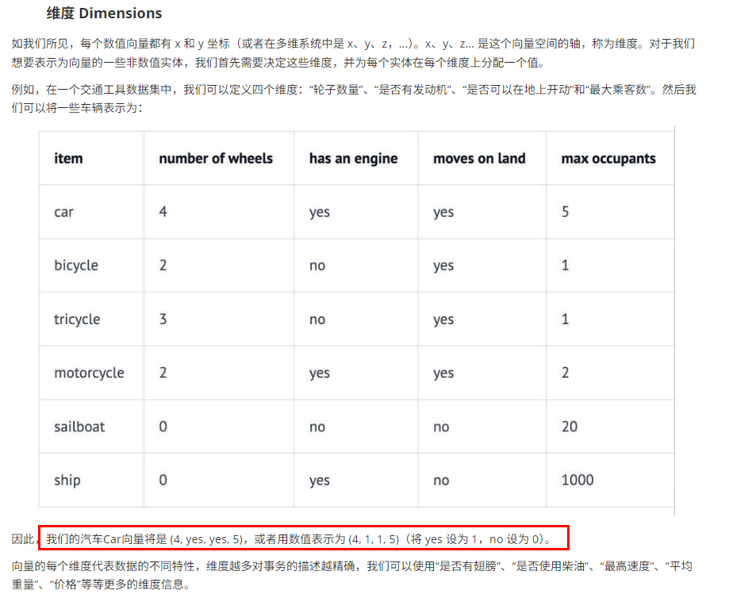

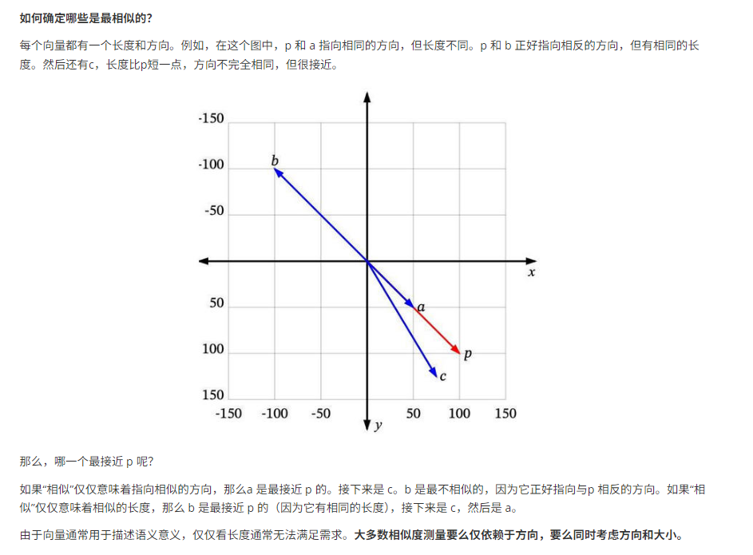

案例2：对比图片


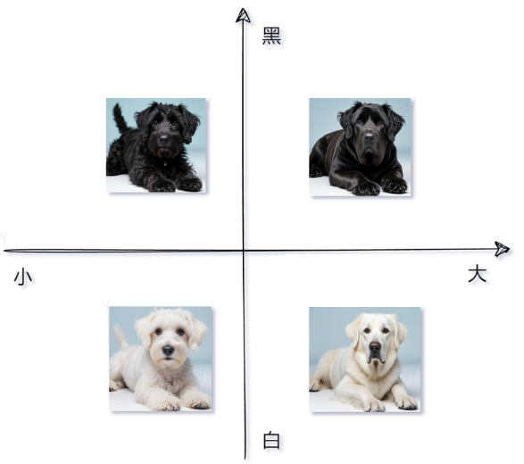

总结

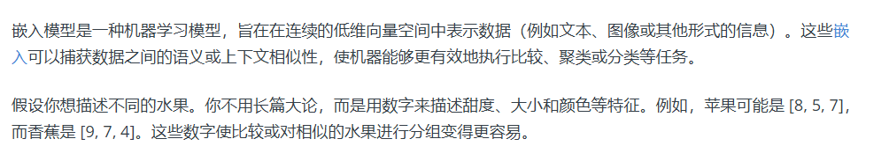

### 向量数据库

[官网-向量存储(Vector Store)](https://docs.langchain.com/oss/python/integrations/vectorstores)

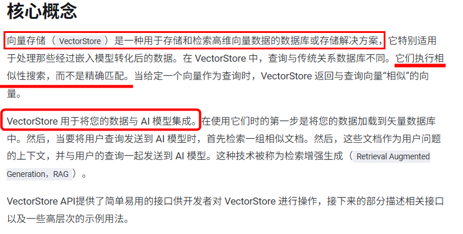

一种专门用于存储、管理和检索向量数据（即高维数值数组）的数据库系统。其核心功能是通过高效的索引结构和相似性计算算法，支持大规模向量数据的快速查询与分析，向量数据库维度越高，查询精准度也越高，查询效果也越好。

- [LangChain支持的向量数据库List清单](https://docs.langchain.com/oss/python/integrations/vectorstores)
- [LangChain4J支持的向量数据库List清单](https://docs.langchain4j.dev/integrations/embedding-stores/)
- [SpringAI支持的向量数据库List清单](https://docs.spring.io/spring-ai/reference/api/vectordbs.html)

向量数据库能干嘛？

将文本、图像和视频转换为称为向量（Vectors）的浮点数数组在 VectorStore中，查询与传统关系数据库不同。它们执行相似性搜索，而不是精确匹配。当给定一个向量作为查询时，VectorStore 返回与查询向量“相似”的向量

指征特点：

- 捕捉复杂的词汇关系（如语义相似性、同义词、多义词）
- 向量嵌入为检索增强生成 (RAG) 应用程序提供支持

总结：将文本映射到高维空间中的点，使语义相似的文本在这个空间中距离较近。例如，“肯德基”和”麦当劳”的向量可能会比”肯德基”和”新疆大盘鸡”的向量更接近

### 知识图谱

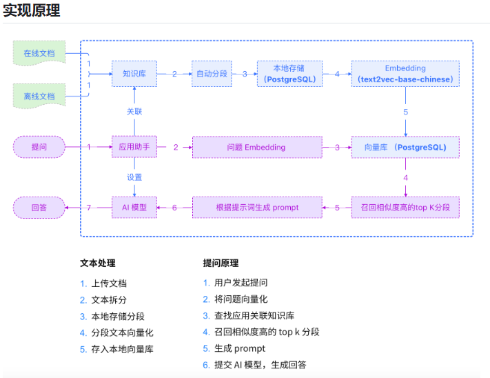

### 常用的向量数据库

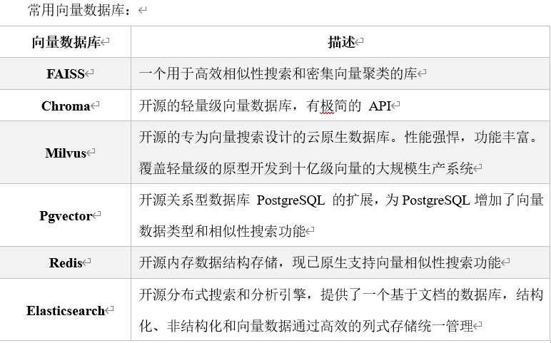

也可以**用redisStack作为向量存储**，在记忆缓存中有做笔记

## Embedding文本向量化

Embedding 是将文本字符串表示为向量（浮点数列表），通过计算向量之间的距离来衡量文本之间的相关性。向量距离越小，表示文本之间的相关性越高；距离越大，相关性越低。


常见的 Embedding 应用包括：

- 搜索：根据文本查询的相关性对结果进行排序
- 聚类：根据文本相似性将其分组
- 推荐：根据相关文本字符串推荐项目
- 异常检测：识别与其他内容相关性较低的异常点
- 多样性测量：分析相似性分布
- 分类：将文本字符串根据其最相似的标签进行分类

阿里云百炼---文本嵌入模型（Embedding Model），[文档](https://bailian.console.aliyun.com/cn-beijing/?tab=api#/api/?type=model&url=2587654)

使用文本向量化模型对文本进行向量化：

```python
# https://bailian.console.aliyun.com/cn-beijing/?productCode=p_efm&tab=doc#/doc/?type=model&url=2842587
# dashscope调用方式

import dashscope
import os
from http import HTTPStatus
from dotenv import load_dotenv

load_dotenv()

input_text = "衣服的质量杠杠的"

dashscope.api_key = os.getenv("QWEN_API_KEY")

resp = dashscope.TextEmbedding.call(
    model="text-embedding-v4",
    input=input_text,
)

if resp.status_code == HTTPStatus.OK:
    print(resp)
```

```python
# https://bailian.console.aliyun.com/cn-beijing/?productCode=p_efm&tab=doc#/doc/?type=model&url=2842587
# OpenAI兼容接口调用方式

import os
from openai import OpenAI
from dotenv import load_dotenv

load_dotenv()

input_text = "衣服的质量杠杠的"

client = OpenAI(
    api_key=os.getenv("QWEN_API_KEY"),
    base_url="https://dashscope.aliyuncs.com/compatible-mode/v1",
)

completion = client.embeddings.create(model="text-embedding-v4", input=input_text)

print(completion.model_dump_json())
```

`langchain_community` 的调用方式

```python
"""
https://bailian.console.aliyun.com/cn-beijing/?tab=api#/api/?type=model&url=2587654
"""

import os
from langchain_community.embeddings import DashScopeEmbeddings
from dotenv import load_dotenv

load_dotenv()

embeddings = DashScopeEmbeddings(
    model="text-embedding-v4",
    dashscope_api_key=os.getenv("QWEN_API_KEY"),
    # other params...
)

text = "This is a test document."

query_result = embeddings.embed_query(text)
print("文本向量长度：", len(query_result), sep="")  # 文本向量长度：1024

doc_results = embeddings.embed_documents(
    [
        "Hi there!",
        "Oh, hello!",
        "What's your name?",
        "My friends call me World",
        "Hello World!",
    ]
)
print(doc_results)
print(
    "文本向量数量：", len(doc_results), "，文本向量长度：", len(doc_results[0]), sep=""
)  # 文本向量数量：5，文本向量长度：1024
```

多模态向量化案例：

```python
import dashscope
import json
import os
from http import HTTPStatus
from dotenv import load_dotenv

load_dotenv()

# Embedding 文本向量化
text = "通用多模态表征模型示例"
input = [{"text": text}]
# 调用多模态embedding模型接口进行向量编码
# https://bailian.console.aliyun.com/?productCode=p_efm&tab=model#/model-market/all?capabilities=ME
dashscope.api_key = os.getenv("QWEN_API_KEY")
resp = dashscope.MultiModalEmbedding.call(
    model="tongyi-embedding-vision-plus",  # 支持 v1 或 v2
    input=input,
)

result = ""
# 处理模型返回结果，提取关键信息并格式化输出
if resp.status_code == HTTPStatus.OK:
    result = {
        "status_code": resp.status_code,
        "request_id": getattr(resp, "request_id", ""),
        "code": getattr(resp, "code", ""),
        "message": getattr(resp, "message", ""),
        "output": resp.output,
        "usage": resp.usage,
    }
    print(json.dumps(result, ensure_ascii=False, indent=4))

print("=================================")
print()

# result 就是你已经拿到的完整 dict
# embedding_values = result["output"]["embeddings"][0]["embedding"]
# print(embedding_values)
# print("=================================")
# print("=================================")
# # 只打印 embedding 数组
# print(json.dumps(embedding_values, ensure_ascii=False))
```

## 通过向量计算语义相似度

```python
"""
把文本转换成向量有什么用呢？
最核心的作用是可以通过向量之间的计算，来分析文本与文本之间的相似性。
计算的方法有很多种，其中用得最多的是向量余弦相似度。
Python语言中提供了一个库sklearn，可以很方便的计算向量之间的余弦相似度
"""

import dashscope
import os
from http import HTTPStatus
import numpy as np
from dotenv import load_dotenv

load_dotenv()


# 准备输入文本数据
texts = ["我喜欢吃苹果", "苹果是我最喜欢吃的水果", "我喜欢用苹果手机"]

# 获取每个文本的embedding向量
embeddings = []
dashscope.api_key = os.getenv("QWEN_API_KEY")
# 假如要处理图片，请参考https://bailian.console.aliyun.com/cn-beijing/?productCode=p_efm&tab=doc#/doc/?type=model&url=2842587
for text in texts:
    input_data = [{"text": text}]
    resp = dashscope.MultiModalEmbedding.call(
        model="multimodal-embedding-v1",
        base_url="https://dashscope.aliyuncs.com/compatible-mode/v1",
        input=input_data,
    )

    if resp.status_code == HTTPStatus.OK:
        embedding = resp.output["embeddings"][0]["embedding"]
        embeddings.append(embedding)


# 计算余弦相似度
def cosine_similarity(vec1, vec2):
    # 计算两个向量的余弦相似度
    dot_product = np.dot(vec1, vec2)
    norm_vec1 = np.linalg.norm(vec1)
    norm_vec2 = np.linalg.norm(vec2)
    return dot_product / (norm_vec1 * norm_vec2)


# 比较所有文本之间的相似度
print("文本相似度比较结果:")
print("=" * 40)

for i in range(len(texts)):
    for j in range(i + 1, len(texts)):
        similarity = cosine_similarity(embeddings[i], embeddings[j])
        print(f"文本{i + 1} vs 文本{j + 1}:")
        print(f"  文本{i + 1}: {texts[i]}")
        print(f"  文本{j + 1}: {texts[j]}")
        print(f"  余弦相似度: {similarity:.4f}")
        print("-" * 40)

# 文本相似度比较结果:
# ========================================
# 文本1 vs 文本2:
#   文本1: 我喜欢吃苹果
#   文本2: 苹果是我最喜欢吃的水果
#   余弦相似度: 0.9064
# ----------------------------------------
# 文本1 vs 文本3:
#   文本1: 我喜欢吃苹果
#   文本3: 我喜欢用苹果手机
#   余弦相似度: 0.7656
# ----------------------------------------
# 文本2 vs 文本3:
#   文本2: 苹果是我最喜欢吃的水果
#   文本3: 我喜欢用苹果手机
#   余弦相似度: 0.7421
# ----------------------------------------
```

## Embedding 文本向量化存入向量数据库

```python
# pip install langchain-community dashscope redis redisvl
import os
from langchain_community.embeddings import DashScopeEmbeddings
from langchain_community.vectorstores import Redis
from langchain_core.documents import Document
from dotenv import load_dotenv

load_dotenv()

# 1. 初始化阿里千问 Embedding 模型
embeddings = DashScopeEmbeddings(
    model="text-embedding-v3",  # 支持 v1 或 v2
    dashscope_api_key=os.getenv("QWEN_API_KEY"),
)


# 2. 准备要向量化的文本（Document 列表）
texts = [
    "通义千问是阿里巴巴研发的大语言模型。",
    "Redis 是一个高性能的键值存储系统，支持向量检索。",
    "LangChain 可以轻松集成各种大模型和向量数据库。",
]
documents = [
    Document(page_content=text, metadata={"source": "manual"}) for text in texts
]

# 3. 连接到 Redis 并存入向量（自动调用 embeddings 嵌入）
vector_store = Redis.from_documents(
    documents=documents,
    embedding=embeddings,
    redis_url="redis://localhost:6389",  # 替换为你的 Redis 地址
    index_name="my_index1",  # 向量索引名称
)

# 4. （可选）后续可直接用于检索
retriever = vector_store.as_retriever(search_kwargs={"k": 2})
results = retriever.invoke("LangChain 和 Redis 怎么结合？")
for res in results:
    print(res.page_content)
# LangChain 可以轻松集成各种大模型和向量数据库。
# Redis 是一个高性能的键值存储系统，支持向量检索。
```

查看redis中的数据

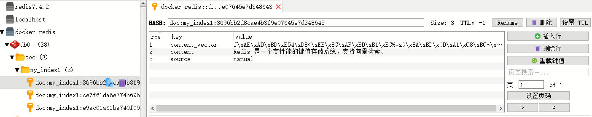

