# A2A：AI架构的协议革命

概述：

在AI技术快速发展的今天，两个关键协议正在重塑我们构建智能系统的方式：

Google的Agent-to-Agent协议(A2A)和Model Context Protocol(MCP)。

这两个协议代表了AI架构发展的不同维度，但它们共同指向一个未来：我们正从确定性编程转向自主协作系统

## 协议的本质区别：工具vs代理

MCP（Model Context Protocol）：本质上是关于工具访问的协议。它定义了大语言模型如何与各种工具、数据和资源交互的标准方式。简单来说，MCP让AI能够使用各种功能，就像程序员调用函数一样。

A2A（Agent-to-Agent Protocol）：则专注于代理协作。它建立了智能代理之间相互发现、交流和合作的方式，使得不同的AI系统能够像人类团队一样协同工作。

A2A vs MCP：

MCP是工具车间，它让工人（AI模型）知道每个工具（API、函数）的位置、用途和使用方法，但不指导工人之间如何合作。

A2A是会议室，它让不同专业人士（专业AI代理）能坐在一起，理解彼此的专长，并协调如何共同完成复杂任务。


一个修车厂的例子：想象一个自动修车厂，有多个AI维修工：

MCP的角色：让维修工知道如何使用千斤顶、扳手、测试仪等特定工具。"将平台升高2米"，"把扳手向右转4毫米"这样的结构化指令，是人 invoke 工具

A2A的角色：让客户能与维修工交流（"我的车发出咔嗒声"）并让维修工之间或与配件供应商代理协作。"发送左轮的照片"，"我注意到有液体泄漏，这种情况持续多久了？"，是车主和工程师及工程师之间的沟通协商协作

## 多智能体架构 (Multi-Agent Architecture)

[文档](https://docs.langchain.com/oss/python/langchain/multi-agent)

在 LangChain 体系中，LangChain 主要集成了和大语言模型的交互能力。LangGraph 主要实现复杂的流程调度。

将这两个能力结合起来，就可以实现一个多智能体架构 (Multi-Agent Architecture)，它不是让一个大模型“无所不能”，而是通过 多个专精的 Agent 协作来完成更复杂的任务。

### 单智能体(Single Agent)

Single Agent（单智能体）

结构： 一个 LLM + 工具集合，LLM 决定是否调用工具，自己完成所有逻辑

使用场景：简单对话助手、单一领域（天气查询、SQL 问答、知识库 QA）

例子：“查询北京天气” → LLM 调用 get_weather()；“翻译一句话” → LLM 调用 translator()

```python
import os
from langchain.chat_models import init_chat_model
from langchain_core.messages import HumanMessage
from langchain.agents import create_agent
from dotenv import load_dotenv

load_dotenv()


# ========== 1. 获取指定城市的天气信息 ==========
def get_weather(city: str) -> str:
    """获取指定城市的天气信息。
    Args:
        city: 城市名称
    Returns:
        返回该城市的天气描述
    """
    return f"今天{city}是晴天，仅做测试，固定写死"


# ========== 2. 定义大模型 ==========
llm = init_chat_model(
    model="qwen-plus",
    model_provider="openai",
    api_key=os.getenv("QWEN_API_KEY"),
    base_url="https://dashscope.aliyuncs.com/compatible-mode/v1",
)

# 使用LangGraph提供的API创建Agent
agent = create_agent(
    model=llm,  # 添加模型
    tools=[get_weather],  # 添加工具
)
print("agent底层本质是个什么对象: " + str(type(agent)))
human_message = HumanMessage(content="今天深圳天气怎么样？")
response = agent.invoke({"messages": [human_message]})
# print(response)
print()
print("模型回答：", response["messages"][-1].content)
print()
response["messages"][-1].pretty_print()


# 使用stream方法进行流式调用
# 这里stream_mode参数有四种选项：
# - messages：流式输出大语言模型回复的token
# - updates : 流式输出每个工具调用的每个步骤。
# - values : 一次输出到所有的chunk。默认值。
# - custom : 自定义输出。主要是可以在工具内部使用get_stream_writer获取输入流，添加自定义的内容。
# for chunk in agent.stream(
#         {"messages": [{"role": "user", "content": "请问北京今天天气如何？"}]},
#         stream_mode="values",
# ):
#     chunk["messages"][-1].pretty_print()
```

### 多智能体 (Multi-Agent)

在 LangGraph 里，Agent 就是一个 可调用的节点，通常封装了一个 LLM + 工具调用逻辑。

多智能体架构 = 多个 Agent 节点组成一个图 (Graph)，它们通过消息传递、条件跳转和记忆 (Memory) 协作。

对比：

- 单智能体 → “一个大模型，负责所有决策”
- 多智能体 → “多个小模型/角色，分工明确，互相调用”

好处：

- 解耦复杂任务 → 每个 Agent 只解决自己领域的问题。
- 可扩展 → 可以动态增加新 Agent。
- 更可控 → 通过人类干预闭环 (HITL)、时间回溯 (Time Travel) 管理执行流程。

多智能体架构：

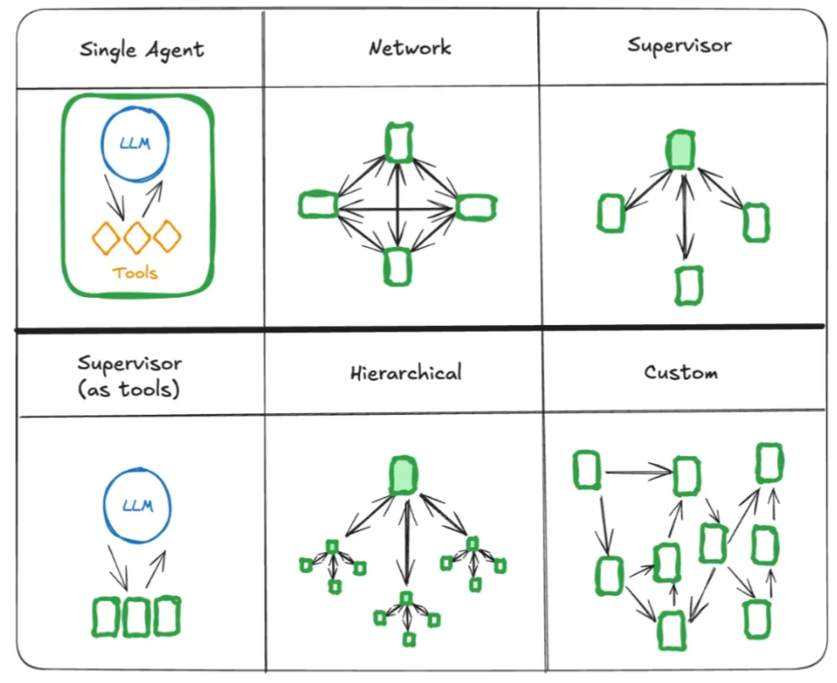

常见的智能体连接方式

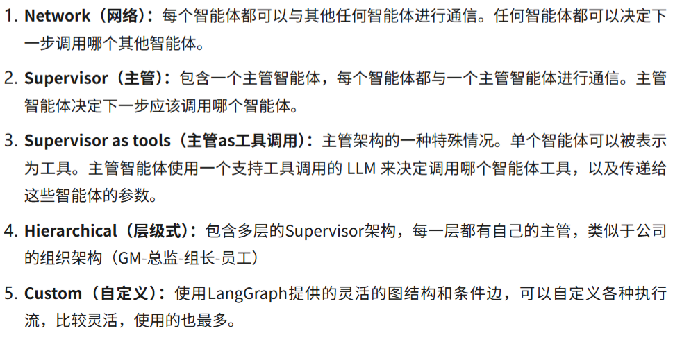

#### Network（网络型）

结构： 多个智能体平等存在，每个 Agent 可以和其他 Agent 通信，类似“去中心化网络”

使用场景：

- 多视角协作（头脑风暴）
- 并行搜索/汇总信息
- 研究讨论类场景

例子： 

- 用户问“新能源车市场前景”
- Agent A 查政策
- Agent B 查技术趋势
- Agent C 查竞争对手
- 最终，互相交流 → 给出综合分析

#### Supervisor（监督者型）

结构：一个主控 Agent（Supervisor），调度其他 Agent，子 Agent 只负责各自领域

使用场景：

- 企业助手（IT、HR、财务多领域）
- 智能客服（分配给不同领域专家）

例子：

用户问“帮我报销差旅费”，Supervisor → 路由给财务 Agent

用户问“我的邮箱密码忘了”，Supervisor → 路由给 IT Agent

####  Supervisor (as tools)（监督者作为工具）

结构：一个 LLM 可以直接调用不同的“子智能体”当作工具，子智能体更像是 专业插件

使用场景：

- 单一 LLM 核心，但可以调用领域专家
- 类似插件系统（Copilot + 插件）

例子： 主 LLM 回答问题 → 调用 法律Agent() 或 翻译Agent() 作为工具，相当于把“Agent”抽象成工具调用

#### Hierarchical（层级型）

结构：多层次的监督者，顶层 Supervisor 分配任务给子 Supervisor，子 Supervisor 再调度子 Agent

使用场景：

- 大型任务拆解（项目管理、复杂管道任务）
- AI 公司/部门结构模拟

例子：

任务：“写一份智能家居市场调研报告”

顶层 Supervisor：任务拆成「市场」「技术」「用户调研」

市场 Supervisor → 管理 3 个 Agent（查政策/竞争对手/数据）

技术 Supervisor → 管理 2 个 Agent（硬件/软件趋势）

最后顶层汇总

#### Custom（自定义混合型）

结构：根据业务需要自由组合（路由 + 协作 + 监督 + HITL）图结构灵活，不一定规则

使用场景：

- 高度定制的企业级 AI 应用
- 多步骤、多部门、多数据源场景

例子：

企业 Copilot：

用户输入 → Supervisor 判断 → 财务/IT/HR Agent

某些 Agent 互相协作（如 IT + 安全）

最终结果交给人类审批 (HITL)

#### 总结对比

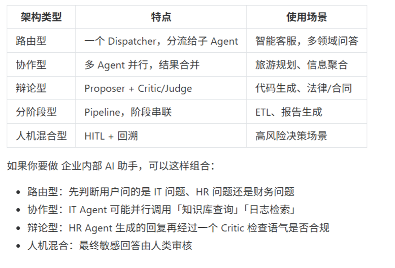

## A2A 案例

### 案例1：supervisor（主管）

每个子智能体由一个中央主管智能体协调。

主管控制所有的通信流和任务委派，根据当前上下文和任务需求决定调用哪个智能体。

Supervisor 架构模仿了企业中“项目经理”的角色。它采用经典的“管理者-工作者”结构，

由一个中心的主管代理（Supervisor）负责接收用户任务，并将其分解、委派给各个专业的工作者代理（Worker Agents），并最终整合结果。

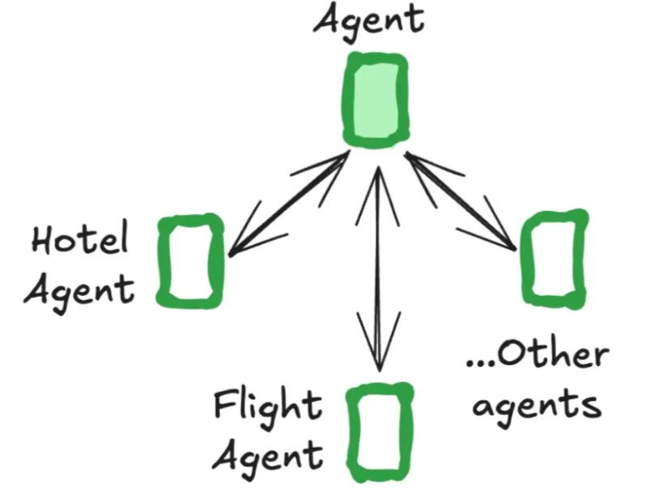

LangGraph提供了专门的Supervisor Python库

```bash
pip install langgraph-supervisor
# or
uv add langgraph-supervisor
```

流程说明

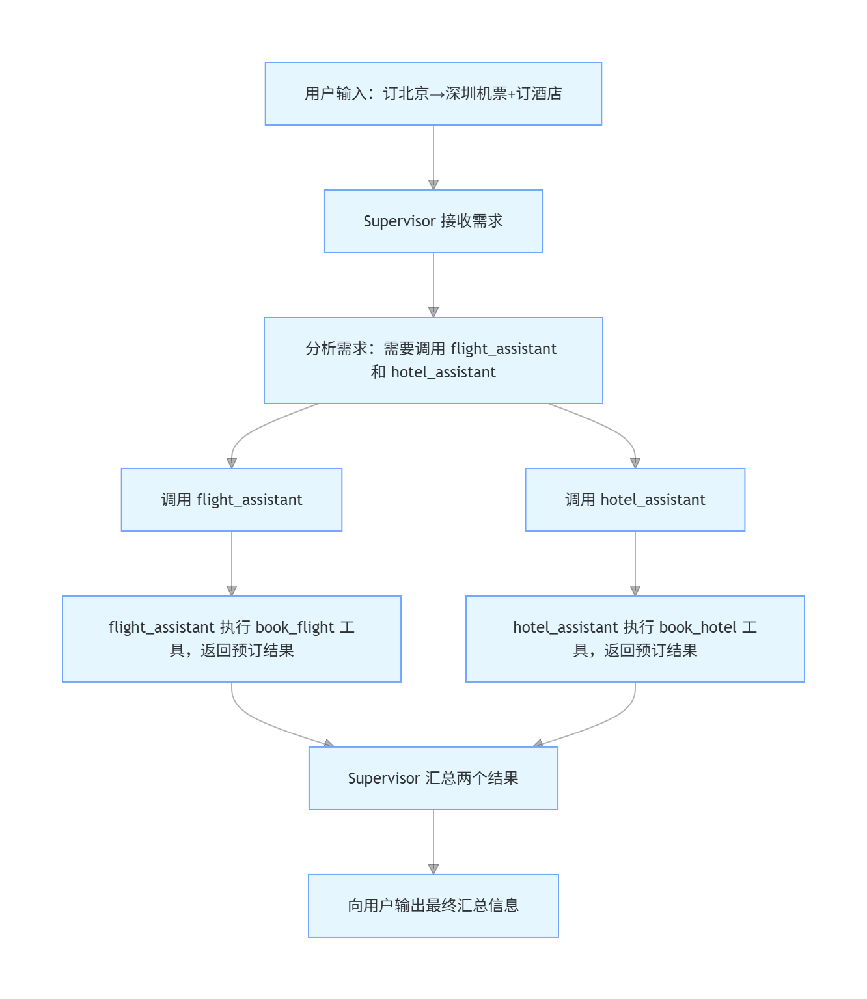

v0.3 版本

```python
import os

from langchain_core.messages import HumanMessage, AIMessage
from langchain_openai import ChatOpenAI
from langgraph.prebuilt import create_react_agent
from langgraph_supervisor import create_supervisor
from dotenv import load_dotenv

load_dotenv()


"""
langgraph.prebuilt.create_react_agent 在 LangGraph v1.0+ 中已被弃用，并将在 v2.0 中移除。

使用 langchain.agents.create_agent 来替代它
"""


def print_chinese_messages(chunk: dict):
    """
    只打印各个角色（supervisor / flight_assistant / hotel_assistant）
    输出的中文 content，过滤 tool / 空消息 / 英文控制信息
    """
    if not isinstance(chunk, dict):
        return

    for role, payload in chunk.items():
        if not isinstance(payload, dict):
            continue

        messages = payload.get("messages", [])
        for msg in messages:
            if isinstance(msg, (HumanMessage, AIMessage)):
                content = (msg.content or "").strip()
                if not content:
                    continue
                # 过滤明显的系统英文控制语
                if content.startswith("Transferring"):
                    continue
                if "Successfully transferred" in content:
                    continue

                print(f"{role}：{content}\n")


def init_llm_model() -> ChatOpenAI:
    """初始化大语言模型（ChatOpenAI）"""
    try:
        model = ChatOpenAI(
            model="qwen-plus",
            api_key=os.getenv("QWEN_API_KEY"),
            base_url="https://dashscope.aliyuncs.com/compatible-mode/v1",
            temperature=0.1,  # 低随机性，保证任务执行稳定性
            max_tokens=1024,
        )
        print("✅ 语言模型初始化成功")
        return model
    except Exception as e:
        print(f"❌ 语言模型初始化失败：{str(e)}")
        raise SystemExit(1)


def book_hotel(hotel_name: str):
    """预订酒店"""
    print(f"✅ 成功预订了 {hotel_name} 的住宿")
    return f"成功预订了 {hotel_name} 的住宿。"


def book_flight(from_airport: str, to_airport: str):
    """预订航班"""
    print(f"✅ 成功预订了从 {from_airport} 到 {to_airport} 的航班")
    return f"成功预订了从 {from_airport} 到 {to_airport} 的航班。"


flight_assistant = create_react_agent(
    model=init_llm_model(),
    tools=[book_flight],
    prompt=(
        "你是专业的航班预订助手，专注于帮助用户预订机票。\n"
        "工作流程：\n"
        "1. 从用户需求中提取出发地和目的地信息\n"
        "2. 调用book_flight工具完成预订\n"
        "3. 收到预订成功的确认后，向主管汇报结果并结束\n"
        "注意：每次只处理一个预订请求，完成后立即结束，不要重复调用工具。"
    ),
    name="flight_assistant",
)
hotel_assistant = create_react_agent(
    model=init_llm_model(),
    tools=[book_hotel],
    prompt=(
        "你是专业的酒店预订助手，专注于帮助用户预订酒店。\n"
        "工作流程：\n"
        "1. 从用户需求中提取酒店信息（如果未指定，选择经济型酒店）\n"
        "2. 调用book_hotel工具完成预订\n"
        "3. 收到预订成功的确认后，向主管汇报结果并结束\n"
        "注意：每次只处理一个预订请求，完成后立即结束，不要重复调用工具。"
    ),
    name="hotel_assistant",
)
supervisor = create_supervisor(
    agents=[flight_assistant, hotel_assistant],
    model=init_llm_model(),
    prompt=(
        "你是一个智能任务调度主管，负责协调航班预订助手(flight_assistant)和酒店预订助手(hotel_assistant)。\n\n"
        "工作流程：\n"
        "1. 分析用户需求，确定需要哪些服务（航班、酒店或两者）\n"
        "2. 如果需要预订航班，调用flight_assistant一次\n"
        "3. 如果需要预订酒店，调用hotel_assistant一次\n"
        "4. 收到助手的预订确认后，记录结果\n"
        "5. 当所有任务都完成后，向用户汇总所有预订结果，然后立即结束\n\n"
        "关键规则：\n"
        "- 每个助手只能调用一次，不要重复调用\n"
        "- 看到'成功预订'的消息后，该任务就已完成\n"
        "- 所有任务完成后，必须直接结束，不要再调用任何助手\n"
        "- 如果已经看到航班和酒店的预订确认，立即汇总并结束"
    ),
).compile()

for chunk in supervisor.stream(
    {
        "messages": [
            {
                "role": "user",
                "content": "帮我预定一个北京到深圳的机票，并且预定一个酒店",
            }
        ]
    }
):
    print(chunk)
    print("\n")
```

v1.0+ 版本

```python
import os
import re
from langchain_openai import ChatOpenAI
from langchain.agents import create_agent
from langgraph_supervisor import create_supervisor
from dotenv import load_dotenv

load_dotenv()


# 1. 初始化大语言模型
def init_llm_model() -> ChatOpenAI:
    return ChatOpenAI(
        model="qwen-plus",
        api_key=os.getenv("QWEN_API_KEY"),
        base_url="https://dashscope.aliyuncs.com/compatible-mode/v1",
        temperature=0.1,
        max_tokens=1024,
    )


# 2. Tools（必须有 docstring）
def book_flight(from_airport: str, to_airport: str) -> str:
    """预订航班工具。根据出发机场和到达机场预订一张机票，并返回预订结果。"""
    return f"✅ 成功预订了从 {from_airport} 到 {to_airport} 的航班"


def book_hotel(hotel_name: str) -> str:
    """预订酒店工具。根据酒店名称完成酒店预订，并返回预订结果。"""
    return f"✅ 成功预订了 {hotel_name} 的住宿"


# 3. 子 Agent
flight_assistant = create_agent(
    model=init_llm_model(), tools=[book_flight], name="flight_assistant"
)

hotel_assistant = create_agent(
    model=init_llm_model(), tools=[book_hotel], name="hotel_assistant"
)

# 4. 创建 Supervisor，协调者主管
supervisor = create_supervisor(
    agents=[flight_assistant, hotel_assistant],
    model=init_llm_model(),
    prompt=(
        "你是旅行预订系统的调度主管，负责协调航班预订和酒店预订。\n\n"
        "当用户提出航班和酒店预订请求时，你的工作流程是：\n"
        "1. 首先调用flight_assistant来预订航班\n"
        "2. 然后调用hotel_assistant来预订酒店\n"
        "3. 收到两个助手的结果后，汇总并向用户报告\n"
        "4. 完成后结束对话\n\n"
        "重要规则：\n"
        "- 每个助手只能调用一次\n"
        "- 不要重复任何内容\n"
        "- 不要输出任何英文\n"
        "- 所有通信都使用中文\n"
    ),
).compile()


# 5. 消息过滤器，就是一个工具类，处理大模型返回的重复废话，直接用可以不看
def filter_messages(chunk: dict) -> str:
    """提取并过滤消息，只返回中文内容，去除重复和英文"""
    output = ""

    if isinstance(chunk, dict):
        for role, payload in chunk.items():
            if isinstance(payload, dict) and "messages" in payload:
                for msg in payload["messages"]:
                    if hasattr(msg, "content") and msg.content:
                        content = msg.content.strip()

                        # 过滤英文系统消息
                        if (
                            content
                            and not content.startswith("Successfully")
                            and not content.startswith("Transferring")
                            and "Successfully transferred" not in content
                            and "transferred back to" not in content
                            and not content.startswith("帮我预订从")
                        ):
                            # 只保留中文内容
                            chinese_content = re.sub(
                                r'[^\u4e00-\u9fff，。！？：；""、\s\d✅]', "", content
                            )
                            if chinese_content and len(chinese_content.strip()) > 5:
                                output += f"{role}: {chinese_content.strip()}\n"

    return output


# 6. 主程序
def main():
    print("=" * 60)
    print(
        "智能旅行预订系统，由于大模型每次调用，可能出现预定不成功情况，这是正常反馈,主要是2026.2.8千问赠送奶茶活动，调用失败"
    )
    print("=" * 60)
    print()

    # 收集用户信息
    print("请按顺序提供以下信息：")
    print("-" * 40)

    # 1. 询问出发机场
    from_airport = input("1. 您的出发机场是哪里？: ").strip()
    while not from_airport:
        print("请输入有效的出发机场名称")
        from_airport = input("1. 您的出发机场是哪里？: ").strip()

    # 2. 询问到达机场
    to_airport = input("\n2. 您的到达机场是哪里？: ").strip()
    while not to_airport:
        print("请输入有效的到达机场名称")
        to_airport = input("2. 您的到达机场是哪里？: ").strip()

    # 3. 询问酒店名称
    hotel_name = input("\n3. 您要预订的酒店名称是什么？: ").strip()
    while not hotel_name:
        print("请输入有效的酒店名称")
        hotel_name = input("3. 您要预订的酒店名称是什么？: ").strip()

    # 构造更明确的用户请求
    user_request = (
        f"请帮我预订以下旅行安排：\n"
        f"1. 航班：从 {from_airport} 飞往 {to_airport}\n"
        f"2. 酒店：{hotel_name}\n"
        f"请完成这两个预订。"
    )

    print("\n" + "=" * 60)
    print("正在处理您的预订请求...")
    print("=" * 60)
    print()

    # 准备输入数据
    # 创建一个字典，包含一个messages键
    # messages是一个列表，包含一个消息字典
    # 每个消息字典包含role（角色）和content（内容）字段
    input_data = {"messages": [{"role": "user", "content": user_request}]}

    # 使用流式处理
    try:
        # 创建一个空集合，用于记录已经打印过的消息内容，避免重复显示
        seen_contents = set()

        for chunk in supervisor.stream(input_data):
            # 调用filter_messages函数处理当前chunk，提取并过滤其中的消息
            filtered_output = filter_messages(chunk)
            # 如果filtered_output不为空（即有过滤后的消息内容）
            if filtered_output:
                # 将过滤后的输出按行分割成列表 strip() 去除首尾空白字符，split('\n') 按换行符分割
                lines = filtered_output.strip().split("\n")
                # 遍历每一行
                for line in lines:
                    # 检查该行是否非空且不在已见过内容的集合中
                    if line and line not in seen_contents:
                        print(line)
                        # 将该行内容添加到已见过集合中，确保不会重复打印
                        seen_contents.add(line)

        # 如果输出太少，显示总结信息
        if len(seen_contents) < 2:
            print("\n" + "=" * 60)
            print("预订已完成！")
            print(f"航班：从 {from_airport} 到 {to_airport}")
            print(f"酒店：{hotel_name}")
            print("=" * 60)
    except Exception as e:
        print(f"\n处理过程中出现错误: {e}")
        # 如果出错，直接调用工具
        print("\n正在直接执行预订...")
        flight_result = book_flight(from_airport, to_airport)
        hotel_result = book_hotel(hotel_name)
        print(flight_result)
        print(hotel_result)

    print("\n感谢使用智能旅行预订系统！")


# 7. 运行主程序
if __name__ == "__main__":
    try:
        main()
    except KeyboardInterrupt:
        print("\n\n程序被用户中断。")
    except Exception as e:
        print(f"\n系统出现错误: {e}")


"""
运行结果如下：

============================================================
智能旅行预订系统，由于大模型每次调用，可能出现预定不成功情况，这是正常反馈
============================================================

请按顺序提供以下信息：
----------------------------------------
1. 您的出发机场是哪里？: 北京首都

2. 您的到达机场是哪里？: 深圳宝安

3. 您要预订的酒店名称是什么？: 深圳希尔顿

============================================================
正在处理您的预订请求...
============================================================

supervisor: 请帮我预订以下旅行安排：
1 航班：从 北京首都 飞往 深圳宝安
2 酒店：深圳希尔顿
请完成这两个预订。
flight_assistant: 航班已成功预订！接下来，我将为您预订深圳希尔顿酒店。由于当前工具仅支持航班预订，我需要切换到酒店预订助手来完成此任务。
正在为您转接到酒店预订助手
supervisor: 航班已成功预订！接下来，我将为您预订深圳希尔顿酒店。由于当前工具仅支持航班预订，我需要切换到酒店预订助手来完成此任务。
hotel_assistant: ✅ 您的旅行安排已全部完成：
1 航班：已成功预订，从北京首都机场飞往深圳宝安机场由航班助手完成。
2 酒店：已成功预订 深圳希尔顿由酒店助手完成。
如有其他需求如接送、餐饮、景点门票等，欢迎随时告诉我！祝您旅途愉快！
supervisor: ✅ 您的旅行安排已全部完成：
1 航班：已成功预订，从北京首都机场飞往深圳宝安机场。
2 酒店：已成功预订深圳希尔顿酒店。
所有预订均已确认，祝您旅途愉快！

感谢使用智能旅行预订系统！
"""
```

### 案例2：handoffs（交接）

handoffs 指的是一个智能体将控制权交接给另一个智能体，handoffs需要包含两个最基本的要素：

- 目的地：下一个智能体

- State：传递给下一个智能体的信息

Supervisor都默认使用了create_handoff_tool移交工具，我们也可以自己实现交接函数

```python
import os
from typing import Annotated
from langchain_openai import ChatOpenAI
from langchain_core.messages import HumanMessage
from langchain_core.tools import tool
from langchain.agents import create_agent
from langgraph.graph import StateGraph, START
from langgraph.graph.message import MessagesState
from langgraph.prebuilt.tool_node import InjectedState
from langgraph.types import Command, Send
from dotenv import load_dotenv

load_dotenv()


# ===============================
# 1. 初始化大语言模型
# ===============================
def init_llm_model() -> ChatOpenAI:
    return ChatOpenAI(
        model="qwen-plus",
        api_key=os.getenv("QWEN_API_KEY"),
        base_url="https://dashscope.aliyuncs.com/compatible-mode/v1",
        temperature=0.1,
        max_tokens=1024,
    )


model = init_llm_model()


# ===============================
# 2. 通用 Handoff 工具工厂
# ===============================
def create_task_description_handoff_tool(
    *, agent_name: str, description: str | None = None
):
    name = f"transfer_to_{agent_name}"
    description = description or f"移交给 {agent_name}"

    @tool(name, description=description)
    def handoff_tool(
        task_description: Annotated[
            str, "描述下一个 Agent 应该做什么，包括所有必要信息"
        ],
        state: Annotated[MessagesState, InjectedState],
    ) -> Command:
        task_description_message = {
            "role": "user",
            "content": task_description,
        }
        agent_input = {
            **state,
            "messages": [task_description_message],
        }

        return Command(
            goto=[Send(agent_name, agent_input)],
            graph=Command.PARENT,
        )

    return handoff_tool


# ===============================
# 3. 业务工具（必须有 docstring）
# ===============================
@tool("book_flight")
def book_flight(from_airport: str, to_airport: str) -> str:
    """预订航班，根据出发地和目的地完成机票预订"""
    print(f"✅ 成功预订了从 {from_airport} 到 {to_airport} 的航班")
    return f"成功预订了从 {from_airport} 到 {to_airport} 的航班。"


@tool("book_hotel")
def book_hotel(hotel_name: str) -> str:
    """预订酒店，根据酒店名称完成预订"""
    print(f"✅ 成功预订了 {hotel_name} 的住宿")
    return f"成功预订了 {hotel_name} 的住宿。"


# ===============================
# 4. Handoff 工具
# ===============================
transfer_to_flight_assistant = create_task_description_handoff_tool(
    agent_name="flight_assistant",
    description="将任务移交给航班预订助手",
)

transfer_to_hotel_assistant = create_task_description_handoff_tool(
    agent_name="hotel_assistant",
    description="将任务移交给酒店预订助手",
)


# ===============================
# 5. 定义 Agent（create_agent 新接口）
# create_agent 不再显式接收 prompt，而是：
# 通过 tool schema + tool 名称 + tool docstring
# 通过 graph 上下文（handoff 描述）
# 通过 MessagesState 历史消息
# ===============================
flight_assistant = create_agent(
    model=model,
    tools=[book_flight, transfer_to_hotel_assistant],  # 包含移交工具
    name="flight_assistant",
)

hotel_assistant = create_agent(
    model=model,
    tools=[book_hotel, transfer_to_flight_assistant],  # 包含移交工具
    name="hotel_assistant",
)


# ===============================
# 6. 构建多 Agent Graph
# ===============================
multi_agent_graph = (
    StateGraph(MessagesState)
    .add_node(flight_assistant)
    .add_node(hotel_assistant)
    .add_edge(START, "flight_assistant")
    .compile()
)


# ===============================
# 7. 运行
# ===============================
if __name__ == "__main__":
    result = multi_agent_graph.invoke(
        {
            "messages": [
                HumanMessage(content="帮我预订从北京到上海的航班，并预订如家酒店")
            ]
        }
    )

    print("\n====== 最终对话结果 ======")
    for msg in result["messages"]:
        if msg.type in ("human", "ai"):
            print(msg.content)
```

## Agent Skills（智能体技能）

[文档1](https://agentskills.io/what-are-skills)、[文档2](https://developers.openai.com/codex/skills/)

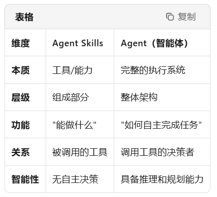

可以把 Agent 想象成一位厨师，而 Agent Skills 就是厨师掌握的各种烹饪技法（刀工、炒、蒸、烤等）和厨房工具（锅、铲、烤箱等）。

厨师（Agent）：决定做什么菜、用什么食材、按什么顺序操作

烹饪技法（Skills）：完成具体工序的能力单元和工序流程

没有厨师，技法只是闲置的工具；没有技法，厨师也无法完成烹饪。两者结合，才能做出美味的菜肴。

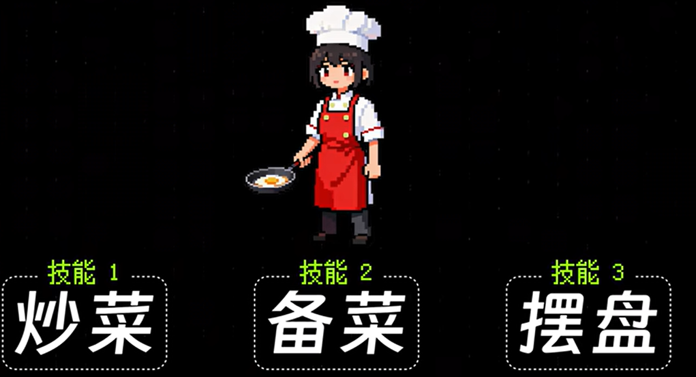

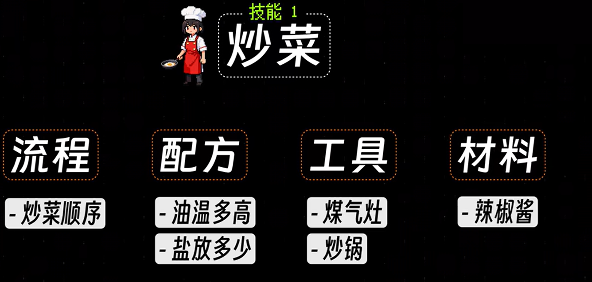

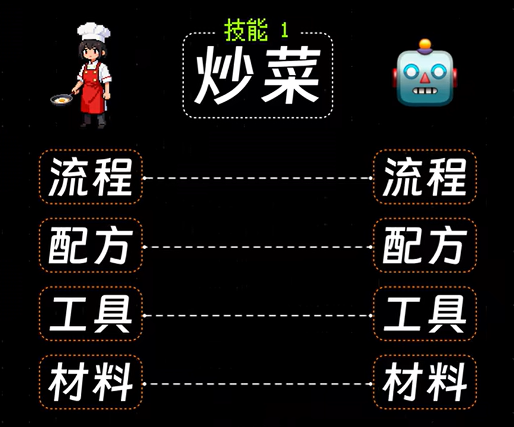

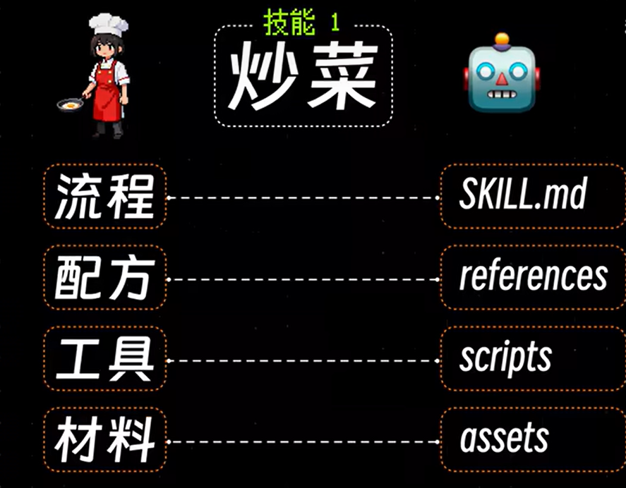

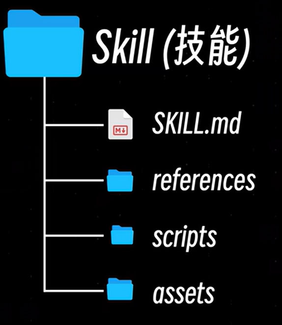

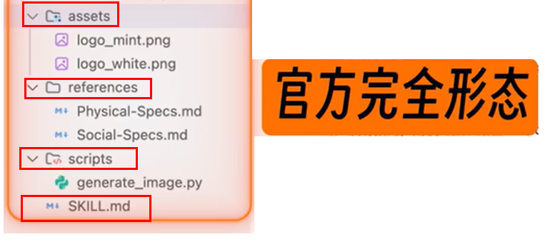

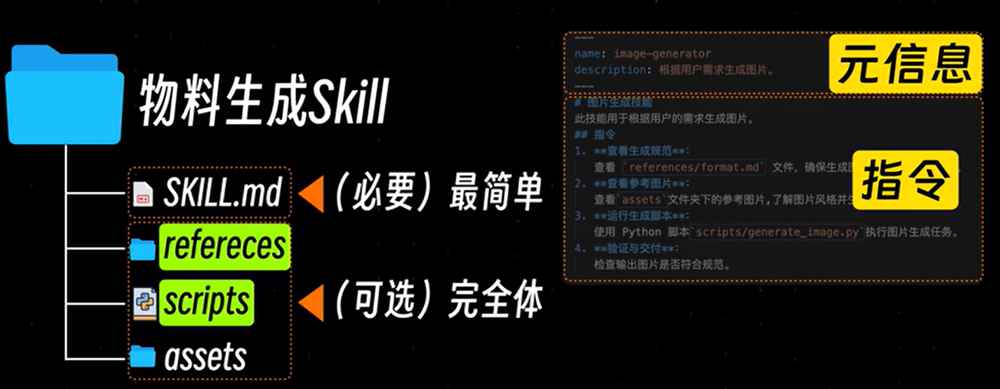

skills 官方说法就是 **渐进式披露三层架构**

简单


复杂

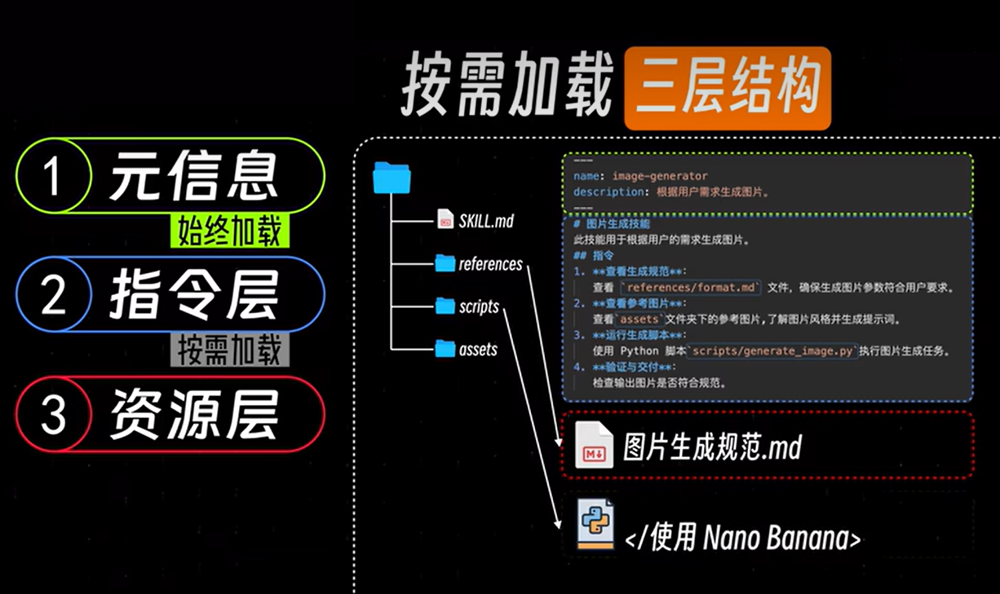

**总结：提示词的规范化+工程化规约落地实现，类似提示词版本的maven结构**