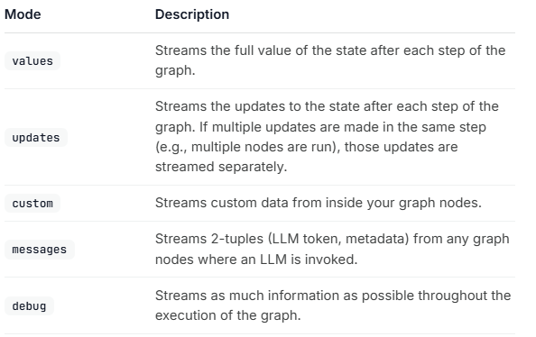
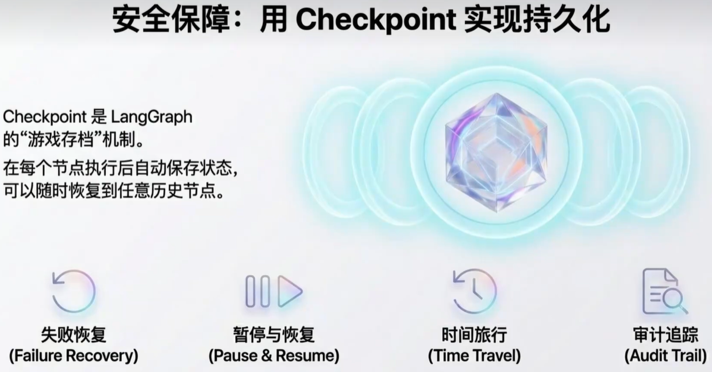
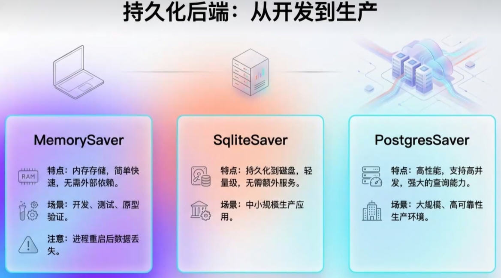
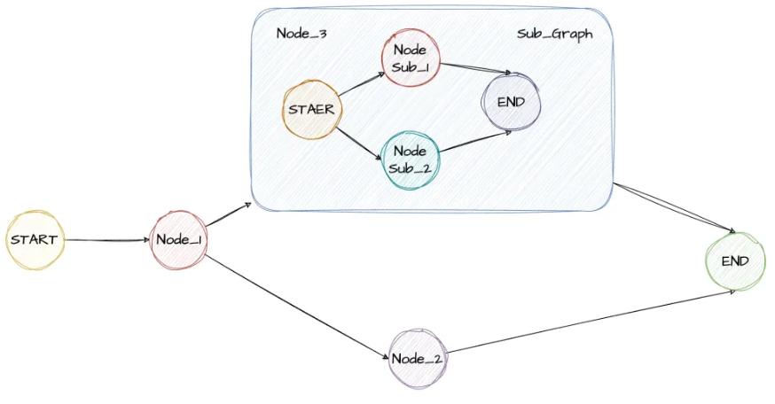

# LangGraph 高级特性

## 高级特性之流式处理(Streaming)

[文档](https://docs.langchain.com/oss/python/langgraph/streaming)

LangGraph 里的 “流式传输” 功能，核心就是让 AI 应用（比如用大语言模型做的工具、对话机器人）能 “实时输出结果”，不用等整个流程跑完，体验更流畅。


用大白话拆解重点： 大语言模型（LLM）回应通常有点慢，流式传输能让结果 “一点点蹦出来”（比如打字机似的），用户不用干等，体验更好。简单说，这功能就是让 LangGraph 做的 AI 应用 “更透明、更流畅”，用户能实时看到进度，开发者也方便调试，还能灵活适配各种需求。

langchain流式输出，它主要是处理回复的长篇文字信息内容； langgraph流式输出，实时看流程状态 。

能实现啥效果？

- 实时看流程状态：比如知道 AI 现在在处理哪个步骤、当前的结果是什么（比如 “正在细化主题”“已生成笑话初稿”）；
- 实时看子流程结果：如果你的 AI 流程里嵌套了小流程（子图），也能同步看到子流程的进度；
- 实时看 LLM 输出的每一个字：比如 AI 写笑话时，每个词、每句话实时蹦出来，不是最后一次性显示；
- 自定义实时消息：比如让 AI 干活时，实时发 “进度 30%”“正在调用工具查数据” 这种自定义提示；
- 调试用：能看到流程里的详细细节，方便找问题。

怎么使用？

就像选功能开关一样，用的时候指定 “模式” 就行



- values：每步结束后，输出完整的当前状态（比如 “主题：冰淇淋和猫；笑话：xxx”）；
- updates：每步结束后，只输出变化的部分（比如只显示 “主题新增了‘和猫’”）；
- messages：专门实时输出 LLM 的每一个字 / 词，还带相关信息（比如是哪个步骤调用的 LLM）；
- custom：只输出你自定义的消息（比如进度提示）；
- debug：输出所有细节，方便调试。

基本用法：LangGraph有stream（同步）和astream（异步）方法，以迭代器的形式生成流式输出。

案例1：流图状态(Stream graph state)

使用流模式，并在图执行时流式传输其状态。updates  values

- updates在图的每一步后，将更新流向状态。
- values在图的每一步后，流出状态的全部值。

```python
"""
StreamGraphState.py

流图状态
使用流模式，并在图执行时流式传输其状态。updatesvalues
updates在图的每一步后，将更新流向状态。
values在图的每一步后，流出状态的---->全部值。
"""

from typing import TypedDict
from langgraph.graph import StateGraph, START, END


class AtguiguState(TypedDict):
    topic: str
    joke: str


def refine_topic(state: AtguiguState):
    return {"topic": state["topic"] + " and cats"}


def generate_joke(state: AtguiguState):
    return {"joke": f"This is a joke about {state['topic']}"}


def main():
    graph = (
        StateGraph(AtguiguState)
        .add_node(refine_topic)
        .add_node(generate_joke)
        .add_edge(START, "refine_topic")
        .add_edge("refine_topic", "generate_joke")
        .add_edge("generate_joke", END)
        .compile()
    )

    # updates在图的每一步后，将更新流向状态。
    for chunk in graph.stream({"topic": "ice cream"}, stream_mode="updates"):
        print(chunk)

    print()

    # values在图的每一步后，流出状态的全部值。
    for chunk in graph.stream({"topic": "ice cream"}, stream_mode="values"):
        print(chunk)


if __name__ == "__main__":
    main()
```

案例2：多模式流+debug模式并存(Stream multiple mdes)

将列表作为stream_mode参数传递，以同时流式传输多种模式。

流式输出将是(mode, chunk)形式的元组，其中mode是流模式的名称，chunk是该模式所流式传输的数据。

```python
"""
StreamMultipleModes.py
LangGraph 多模式流式传输演示
"""

from typing import TypedDict
from langgraph.graph import StateGraph, START, END


# 定义状态类型
class AtguiguState(TypedDict):
    question: str
    answer: str
    confidence: float  # 置信度分数
    steps: list


def think(state: AtguiguState) -> AtguiguState:
    """思考节点"""
    question = state["question"]
    # 模拟思考过程
    steps = [f"分析问题: {question}", "检索相关知识", "形成初步答案"]
    return {"steps": steps}


def respond(state: AtguiguState) -> AtguiguState:
    """回应节点"""
    question = state["question"]
    # 根据问题生成答案
    if "天气" in question:
        answer = "今天天气晴朗"
        confidence = 0.9
    elif "时间" in question:
        answer = "现在是上午10点"
        confidence = 0.8
    else:
        answer = "这是一个很好的问题"
        confidence = 0.7

    return {"answer": answer, "confidence": confidence}


def reflect(state: AtguiguState) -> AtguiguState:
    """反思节点"""
    answer = state["answer"]
    confidence = state["confidence"]
    steps = state.get("steps", [])

    steps.append(f"验证答案: {answer}")
    steps.append(f"置信度评估: {confidence}")

    if confidence > 0.8:
        conclusion = "高置信度答案"
    elif confidence > 0.5:
        conclusion = "中等置信度答案"
    else:
        conclusion = "低置信度答案"

    steps.append(f"结论: {conclusion}")

    return {"steps": steps}


def main():
    # 构建图
    builder = StateGraph(AtguiguState)
    builder.add_node("think", think)
    builder.add_node("respond", respond)
    builder.add_node("reflect", reflect)

    builder.add_edge(START, "think")
    builder.add_edge("think", "respond")
    builder.add_edge("respond", "reflect")
    builder.add_edge("reflect", END)

    graph = builder.compile()

    print("=== LangGraph 多模式流式传输演示 ===\n")

    # 准备输入
    input_state = {
        "question": "今天天气怎么样?",
        "answer": "",
        "confidence": 0.0,
        "steps": [],
    }

    print("--- 1. 使用 stream_mode='values' 模式 ---")
    print("显示每一步执行后的完整状态:")
    for chunk in graph.stream(input_state, stream_mode="values"):
        print(f"  {chunk}")

    print("\n" + "=" * 60 + "\n")

    print("--- 2. 使用 stream_mode='updates' 模式 ---")
    print("只显示每一步的状态更新:")
    for chunk in graph.stream(input_state, stream_mode="updates"):
        print(f"  {chunk}")

    print("\n" + "=" * 60 + "\n")
    #
    print("--- 3. 同时使用stream_mode=[values,updates]多种流模式 ---")
    print("同时显示完整状态和状态更新:")
    for mode, chunk in graph.stream(input_state, stream_mode=["values", "updates"]):
        print(f"  [{mode}]: {chunk}")

    print("\n" + "=" * 60 + "\n")

    print("--- 4. 使用 debug 模式 ---")
    print("显示详细的调试信息:")
    try:
        for chunk in graph.stream(input_state, stream_mode="debug"):
            print(f"  {chunk}")
    except Exception as e:
        print(f"  Debug模式可能需要特殊配置: {e}")


if __name__ == "__main__":
    main()
```

案例3： LLM令牌(LLM tokens)

使用messages流模式，从图中的任何部分（包括节点、工具、子图或任务）逐token流式传输大型语言模型（LLM）的输出。
messages模式的流式输出是一个元组(message_chunk, metadata)，其中：

- message_chunk：来自大语言模型（LLM）的令牌或消息片段。
- metadata：一个包含图节点和大语言模型调用详情的字典。

```python
"""
StreamLLMTokens.py

使用messages流模式，从图中的任何部分（包括节点、工具、子图或任务）逐token流式传输大型语言模型（LLM）的输出。
messages模式的流式输出是一个元组(message_chunk, metadata)，其中：
- message_chunk：来自大语言模型（LLM）的令牌或消息片段。
- metadata：一个包含图节点和大语言模型调用详情的字典元数据。

"""

from typing import TypedDict
from langgraph.graph import StateGraph, START
from langchain.chat_models import init_chat_model
import os
from dotenv import load_dotenv

load_dotenv()


class State(TypedDict):
    query: str
    answer: str


def node(state: State):
    print("开始调用node节点")

    model = init_chat_model(
        model="qwen-plus",
        model_provider="openai",
        api_key=os.getenv("QWEN_API_KEY"),
        base_url="https://dashscope.aliyuncs.com/compatible-mode/v1",
    )

    llm_result = model.invoke([("user", state["query"])])
    print("llm invoke结束", end="\n\n")

    return {"answer": llm_result}


def main():
    graph = (
        StateGraph(state_schema=State).add_node(node).add_edge(START, "node").compile()
    )

    inputs = {"query": "帮我生成一个100字的小学生作文，主题为我的一天"}

    # stream_mode="messages"从任何调用了大语言模型的图节点流式传输二元组（大语言模型token，元数据）。
    """messages模式的流式输出是一个元组(message_chunk, metadata)，其中：
    - message_chunk：来自大语言模型（LLM）的令牌或消息片段。
    - metadata：一个包含图节点和大语言模型调用详情的字典元数据。"""
    for chunk, meta_data in graph.stream(inputs, stream_mode="messages"):
        # print(f"type of chunk:{type(chunk)}")
        print(chunk.content, end="")
        # print(meta_data, end="")
        # print(chunk, end="")


if __name__ == "__main__":
    main()
```

案例4：流式传输自定义数据StreamCustomData

要从LangGraph节点或工具内部发送自定义用户定义数据，请遵循以下步骤：

1. 使用get_stream_writer访问流写入器并发送自定义数据。
2. 调用.stream()或.astream()时，设置stream_mode="custom"以在流中获取自定义数据。你可以组合多种模式（例如["updates", "custom"]），但至少有一种模式必须是"custom"。

```python
"""
StreamCustomData.py

要从LangGraph节点或工具内部发送自定义用户定义数据，请遵循以下步骤：
	使用get_stream_writer访问流写入器并发送自定义数据。
	调用.stream()或.astream()时，设置stream_mode="custom"以在流中获取自定义数据。
你可以组合多种模式（例如["updates", "custom"]），但至少有一种模式必须是"custom"。

LangGraph 自定义数据流式传输演示
展示如何从节点内部发送自定义用户定义数据
"""

from typing import TypedDict
from langgraph.config import get_stream_writer
from langgraph.graph import StateGraph, START, END


class State(TypedDict):
    query: str
    answer: str
    progress: list


def node_with_custom_streaming(state: State) -> State:
    """带自定义流式传输的节点"""
    # 获取流写入器以发送自定义数据,使用get_stream_writer访问流写入器并发送自定义数据。
    writer = get_stream_writer()

    # 发送自定义数据（例如，进度更新）
    writer({"custom_key": "开始处理查询"})
    writer({"progress": "步骤1: 分析查询内容", "status": "running"})

    query = state["query"]

    writer({"progress": "步骤2: 生成结果", "status": "running"})
    writer({"progress": "步骤3: 完成处理", "status": "completed"})
    writer({"custom_key": "查询处理完成"})

    # 模拟处理过程
    result = f"处理结果: {query.upper()}"
    return {"answer": result, "progress": state.get("progress", []) + ["处理完成"]}


def main():
    print("=== LangGraph 自定义数据流式传输演示 ===\n")

    # 构建图
    graph = (
        StateGraph(State)
        .add_node("node_with_custom_streaming", node_with_custom_streaming)
        .add_edge(START, "node_with_custom_streaming")
        .add_edge("node_with_custom_streaming", END)
        .compile()
    )

    inputs = {"query": "hello world", "answer": "", "progress": []}

    print("--- 1. 单独使用 custom 流模式 ---")
    try:
        # 设置 stream_mode="custom" 以在流中接收自定义数据
        for chunk in graph.stream(inputs, stream_mode="custom"):
            print(f"自定义数据块: {chunk}")
    except Exception as e:
        print(f"错误: {e}")
        print("说明: 在Graph API中，自定义流数据需要在节点中通过特定方式发送")

    print("\n" + "=" * 50 + "\n")

    print("--- 2. 单独使用 updates 流模式 ---")
    for chunk in graph.stream(inputs, stream_mode="updates"):
        print(f"状态更新: {chunk}")

    print("\n" + "=" * 50 + "\n")
    #
    print("--- 3. 同时使用 custom 和 updates 流模式 ---")
    try:
        for mode, chunk in graph.stream(inputs, stream_mode=["custom", "updates"]):
            print(f"[{mode}]: {chunk}")
    except Exception as e:
        print(f"错误: {e}")
        print("说明: 在Graph API中，需要特殊配置才能使用自定义流模式")


if __name__ == "__main__":
    main()
```

```python
"""
StreamCustomDataSimple.py

要从LangGraph节点或工具内部发送自定义用户定义数据，请遵循以下步骤：
- 使用get_stream_writer访问流写入器并发送自定义数据。
- 调用.stream()或.astream()时，设置stream_mode="custom"以在流中获取自定义数据。
你可以组合多种模式（例如["updates", "custom"]），但至少有一种模式必须是"custom"。

LangGraph 自定义数据流式传输演示
展示如何从节点内部发送自定义用户定义数据
"""

from typing import TypedDict
from langgraph.config import get_stream_writer
from langgraph.graph import StateGraph, START, END


class State(TypedDict):
    query: str
    answer: str


def node(state: State):
    # Get the stream writer to send custom data
    writer = get_stream_writer()
    # Emit a custom key-value pair (e.g., progress update)
    writer({"custom_key": "学习Agent，O(∩_∩)O"})
    return {"answer": "some data"}


graph = (
    StateGraph(State)
    .add_node(node)
    .add_edge(START, "node")
    .add_edge("node", END)
    .compile()
)

# Set stream_mode="custom" to receive the custom data in the stream
# for chunk in graph.stream({"query": "example"}, stream_mode=["custom"]):
#     print(chunk)
#
# for chunk in graph.stream({"query": "example"}, stream_mode=["updates", "custom"]):
#     print(chunk)
#
for chunk in graph.stream({"query": "example"}, stream_mode=["values", "custom"]):
    print(chunk)
```

## 高级特性之状态持久化(Persistence）

[文档](https://docs.langchain.org.cn/oss/python/langgraph/persistence)


状态持久化指的是在程序运行时将瞬间的状态保存下来，以便后续需要的时候能够重新恢复执行，用于解决因为程序退出、重启等事件而丢失任务。在 LangGraph 如果使用了持久化，工作流执行的每个步骤结束后，系统会自动将当前整个图的状态（包括所有变量、历史消息、下一步要执行的节点等信息）完整地保存下来，这份存档就是一个检查点（Checkpoint），LangGraph支持存储在内存、Redis、DB等存储介质中。

检查点通过thread_id（会话id，不是操作系统中的线程id）区分不同的会话，后续重新执行时会使用。使用检查点调用图时，必须在配置的可配置部分指定thread_id。`{"configurable": {"thread_id": "user-001"}`。

 短期记忆（Checkpointer）



- 载体：Checkpointer（MemorySaver、RedisSaver、PostgresSaver…）

- 作用：把每轮消息 + 工具调用结果序列化成图状态，按 thread_id 持久化；下次传入相同 thread_id 自动续写。

- 原理：每次你调用 graph.invoke(...) 或 graph.stream(...)，LangGraph 都会维护一个状态（state）。如果没有 Checkpointer，这个 state 默认只存在本次调用内，调用结束就丢掉了。如果启用了 Checkpointer，它会把 state 保存到存储中（内存/数据库/文件），下次继续调用时，可以恢复之前的 state，实现“记忆”。

长期记忆（BaseStore）

- 载体：BaseStore（InMemoryStore、RedisStore、AsyncPostgresStore…）

- 作用：显式保存“用户偏好”“背景事实”等高密度信息，由 LLM 主动读写；Store 支持向量检索，支持命名空间隔离。

BaseStore 和 Checkpointer 的区别：

Checkpointer：保存图的运行状态（短期记忆，主要用于同一个线程连续对话）。

Store：LangGraph的存储模块提供持久化的键值存储，支持跨线程和会话的长期内存，适用于需持久化数据的复杂工作流。

案例1：内存检查点

```python
"""
MemoryPersistence.py
langgraph-checkpoint：检查点保存器（BaseCheckpointSaver）
的基础接口以及序列化/反序列化接口（SerializerProtocol）。
包含用于实验的内存中检查点实现（InMemorySaver）。
LangGraph 已内置 langgraph-checkpoint。


LangGraph 1.0 持久化存储演示 - 内存存储 (In-Memory)

特点：
- 数据暂存于内存，程序关闭后丢失
- 无需额外配置
- 适用于本地测试和临时验证工作流逻辑
"""

from typing import Annotated
from typing_extensions import TypedDict
from langgraph.graph import StateGraph, START, END
from langgraph.checkpoint.memory import InMemorySaver
import operator


# 定义状态
class PersistenceDemoState(TypedDict):
    # operator.add：将元素追加到现有元素中，支持列表、字符串、数值类型的追加
    messages: Annotated[list, operator.add]
    step_count: Annotated[int, operator.add]


# 节点函数
def step_one(state: PersistenceDemoState) -> dict:
    print("执行步骤 1")
    return {"messages": ["执行了步骤 1"], "step_count": 1}


def step_two(state: PersistenceDemoState) -> dict:
    print("执行步骤 2")
    return {"messages": ["执行了步骤 2"], "step_count": 1}


def step_three(state: PersistenceDemoState) -> dict:
    print("执行步骤 3")
    return {"messages": ["执行了步骤 3"], "step_count": 1}


# 构建图
def create_graph():
    builder = StateGraph(PersistenceDemoState)

    builder.add_node("step_one", step_one)
    builder.add_node("step_two", step_two)
    builder.add_node("step_three", step_three)

    builder.add_edge(START, "step_one")
    builder.add_edge("step_one", "step_two")
    builder.add_edge("step_two", "step_three")
    builder.add_edge("step_three", END)

    return builder


def main():
    print("=== LangGraph 1.0 内存持久化存储演示 ===\n")

    # 编译图并使用内存存储
    graph = create_graph()
    app = graph.compile(checkpointer=InMemorySaver())

    # 配置线程ID用于存储状态
    config = {"configurable": {"thread_id": "user_13811112222"}}

    print("1. 首次执行工作流:")
    result = app.invoke({"messages": ["开始执行"], "step_count": 0}, config)

    print(f"执行结果result: {result}\n")

    print("2. 检查存储的状态:")
    saved_state = app.get_state(config)
    print(f"保存的状态: {saved_state.values}")
    print(f"下一个节点: {saved_state.next}\n")

    # 获取指定线程的完整执行历史（正序：从最早到最晚,第一步在栈底）
    history = app.get_state_history(config)
    # 遍历历史中的每一个检查点快照
    for checkpoint in history:
        print("=" * 50)
        # 该时刻的完整State状态（最核心）
        print(f"当前状态: {checkpoint.values}")

    print("=" * 80)
    print("3. 恢复执行工作流:")
    # 由于工作流已经完成，这里会直接返回最终结果
    result2 = app.invoke(None, config)
    print(f"恢复执行结果: {result2}\n")

    print("=== 演示结束 ===")


if __name__ == "__main__":
    main()
```

案例2：数据库检查点(sqlite)



```python
"""
SqlitePersistence.py
在底层，检查点功能由符合BaseCheckpointSaver接口的检查点对象提供支持。
LangGraph提供了多种检查点实现，所有这些实现都通过独立的、可安装的库来完成，数据库类型的有：
	langgraph-checkpoint-sqlite：使用SQLite数据库（SqliteSaver / AsyncSqliteSaver）存储检查点。
非常适合实验和本地工作流程。需要单独安装。
	langgraph-checkpoint-postgres：使用Postgres数据库（PostgresSaver / AsyncPostgresSaver）
存储检查点，用于LangSmith。非常适合在生产环境中使用。需要单独安装。
......

本次案例，安装sqlite所需依赖
pip install langgraph-checkpoint-sqlite
"""

import sqlite3
import operator
from typing import TypedDict, Annotated
from langgraph.checkpoint.sqlite import SqliteSaver
from langgraph.graph import StateGraph, START, END


class MyState(TypedDict):
    messages: Annotated[list, operator.add]


def node_1(state: MyState):
    return {"messages": ["abc", "def"]}


def main():
    # 数据存储到D:\\workspace目录下面，需要目录存在
    conn = sqlite3.connect(
        database="D:\\workspace\\sqlite_data.db", check_same_thread=False
    )
    sqliteDB = SqliteSaver(conn=conn)

    builder = StateGraph(MyState)
    builder.add_node("node_1", node_1)

    builder.add_edge(START, "node_1")
    builder.add_edge("node_1", END)

    graph = builder.compile(checkpointer=sqliteDB)
    # 同一个用户id下，每次执行都会插入一次新数据
    config = {"configurable": {"thread_id": "user-001"}}

    initial_state = graph.get_state(config)
    print(f"Initial state: {initial_state}")

    # 执行图
    result = graph.invoke({"messages": []}, config)
    print(f"Result: {result}")

    print()
    print("====================查看执行后的状态====================")
    # 查看执行后的状态
    final_state = graph.get_state(config)
    print()
    print(f"Final state: {final_state}")

    conn.close()


if __name__ == "__main__":
    main()
```

案例3：预构建 Agent 实现记忆存储

```python
import os
from langchain.chat_models import init_chat_model
from langgraph.checkpoint.memory import InMemorySaver
from langchain.agents import create_agent
from dotenv import load_dotenv

load_dotenv()

# ==========定义大模型 ==========
llm = init_chat_model(
    model="qwen-plus",
    model_provider="openai",
    api_key=os.getenv("QWEN_API_KEY"),
    temperature=0.0,
    base_url="https://dashscope.aliyuncs.com/compatible-mode/v1",
)

# 定义短期记忆使用内存（生产可以换 RedisSaver/PostgresSaver）
checkpointer = InMemorySaver()
agent = create_agent(model=llm, checkpointer=checkpointer)
# 多轮对话配置，同一 thread_id 即同一会话
config = {"configurable": {"thread_id": "user-001"}}

msg1 = agent.invoke(
    {"messages": [("user", "你好，我叫张三，喜欢足球，60字内简洁回复")]}, config
)
msg1["messages"][-1].pretty_print()

# 6. 第二轮（继续同一 thread）
msg2 = agent.invoke({"messages": [("user", "我叫什么？我喜欢做什么？")]}, config)
msg2["messages"][-1].pretty_print()
```

## 高级特性之时间回溯(Time-Travel)

[文档](https://docs.langchain.com/oss/python/langgraph/use-time-travel)

在处理基于模型做决策的非确定性系统（例如由大语言模型驱动的智能体）时，详细检查它们的决策过程可能会很有用：

1. 理解推理过程：分析达成成功结果的各个步骤。
2. 调试错误：确定错误发生的位置和原因。

3. 探索替代方案：测试不同的路径以发现更好的解决方案。

LangGraph 提供了时间回溯功能来支持这些使用场景。具体来说，可以从之前的检查点恢复执行——要么重放相同的状态，要么对其进行修改以探索其他可能性。在所有情况下，恢复过去的执行都会在历史记录中产生一个新的分支。

LangGraph的时间旅行，是一个允许你“回到对话的某个历史状态点，并从那里重新执行”的功能。就是用来回溯、检查、修改一个工作流执行过程中的历史状态，并从某个历史节点重新执行，从而实现对智能体决策过程的调试、分析和路径探索。它依赖 Checkpointer（检查点系统），比如 MemorySaver、数据库持久化 saver 等，把每一步执行的 状态（state） 保存下来。

可以类比成：

普通对话：只能按顺序走下去

有时间回溯：可以跳到某一步（比如第 3 次工具调用前），从那个状态继续，甚至尝试不同的分支

使用场景：

- 调试：想看 agent 在某个历史状态下会如何响应
- 修复：发现某一步错误，可以回到那一步，重新走另一条路径
- 探索分支：从同一个历史状态，分叉出多个可能的结果，做 what-if 实验
- 人类反馈 (HITL)：如果用户拒绝了工具调用，可以退回到之前状态，重新走对话

```python
"""
要在LangGraph中使用时间旅行：
（1）使用invoke或stream方法，以初始输入来运行图表。
（2）识别现有线程中的检查点：使用get_state_history方法检索特定thread_id的执行历史，
    并找到所需的checkpoint_id。然后，你可以找到截至该中断记录的最新检查点。
（3）更新图状态（可选）：使用update_state方法在检查点修改图的状态，并从替代状态恢复执行。
（4）从检查点恢复执行：使用invoke或stream方法，输入为None，配置中包含适当的thread_id和检查点ID

LangGraph 时间旅行演示

该演示展示了更复杂的时间旅行功能，包括：
1. 运行图并生成多个状态
2. 查看历史状态
3. 从不同历史点恢复执行
4. 比较不同执行路径的结果
"""

import uuid
from typing_extensions import TypedDict, NotRequired
from langgraph.graph import StateGraph, START, END
from langgraph.checkpoint.memory import MemorySaver
from langgraph.checkpoint.memory import InMemorySaver


class StoryState(TypedDict):
    """故事状态定义"""

    character: NotRequired[str]  # character（角色/人物）
    setting: NotRequired[str]  # setting（场景/背景）
    plot: NotRequired[str]  # plot（情节/剧情）
    ending: NotRequired[str]  # ending（结局/结尾）


def create_character(state: StoryState):
    """
    创建故事角色
    Args:
        state: 当前状态
    Returns:
        dict: 更新后的状态
    """
    print("执行节点: create_character")

    # 模拟LLM调用
    mock_character = "一只会说话的猫"
    print(f"创建的角色: {mock_character}")
    return {"character": mock_character}


def set_setting(state: StoryState):
    """
    设置故事背景
    Args:
        state: 当前状态
    Returns:
        dict: 更新后的状态
    """
    print("执行节点: set_setting")

    # 模拟LLM调用
    mock_setting = "在一个神秘的图书馆里"
    print(f"设置的背景: {mock_setting}")
    return {"setting": mock_setting}


def develop_plot(state: StoryState):
    """
    发展故事情节
    Args:
        state: 当前状态
    Returns:
        dict: 更新后的状态
    """
    print("执行节点: develop_plot")

    # 模拟LLM调用
    character = state.get("character", "未知角色")
    setting = state.get("setting", "未知背景")
    mock_plot = f"{character}在{setting}发现了一本会发光的书"
    print(f"发展的剧情: {mock_plot}")
    return {"plot": mock_plot}


def write_ending(state: StoryState):
    """
    编写故事结局
    Args:
        state: 当前状态
    Returns:
        dict: 更新后的状态
    """
    print("执行节点: write_ending")

    # 模拟LLM调用
    plot = state.get("plot", "未知剧情")
    mock_ending = f"当{plot}时，整个图书馆都被魔法光芒照亮了"
    print(f"编写的结局: {mock_ending}")
    return {"ending": mock_ending}


def main():
    """主函数 - 演示高级时间旅行功能"""
    print("=== LangGraph 高级时间旅行演示 ===\n")

    # 构建工作流
    workflow = StateGraph(StoryState)

    # 添加节点
    workflow.add_node("create_character", create_character)
    workflow.add_node("set_setting", set_setting)
    workflow.add_node("develop_plot", develop_plot)
    workflow.add_node("write_ending", write_ending)

    # 添加边来连接节点
    workflow.add_edge(START, "create_character")
    workflow.add_edge("create_character", "set_setting")
    workflow.add_edge("set_setting", "develop_plot")
    workflow.add_edge("develop_plot", "write_ending")
    workflow.add_edge("write_ending", END)

    # 编译
    graph = workflow.compile(checkpointer=InMemorySaver())

    # 1. 运行图表生成第一个故事
    print("1. 生成第一个故事...")
    config1 = {
        "configurable": {
            "thread_id": str(uuid.uuid4()),
        }
    }

    story1 = graph.invoke({}, config1)
    print(f"角色: {story1['character']}")
    print(f"背景: {story1['setting']}")
    print(f"剧情: {story1['plot']}")
    print(f"结局: {story1['ending']}")
    print("话痨猫-图书馆-发光书-魔法亮")
    print()

    # 2. 查看历史状态
    print("2. 查看第一个故事的历史状态...")
    states1 = list(graph.get_state_history(config1))

    print("历史状态:")
    for i, state in enumerate(states1):
        print(f"  {i}. 下一步节点: {state.next}")
        print(f"     检查点ID: {state.config['configurable']['checkpoint_id']}")
        if state.values:
            print(f"     状态值: {state.values}")
        print()

    # 3. 从中间状态恢复执行，创建第二个故事
    print("3. 从中间状态恢复执行，创建第二个故事...")

    # 选择create_character执行后的状态
    # 3. 下一步节点: ('set_setting',)
    #  检查点ID: 1f103431-a499-650f-8001-b96045a4ed87
    #  状态值: {'character': '一只会说话的猫'}
    character_state = states1[2]  # 索引2对应create_character执行后的状态
    print(f"选中的状态: {character_state.next}")
    print(f"选中的状态值: {character_state.values}")

    # 更新状态，改变角色
    new_config = graph.update_state(
        character_state.config, values={"character": "一只会飞的龙"}
    )
    print(f"新配置: {new_config}")
    print()

    # 4. 从新检查点恢复执行
    print("4. 从新检查点恢复执行，生成第二个故事...")
    story2 = graph.invoke(None, new_config)
    print(f"新角色: {story2['character']}")
    print(f"背景: {story2['setting']}")
    print(f"剧情: {story2['plot']}")
    print(f"结局: {story2['ending']}")
    print()

    # 5. 比较两个故事
    print("5. 比较两个故事:")
    print("  故事1:")
    print(f"    角色: {story1['character']}")
    print(f"    背景: {story1['setting']}")
    print(f"    剧情: {story1['plot']}")
    print(f"    结局: {story1['ending']}")
    print()

    print("  故事2:")
    print(f"    角色: {story2['character']}")
    print(f"    背景: {story2['setting']}")
    print(f"    剧情: {story2['plot']}")
    print(f"    结局: {story2['ending']}")
    print()

    print("=== 演示完成 ===")


if __name__ == "__main__":
    main()
```

## 高级特性之子图(Subgraphs)

[文档](https://docs.langchain.com/oss/python/langgraph/use-subgraphs)

在LangGraph中允许将一个完整的图作为另一个图的节点，适用于将复杂的任务拆解为多个专业智能体协同完成，每个子图都可以独立开发、测试并且可以复用。每个子图都可以拥有自己的私有数据，也可以与父图共享数据。



```python
"""
在LangGraph中，一个Graph除了可以单独使用，还可以作为一个Node，嵌入到一个Graph中。这种用法就称为子图。
通过子图，我们可以更好的重用Graph，构建更复杂的工作流。尤其在构建多Agent系统时非常有用。
在大型项目中，通常都是由一个团队专门开发Agent，再通过其他团队来完成Agent整合。

使用子图时，基本和使用Node没有太多的区别。唯一需要注意的是，当触发了SubGraph代表的Node后，
实际上是相当于重新调用了一次subgraph.invoke(state)方法

案例说明：
    定义一个子图节点处理函数 sub_node，它接收一个状态对象并返回包含子图响应消息的新状态。
    该函数被集成到一个使用 langgraph 构建的图结构中，最终执行图并输出结果。
"""

from operator import add
from typing import TypedDict, Annotated
from langgraph.constants import END
from langgraph.graph import StateGraph, MessagesState, START
import operator


class AtguiguState(TypedDict):
    """
    定义状态类，用于存储图节点间传递的消息状态
    messages: 使用add函数合并的字符串列表消息
    add 是 LangGraph 内置的状态合并策略，它的行为是：将新返回的列表与原状态中的列表进行拼接（而非覆盖）
    """

    messages: Annotated[list[str], add]


def sub_node(state: AtguiguState) -> AtguiguState:
    # 子图节点处理函数，接收当前状态并返回响应消息
    # @param state 当前状态对象，包含消息列表
    # @return 包含子图响应消息的新状态
    return {"messages": ["response from subgraph"]}


# 创建子图构建器并配置节点和边
subgraph_builder = StateGraph(AtguiguState)
subgraph_builder.add_node("sub_node", sub_node)

subgraph_builder.add_edge(START, "sub_node")
subgraph_builder.add_edge("sub_node", END)
subgraph = subgraph_builder.compile()

# 创建主图构建器并添加子图节点
builder = StateGraph(AtguiguState)
builder.add_node("subgraph_node", subgraph)
builder.add_edge(START, "subgraph_node")
builder.add_edge("subgraph_node", END)

# 编译主图并绘制结构图
graph = builder.compile()

# 执行图并打印结果
"""子图调用的状态传递逻辑当主图调用子图节点时，整个过程会触发两次状态合并：
第一步：主图把初始状态 {"messages": ["main-graph"]} 传递给子图

第二步：子图内部执行 sub_node，返回 {"messages": ["response from subgraph"]}，
        由于 add 策略，子图会把传入的 ["main-graph"] 和返回的 ["response from subgraph"] 拼接，
        得到 ["main-graph", "response from subgraph"]

第三步：子图执行完成后，主图会再次应用 add 策略，
    把主图原有的 ["main-graph"]
    和子图返回的 ["main-graph", "response from subgraph"] 拼接，
    最终得到 ["main-graph", "main-graph", "response from subgraph"]"""
print(graph.invoke({"messages": ["main-graph"]}))
print()  # {'messages': ['main-graph', 'main-graph', 'response from subgraph']}


# 绘制子图结构图
print(subgraph.get_graph().draw_mermaid())
print("=" * 50)
print()
```

```python
"""将子图作为节点添加到父图"""

from langgraph.graph import StateGraph, START, END
from typing import TypedDict


# 1. 状态定义（统一字段名，避免执行时KeyError）
class ParentState(TypedDict):
    parent_messages: list  # 与子图共享数据


class SubgraphState(TypedDict):
    parent_messages: list  # 与父图共享的数据
    sub_message: str  # 子图私有数据


# 2. 定义子图节点函数
def subgraph_node(state: SubgraphState) -> SubgraphState:
    """子图节点处理逻辑：修改共享数据+设置私有数据"""
    # 向共享的parent_messages中添加内容
    state["parent_messages"].append("message from subgraph updateO(∩_∩)O")
    # 设置子图私有数据
    state["sub_message"] = "subgraph private message"
    # print(state["sub_message"])
    return state


# 3. 定义父图节点函数
def parent_node(state: ParentState) -> ParentState:
    """父图初始节点：初始化共享数据"""
    if not state.get("parent_messages"):
        state["parent_messages"] = []
    state["parent_messages"].append("message from 父亲 node")
    return state


# 4. 构建子图
def build_subgraph() -> StateGraph:
    """构建并返回编译后的子图"""
    sub_builder = StateGraph(SubgraphState)
    sub_builder.add_node("sub_node", subgraph_node)
    sub_builder.add_edge(START, "sub_node")
    sub_builder.add_edge("sub_node", END)  # 子图执行完指向结束
    return sub_builder.compile()


# 5. 构建父图
def build_parent_graph(compiled_subgraph) -> StateGraph:
    """构建并返回编译后的父图"""
    builder = StateGraph(ParentState)
    # 添加父图初始节点
    builder.add_node("parent_node", parent_node)
    # 将子图作为节点添加到父图，添加子图添加为父图的节点
    builder.add_node("subgraph_node", compiled_subgraph)
    # 父图执行流程：START -> parent_node -> subgraph_node -> END
    builder.add_edge(START, "parent_node")
    builder.add_edge("parent_node", "subgraph_node")  # 将子图作为节点添加到父图
    builder.add_edge("subgraph_node", END)
    return builder.compile()


# 6. 主方法（程序入口）
def main():
    """主函数：执行父图并输出结果"""
    # 构建子图
    compiled_subgraph = build_subgraph()
    # 构建父图
    parent_graph = build_parent_graph(compiled_subgraph)

    # 执行父图，先初始
    initial_state = {"parent_messages": ["我是父消息"]}
    print("初始状态：", initial_state)

    # 执行父图并获取最终状态
    # 父图执行时会自动调用子图，子图可修改共享的parent_messages，
    # 私有sub_message仅在子图内有效（父图最终状态不会显示，因为父图状态定义中无该字段）
    final_state = parent_graph.invoke(initial_state)
    print("\n执行后最终状态：", final_state)


# 程序入口
if __name__ == "__main__":
    main()
```

LangGraph 中跨图状态交互的标准做法

```python
"""
从节点调用图，本案例是 LangGraph 中跨图状态交互的标准做法。

核心逻辑解释
1. 状态结构差异设计
父图状态（ParentState）：仅包含 user_query（用户输入）和 final_answer（最终结果），聚焦业务层；
子图状态（SubgraphState）：
包含 analysis_input（分析输入）、analysis_result（分析结果）、intermediate_steps（中间步骤），
聚焦分析层；两者无重叠字段，完全独立，必须通过代理节点手动转换。

2. 代理节点核心作用（call_subgraph_proxy）
  2.1 步骤1：父→子状态转换（按子图要求构造输入）
  2.2 步骤2：手动调用子图（而非直接将子图作为父图节点）
  2.3 步骤3：子→父状态映射（提取子图结果，赋值给父图字段）

核心方案：
    父子图状态不同时，通过父图的代理节点而非直接添加子图节点，
    手动完成「父状态→子输入」转换、调用子图、「子输出→父状态」映射；
关键要点：
    代理节点必须接收父图状态、返回父图状态，子图调用通过 compiled_subgraph.invoke() 手动触发；
灵活性：
    该模式可适配任意结构的父子图状态，只需在代理节点中自定义转换逻辑
"""

from langgraph.graph import StateGraph, START, END
from typing import TypedDict


# ====================== 1. 定义不同结构的父子图状态 ======================
# 父图状态：仅包含用户查询和最终答案（与子图状态完全不同）
class ParentState(TypedDict):
    user_query: str  # 父图独有：用户输入的查询
    final_answer: str | None  # 父图独有：子图处理后的最终结果


# 子图状态：专注于分析逻辑（与父图状态无重叠字段）
class SubgraphState(TypedDict):
    analysis_input: str  # 子图独有：分析输入
    analysis_result: str  # 子图独有：分析结果
    intermediate_steps: list  # 子图独有：中间步骤（私有数据）


# ====================== 2. 定义子图核心逻辑 ======================
def subgraph_analysis_node(state: SubgraphState) -> SubgraphState:
    """子图核心节点：处理分析逻辑，生成结果"""
    # 模拟子图的分析过程
    query = state["analysis_input"]
    state["intermediate_steps"] = [f"解析查询：{query}", "执行分析逻辑", "生成结果"]
    state["analysis_result"] = f"针对「{query}」的分析结果：这是子图处理后的内容"
    return state


def build_subgraph() -> StateGraph:
    """构建并编译子图"""
    sub_builder = StateGraph(SubgraphState)
    sub_builder.add_node("subgraph_analysis_node", subgraph_analysis_node)

    sub_builder.add_edge(START, "subgraph_analysis_node")
    sub_builder.add_edge("subgraph_analysis_node", END)
    return sub_builder.compile()


# 提前编译子图（供父图代理节点调用）
compiled_subgraph = build_subgraph()


# ============ 3. 定义父图代理节点（核心：状态转换+调用子图）从节点调用图=======
def call_subgraph_proxy(state: ParentState) -> ParentState:
    """
    父图的代理节点：
    1. 将父图状态转换为子图所需的输入格式
    2. 手动调用子图
    3. 将子图输出映射回父图状态
    """

    # 步骤1：父图状态 → 子图输入（状态转换）,提取父图的user_query，转换为子图需要的analysis_input
    subgraph_input = {
        "analysis_input": state["user_query"],
        "intermediate_steps": [],  # 初始化子图的私有字段
        "analysis_result": "",  # 初始化子图结果字段
    }

    # 步骤2：手动调用编译后的子图，手动调用子图（而非直接将子图作为父图节点）
    subgraph_response = compiled_subgraph.invoke(subgraph_input)

    # 步骤3：子图输出 → 父图状态（结果映射）
    # 提取子图的analysis_result，赋值给父图的final_answer
    return {
        "user_query": state["user_query"],  # 保留父图原有字段
        "final_answer": subgraph_response["analysis_result"],
    }


def build_parent_graph() -> StateGraph:
    """构建并编译父图（添加代理节点，而非直接添加子图）"""
    parent_builder = StateGraph(ParentState)
    # 添加代理节点（核心：手动处理状态转换+调用子图）
    parent_builder.add_node("call_subgraph_proxy", call_subgraph_proxy)
    # 父图执行链路：START → 代理节点 → END
    parent_builder.add_edge(START, "call_subgraph_proxy")
    parent_builder.add_edge("call_subgraph_proxy", END)
    return parent_builder.compile()


# ====================== 4. 主方法 ======================
def main():
    """主函数：执行父图，验证跨图状态转换逻辑"""
    # 1. 构建父图
    parent_graph = build_parent_graph()

    # 2. 定义父图初始状态（仅包含user_query，符合父图状态结构）
    initial_state = {
        "user_query": "请分析Python中StateGraph的使用场景",
        "final_answer": None,
    }
    print("父图初始状态：", initial_state)

    # 3. 执行父图，实际而言父图调用了call_subgraph_proxy
    final_state = parent_graph.invoke(initial_state)

    # 4. 输出结果
    print("\n父图最终状态：", final_state)
    print("\n子图处理后的最终答案：", final_state["final_answer"])


if __name__ == "__main__":
    main()
```

