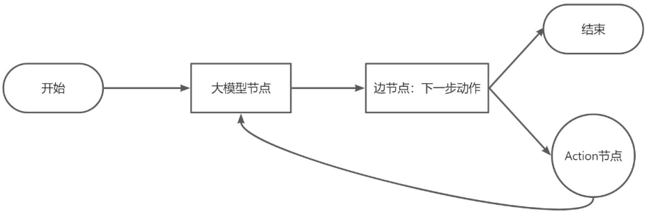
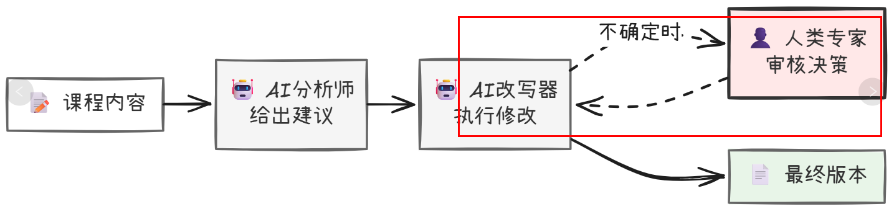
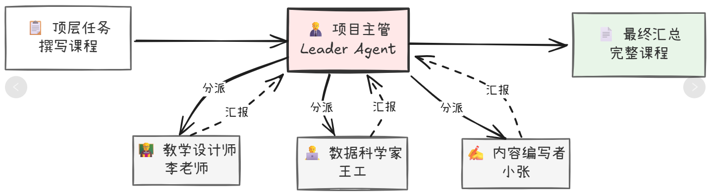
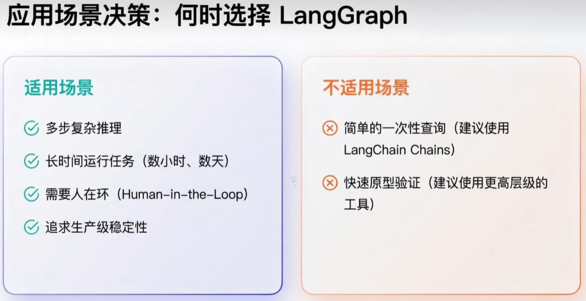
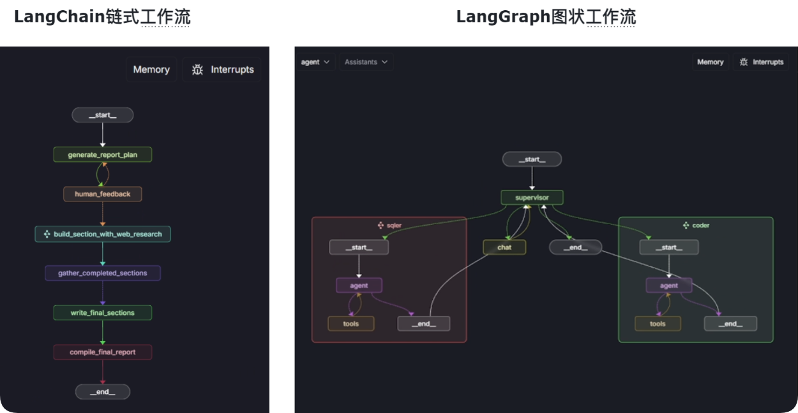
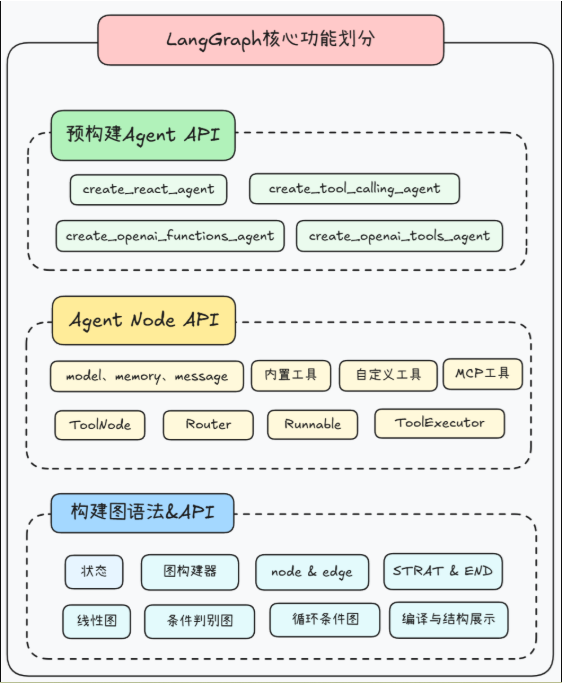
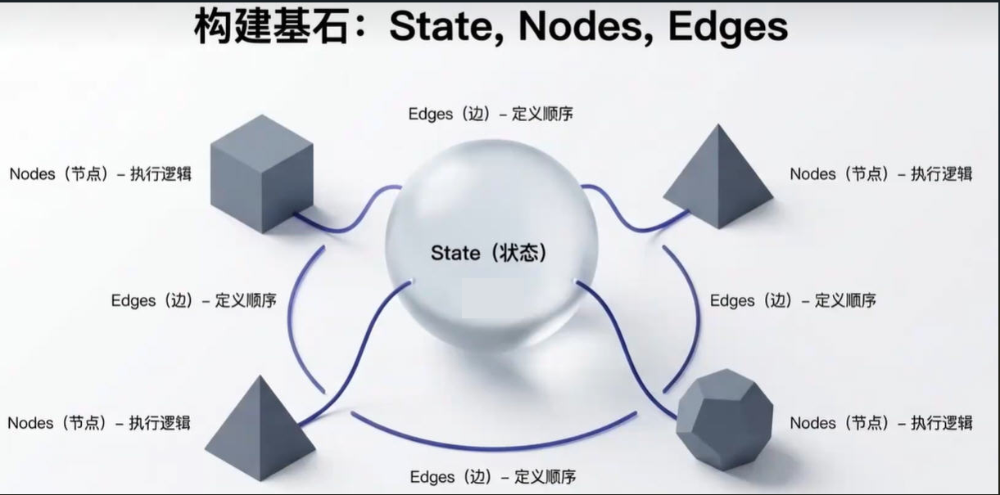
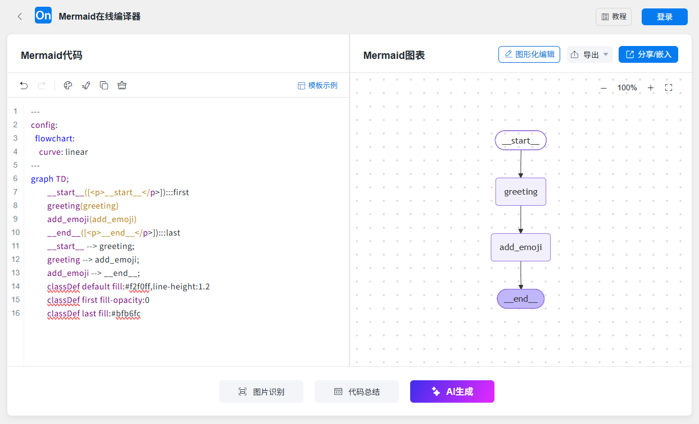
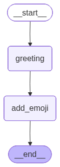
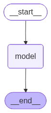

# LangGraph入门

## LangGraph概述

[官网](https://docs.langchain.com/oss/python/langgraph/overview)

LangGraph 是基于 LangChain 构建的、面向智能体多轮交互 / 状态持久化 / 分支并行执行的图结构工作流框架。

LangGraph 是LangChain 生态的一部分，专门用于构建基于大模型（LLM）的复杂、有状态、多智能体应用的框架。核心思想是将应用的工作流程抽象为一个有向图结构，通过节点和边来定义任务的执行步骤和逻辑流，它是对LangChain核心思想的延伸和升级，它把基础单元从”链”换成了”图（Graph）”。相比传统的线性执行模式，LangGraph 支持条件分支、循环、并行等复杂控制流，能够实现状态持久化、断点续跑、时间旅行、人机协作等高级功能，并提供了多智能体协作、层级架构等多种架构模式。

**LangGraph = LangChain + 图编排 + 状态机**

**AB法则(Before | After)**：之前有Chain了，为什么还需要Graph

Chain就像一条工作流水线：原料→A处理→B处理......→最终产品出去。

上述模式清晰且高效。比如”先总结文本，再翻译成英文”，这种一步接一步的线性任务，用Chain简直完美。

但是，现实世界是复杂的！很多任务不是一条直线。

LangGraph和LangChain对比：LangGraph是基于LangChain构建的，无论图结构多复杂，单独每个任务执行链路仍然是线性的，其背后仍然是靠着LangChain的Chain来实现的。

因此我们可以这么来描述LangChain和LangGraph之间的关系：LangGraph是LangChain工作流的高级编排工具，其中“高级”之处就是LangGraph能按照图结构来编排工作流。

案例：

> 想象一个真实的场景：你让一个员工编写写一份小米su7跑车市场分析报告
>
> 他的工作流程可能是这样的：
>
> 1. 上网搜索相关资料。
> 2. 根据资料写出第一版草稿。
> 3. 他自己审阅草稿，觉得”哎呀，数据不够支撑论点”。
> 4. 于是他返回第一步，进行新一轮的搜索，补充更多数据。
> 5. 重写/修改草稿。
> 6. 他又觉得”嗯，结构有点乱”。
> 7. 于是他不搜索了，而是直接对现有内容进行重新组织。
> 8. 最后，他觉得”OK，差不多了”，才把报告交给你。
>
>     思考：上述过程还是流水线吗？还能否打直球？有没有循环反复？

进一步思考

刚才这个过程充满了循环（(loops）、判断(decisions)和分支（branches）。他会根据当前草稿的状态，来决定下一步是该”重新搜索”、”重新组织”还是”提交工作”。



用LangChain的Chain来模拟上述过程，会变得极其痛苦！因为Chain天生就是一条单行线，它很难实现”返回上一步”或者”根据条件跳转到某一步”这种灵活的控制流。开发者需要写大量的、非常不优雅的”胶水代码”来强行实现循环，整个逻辑会变得一团糟。

LangChain的Agent在某种程度上解决了这个问题：

Agent像一个有自主决策能力的“将军”，它基于ReAct（Reason+Act）框架，可以自己决定调用什么工具来完成任务。它确实能实现循环，比如发现信息不够，它会自己决定再次调用搜索工具等等。疑人不用，用人不疑，不管过程，只要结果。

想想还有什么问题？

Agent的最大问题在于，它是一个“黑箱”！你给了它目标和工具，它就开始”自言自语”(Reasoning）和“手忙脚乱”(Acting）了。整个过程，你作为BOSS，很难对它的工作流程进行精细化的控制和干预。

1. 你没法强制它必须先写草稿再批判，它可能搜了半天，觉得信息够了直接就给你一个最终答案。
2. 你没法在它犯错的时候把它拉回来，它可能在一个错误的思路上循环了十几次，浪费了大量的时间
   和API调用Token费用，最终告诉你”我做不到”或者反复错。
3. 它的行为不够稳定，同样的问题，这次它可能是A-B-C的步骤，下次可能是A-C-B，结果可能截然不同。

对于想开发一个可靠、可控、可预测的商业级AI应用的开发者来说，这种”黑箱”式的智能体，就像一个能力很强但野性难驯的Tiger员工，你不敢把真正核心的任务交给它。疑人要用，用人要疑，监控过程，核实结果。

智能体问题补充

人机协作(HITL)：将人类决策融入工作流关键节点，构建可信AI系统



多智能体协作：分层规划与共创协作两种模式，模拟现实团队工作方式



**总结**

LangChain的困境：Chain太流水线，无法优雅地处理循环和条件分支，不适合复杂任务。Agent太自由，像个黑箱，难以控制、调试和保证稳定性。

LangGraph 提供了强大的状态管理机制，允许 Agent 在不同节点之间传递和维护信息，从而实现长期的记忆和多轮对话能力。 通过定义节点和边，可以精确控制 Agent 的执行逻辑，包括条件分支、循环和并行执行等。

LangGraph 能够无缝集成各种外部工具（如搜索引擎、数据库、API 等），让 Agent 能够获取实时信息、执行特定操作，极大地扩展了 LLM 的能力边界。

图结构使得 Agent 的运行路径清晰可见，便于理解 Agent 的决策过程，并在出现问题时进行快速定位和调试。

模块化与可复用性。每个节点都可以是一个独立的、可复用的组件，维护性高且易于扩展。通过子图机制，复杂的工作流可以被分解为多个可独立开发和测试的模块，提高了开发和测试效率



## 作用

彻底打破了“链”的束缚，引入了“图”的结构，让构建复杂AI应用的可能性，从一条直线，变成了一张网。



## 技术架构



## 如何使用

[使用文档](https://docs.langchain.com/oss/python/langgraph/install)

记住这四个词，你就掌握了LangGraph的灵魂：

**State(状态)、Nodes（节点)、Edges(边)、Graph(图)**



可视化：LangGraph 提供了多种图表可视化方式，帮助开发者更好地理解和调试工作流。通过 `graph.get_graph()` 方法可以获取图的结构信息，包括节点和边的详细信息。

基于这个信息，可以使用如下方式进行可视化：

- 生成 Mermaid 代码来可视化图结构。
- 生成简单的 ASCII 文本图表，但需要安装额外的依赖。

```python
from typing import TypedDict, Annotated, List, Dict
from langgraph.graph import StateGraph, START, END
import uuid


# 1．定义State(可选)
class HelloState(TypedDict):
    name: str
    greeting: str


# 2.定义节点Node
def greet(helloState: HelloState) -> dict:
    name = helloState["name"]
    return {"greeting": f"你好,{name}"}


def add_emoji(helloState: HelloState) -> dict:
    greeting = helloState["greeting"]
    return {"greeting": greeting + "  。。。😄"}


# 3.构建图graph
graph = StateGraph(HelloState)

graph.add_node("greeting", greet)
graph.add_node("add_emoji", add_emoji)

graph.add_edge(START, "greeting")
graph.add_edge("greeting", "add_emoji")
graph.add_edge("add_emoji", END)


# 4.编译图
app = graph.compile()

# 5.运行
# invoke()方法只接收状态字典作为核心参数
result = app.invoke({"name": "z3"})
print(result)
print(result["greeting"])


#
# #6 打印图的边和节点信息
# 6.1 打印图的ascii可视化结构
print(app.get_graph().print_ascii())
print("=" * 50)
#
# #6.2 打印图的Mermaid代码可视化结构并通过https://www.processon.com/mermaid编辑器查看
print(app.get_graph().draw_mermaid())
print("=" * 50)


#
# #6.3 生成 PNG并写入文件
png_bytes = app.get_graph().draw_mermaid_png(max_retries=2, retry_delay=2.0)
output_path = "langgraph" + str(uuid.uuid4())[:8] + ".png"
with open(output_path, "wb") as f:
    f.write(png_bytes)
print(f"图片已生成：{output_path}")

"""
上面第3种方式，容易bug,时好时坏
ValueError: Failed to reach https://mermaid.ink  API while trying to render your graph after 1 retries.
To resolve this issue:
1. Check your internet connection and try again
2. Try with higher retry settings: `draw_mermaid_png(..., max_retries=5, retry_delay=2.0)`
3. Use the Pyppeteer rendering method which will render your graph locally in a browser:
`draw_mermaid_png(..., draw_method=MermaidDrawMethod.PYPPETEER)`
"""
```

Mermaid代码可视化结果



生成的图片：



加一点业务

```python
"""
我们先在不接入大模型的情况下构建一个加减法图工作流，
我们这里自定义两个简单函数：一个是加法函数接收当前State并将其中的x值加1，
另一个是减法函数接收当前State并将其中的x值减2，
然后添加名为addition和subtraction的节点，并关联到两个函数上，最后构建出节点之间的边。
"""

from langgraph.constants import START, END
from langgraph.graph import StateGraph


def addition(state):
    print(f"加法节点收到的初始值:{state}")
    return {"x": state["x"] + 1}


def subtraction(state):
    print(f"减法节点收到的初始值:{state}")
    return {"x": state["x"] - 2}


graph = StateGraph(dict)
# 向图构建器中添加节点
# 添加加法运算节点和减法运算节点到构建器中
graph.add_node("addition", addition)
graph.add_node("subtraction", subtraction)

# 定义节点之间的执行顺序 edges
# 设置节点间的依赖关系，形成执行流程图
graph.add_edge(START, "addition")
graph.add_edge("addition", "subtraction")
graph.add_edge("subtraction", END)
# 打印图的边和节点信息
print(graph.edges)
print()
print(graph.nodes)

# 编译图构建器生成计算图
app = graph.compile()
# invoke()方法只接收状态字典作为核心参数，定义一个初始状态字典，包含键值对"x": 5
initial_state = {"x": 5}
# 调用graph对象的invoke方法，传入初始状态，执行图计算流程
result = app.invoke(initial_state)
print(f"最后的结果是:{result}")

# # 打印图的可视化结构
print(app.get_graph().print_ascii())
print()
# 打印图的可视化结构，生成更加美观的Mermaid 代码，通过processon 编辑器查看
print(app.get_graph().draw_mermaid())
```

加上大模型调用

```python
"""
LangGraph 简单案例HelloWorld：
构建一个最小的有向图，流程是：START → 模型节点 → END

LangGraph的灵魂：State(状态) + Nodes(节点) + Edges(边) + Graph(图)
"""

import uuid
from typing import TypedDict, Annotated, List
from langgraph.graph import StateGraph, START, END
from langgraph.graph.message import add_messages
import os
from langchain.chat_models import init_chat_model
from langchain_core.messages import HumanMessage
from dotenv import load_dotenv

load_dotenv()


# ========== 1. 定义状态（State） ==========
# 存储对话消息
class AtguiguState(TypedDict):
    # messages 是一个消息列表，Annotated + add_messages 表示支持自动追加消息
    messages: Annotated[List, add_messages]


# ========== 2. 定义大模型 ==========
llm = init_chat_model(
    model="qwen-plus",
    model_provider="openai",
    api_key=os.getenv("QWEN_API_KEY"),
    base_url="https://dashscope.aliyuncs.com/compatible-mode/v1",
)


# ========== 3. 定义节点函数 ==========
# 节点：调用大模型，并把回复加入到 state["messages"] 里
def model_node(state: AtguiguState):
    reply = llm.invoke(state["messages"])  # 输入历史消息，调用模型
    return {"messages": [reply]}  # 返回新消息，自动加到 state


# ========== 4. 构建图结构 ==========
graph = StateGraph(AtguiguState)  # 初始化图，指定 State 类型

graph.add_node("model", model_node)  # 添加一个节点，名字叫 "model"

graph.add_edge(START, "model")  # 从 START 到 "model"
graph.add_edge("model", END)  # 从 "model" 到 END
# 打印图的边和节点信息
# print(graph.edges)
print()
# print(graph.nodes)

# ========== 5. 编译==========
app = graph.compile()

# ========== 6. 运行 ==========
# result = app.invoke({"messages": [HumanMessage(content="请用一句话解释什么是 LangGraph。")]})
result = app.invoke({"messages": "请用一句话解释什么是 LangGraph。"})

# 打印模型的最后一条回复
print("模型回答：", result["messages"][-1].content)

print()
# =========================
# 1. 打印图的ascii可视化结构
print(app.get_graph().print_ascii())
print("=" * 50)

# 2. 打印图的Mermaid代码可视化结构并通过https://www.processon.com/mermaid编辑器查看
print(app.get_graph().draw_mermaid())
print("=" * 50)

# 3. 生成 PNG并写入文件
png_bytes = app.get_graph().draw_mermaid_png()
output_path = "langgraph" + str(uuid.uuid4())[:8] + ".png"
with open(output_path, "wb") as f:
    f.write(png_bytes)
print(f"图片已生成：{output_path}")
```



**图的构建流程总结：**

1. 初始化一个StateGraph实例
2. 加节点
3. 定义边，将所有的节点连接起来
4. 设置特殊节点，入口和出口（可选）
5. 编译图
6. 执行工作流

## 总结

**LangGraph的灵魂：State(状态) + Nodes(节点) + Edges(边) + Graph(图)**