# mysql

## 基础


### 查询

```mysql
mysql --user=root --password;
use database;
show databases; # 数据库列表
show tables;
show columns from servers; # 显示表列，等于describe servers;
show status;
show create database;
show create table;
show agants;
show errors;
show warnings;

# select
select * from servers;
select server_id,server_name from servers;
select distinct server_name from servers; # 去重，只返回唯一的server_name
select server_name from servers limit 5,5;
select servers.server_name from product.servers;

# order by 
select server_name from servers order by server_name;
select server_name from servers order by server_name, price;
select server_name from servers order by server_name desc; # 降序

# where
select server_name from servers where price < 2.5;
select server_name from servers where price <> 2.5;
select server_name from servers where price != 2.5;
select server_name from servers where price between 5 and 10;
select server_name from servers where price is NULL;
select server_name from servers where id<10 and price < 2.5;
select server_name from servers where id=10 or id=20;
select server_name from servers where id in (10,20) order by server_name;
select server_name from servers where id not in (10,20) order by server_name;

# like
select server_name from servers where server_name like '阿里%';
select server_name from servers where server_name like '_阿里'; # _ 只能配置一个字符

# regexp 正则
select server_name from servers where server_name regexp '正则表达式';

# 计算字段
select concat (trim(server_name), '(', price,')') as name from servers; # concat 拼接，trim去掉前后空格，rtrim去掉右边空格，ltrim去掉左边空格, as 后面是别名
select id,server_name,price * num as total_price from servers where id = 10;


# 聚合函数
select count(*) as num, min(price) as min_price,max(price) as max_price from servers;

# group by  having
select server_name, count(*) as server_num from servers group by server_name;
select server_name, count(*) as server_num from servers group by server_name with rollup;

select server_name, count(*) as server_num from servers group by server_name having count(*) >=2;

# 子查询
select id from servers where price in (select price from servers where id > 100)
select cust_name,(select count(*) from orders where orders.cust_id=customers.cust_id) as orders from customers order by cust_name;


```

### 处理函数

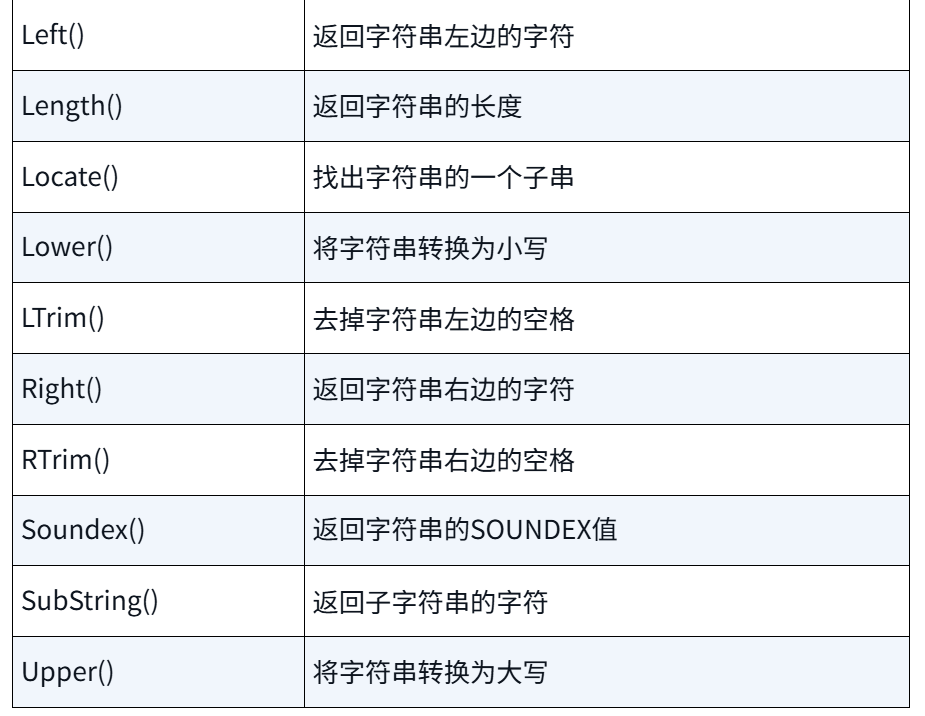

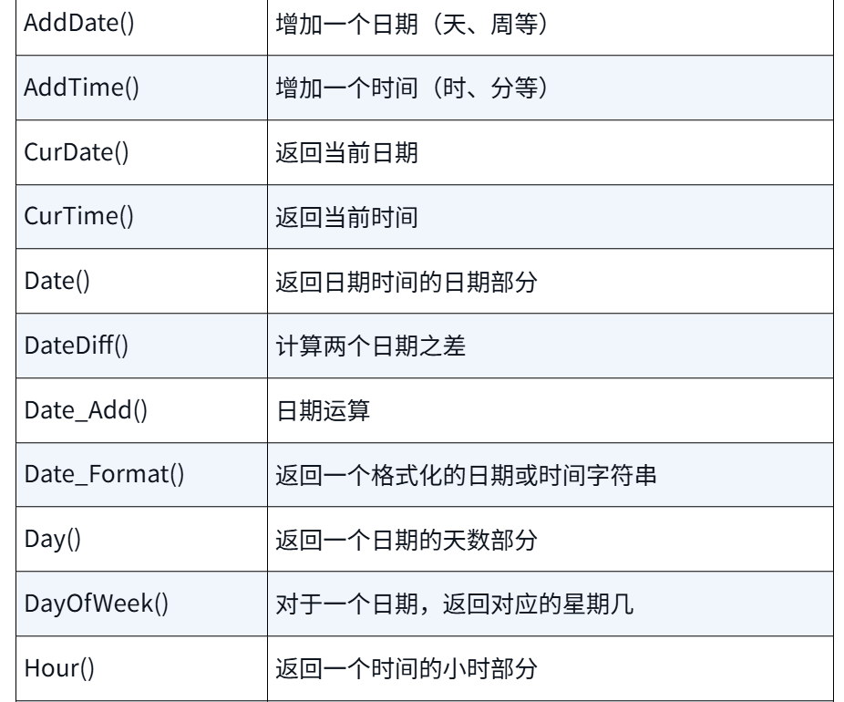

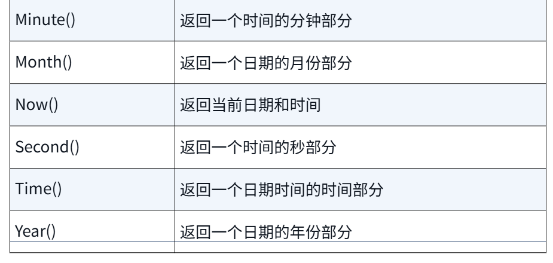

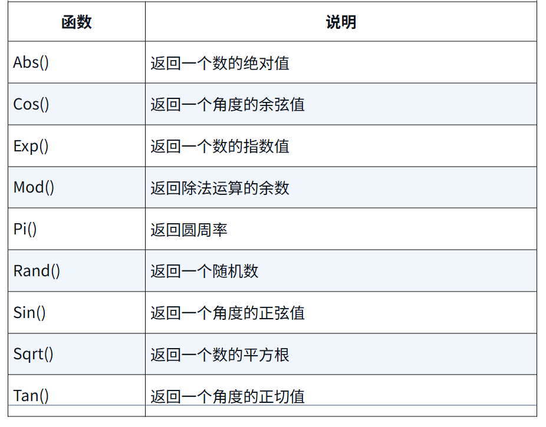

### 聚合函数

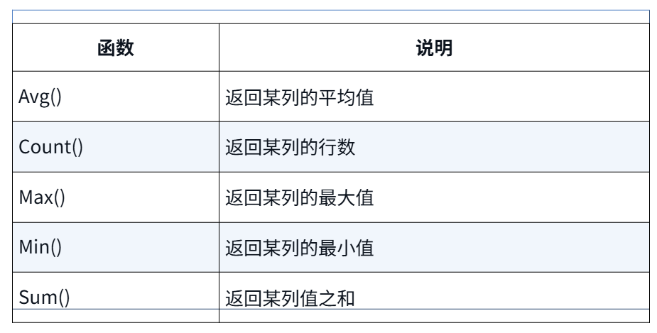

### 连接

```mysql

select vend_name,prod_name from verdors,products where verdors.v_id = products.v_id order by vend_name,prod_name;

# 内连接
select vend_name,prod_name from verdors inner join products on verdors.v_id = products.v_id;

select vend_name,prod_name from verdors inner join products on verdors.v_id = products.v_id inner join orderitems on orderitems.p_id = products.p_id where order_name = 2005;

# 自连接
select P1.p_id,p1.prod_name from products as p1,products as p2 where p1.v_id = p2.v_id and p2.p_id = "xxx"

# 左连接
select customers.cust_id,orders.order_num from customers left join orders on customers.cust_id = orders.cust_id;

# 右连接
select customers.cust_id,orders.order_num from orders right join customers on customers.cust_id = orders.cust_id;

```

### 组合查询

```mysql
# 默认去掉重复行
select v_id,p_id from products where p_price<=5
union
select v_id,p_id from products where v_id in (1001,10002)

# 不去掉重复行
select v_id,p_id from products where p_price<=5
union all
select v_id,p_id from products where v_id in (1001,10002)
order by v_id
```

### 全文搜索

```mysql
select note_text from productnotes where match(note_text) against('rabbit');


select note_text from productnotes where match(note_text) against('rabbit' with query expansion); # 查询扩展


select note_text from productnotes where match(note_text) against('rabbit -rope*' in boolean mode); # 包含rabbit,不包含rope开头的词，布尔模式：按匹配度排序
```

### 插入|更新|删除

```mysql
# 插入
insert into customers (name,city,email) values ('jone','xxx','xxx@xxx.com');

insert low_priority into customers (name,city,email) values ('jone','xxx','xxx@xxx.com');  # 如果查询重要，insert可以降低优先级

insert into customers (name,city,email) values ('jone','xxx','xxx@xxx.com'),
('jan','xxx','xxx@xxx.com');

insert into customers (name,city,email) select cust_name,cust_city,cust_email from custnew;   # 插入查询到的数据；

# 更新
update customers set email = 'xxx@yy.com' where cust_id=123;
update customers set name='abc', email = 'xxx@yy.com' where cust_id=123;

# 删除
delete from customers where id = 123;

truncate table xxx; # 清表，实际是删表重建

```

### 创建表|修改表

```mysql
create table customers (
	id int not null auto_increment,
    name char(50) not null,
    email char(255) null,
    sex int not null default 1,
    price decimal(8,2) not null,
    primary key (id)
) engine = innodb;

alter table customers add phone char(20);
alter table customers drop column phone;

alter table orderitems add constraint fk_ordertimes_orders foreign key (order_num) references orders(order_num);

drop table customers; # 删除表
rename table customers2 to custmers，
products2 to products; # 重命令表
```

### 视图

视图是一张虚拟的表，只包含使用时动态检索数据的查询。通常用来查数据，也可以更新数据，但一大堆的限制，所以不要更新数据。

好处：

1、重用sql语句

2、简化复杂sql操作

3、使用表的组成部分而不是整张表

4、保护数据，可以给用户授予表的特定部分

5、可以返回与底层表不一样的格式数据

规则和限制

1、名称唯一

2、数量没有限制，必须有足够的权限。

3、视频可以嵌套

4、orderby可以用，但是如果创建视图时用了orderby，那么视图的orderby就没用了

5、不能被索引，也不能有与之关联的触发器

6、视图可以和表一起用。

使用：

• 视图用CREATE VIEW语句来创建。

• 使用SHOW CREATE VIEW viewname;来查看创建视图的语句。

• 用DROP语句删除视图，其语法为DROP VIEW viewname;。

• 更新视图时，可以先用DROP语句再用CREATE语句，也可以直接用CREATE OR REPLACE VIEW。CREATE OR REPLACE VIEW会在视图不存在时创建它，并在视图存在时替换它。

```mysql
create view productcustomers as select c_name,c_contact,p_id from customers,orders,orderitems where customers.c_id = orders.c_id and orderitems.order_num = orders.order_num;
```

### 存储过程

存储过程简单来说就是为以后的使用而保存的一个或多个MySQL语句的集合。可以将存储过程视为批文件，虽然它们的作用不仅限于批处理。

```mysql
delimiter //
create procedure productpricing()
begin
	select avg(prod_price) as priceaverage
	from products;
end//
delimiter ;

call productpricing();
drop procedure if exists productpricing;


delimiter //
create procedure ordertotal(
	in onumber int,
    out ototal decimal(8,2)
)
begin
	select sum(item_price*quantity) from orderitems where order_num = onumber into ototal;
end//
delimiter ; # 接收onumber,返回ototal

call ordertotal(20005, @total);
select @total;
call ordertotal(20009, @total);
select @total;

show create procedure ordertotal; # 查结构


```

### 游标

游标(cursor)是一个存储在MySQL服务器上的数据库查询，它不是一个SELECT语句，而是被该语句检索出来的结果集。在存储了游标之后，应用程序可以根据需要滚动或浏览其中的数据。MySQL游标只能用于存储过程和函数。

```mysql
delimiter //
create procedure processorders ()
begin
	declare o int;
	-- 声明
	declare ordernumbers cursor
	for
	select order_num from orders;
	-- 打开
	open ordernumbers;
	-- 获取订单号
	fetch ordernumbers into o;
	-- 这里处理
	-- 关闭
	close ordernumbers;
end //
delimiter ;
```


### 触发器

触发器是MySQL 响应以下任意语句而自动执行的一个MySQL语句（或位于BEGIN语句和END语句之间的一组语句）：• DELETE• INSERT• UPDATE

仅表支持触发器，视图则不支持（临时表也不支持

触发器是按时间、事件和表定义的，每张表的每个事件每次只允许有一个触发器。因此，每张表最多支持 6个触发器（每个INSERT、UPDATE和DELETE的之前和之后）。单一触发器不能与多个事件或多张表关联，所以，如果你需要在INSERT操作和UPDATE操作时都执行触发器，则应该定义两个触发器。

如果 BEFORE 触发器失败，则 MySQL将不执行请求的操作。此外，如果 BEFORE 触发器或语句本身失败，则MySQL将不执行AFTER 触发器（如果有的话)

```mysql
create trigger newproduct after insert on products for each row set @result = 1; # 创建一个触发器，在products每插入一行数据后，@result变量设置为1；

drop trigger newproduct; # 删除，不能更新只能删除
```


### 事务

事务处理(transaction processing)可以用来维护数据库的完整性，它保证成批的MySQL操作要么全部执行，要么全部不执行。

MySQL语句通常直接执行并写入数据库表，这种自动发生的提交（写入或保存）操作称为隐式提交(implicit commit)。

```mysql
start transaction;
delete from orderitems where order_num = 1001;
delete from orders where order_num = 20010;
commit;

start transaction;
savepoint delete1;
update ...;
delete ....;
rollback to delete1;
delete ...;
commit;
# 保存点，回滚到保存点
```

### 全球化和本地化

一次区分大小写（由_cs表示），一次不区分大小写（由_ci表示）

### 安全管理

```mysql
use mysql;
select user from user;

create user ben identified by 'password';
rename user ben to bforta;
drop user bforta;

show grants for bforta;
```


### 维护

主要的日志文件有以下几种。

• 错误日志。它包含了启动和关闭问题以及任何严重错误的详细信息。此日志通常名为hostname.err，位于data 目录中。此日志名可用--log-error命令行选项更改。

• 查询日志。它记录了所有MySQL 活动，在诊断问题时非常有用。此日志文件可能会很快就变得非常大，因此不应该长期使用。此日志通常名为hostname.log，位于data 目录中。此日志名可以用--log命令行选项更改。

• 二进制日志。它记录了更新过（或可能更新过）数据的所有语句。此日志通常名为hostname-bin，位于data 目录中。此日志名可以用--log-bin命令行选项更改。注意，这个日志文件是MySQL 5中添加的，以前的MySQL 版本中使用的是更新日志。

• 慢查询日志。顾名思义，此日志记录了任何执行缓慢的查询。此日志可用于确定哪里需要进行数据库优化。此日志通常名为hostname-slow.log，位于data 目录中。此日志名可以用--log-slow-queries命令行选项更改。

### 性能

MySQL是一个多用户多线程的DBMS，换言之，它经常同时执行多个任务。如果这些任务中的某一个执行缓慢，则所有请求都会受到影响。如果你遇到异常的性能问题，则可以使用SHOW PROCESSLIST 显示所有活动进程以及它们的线程 ID和执行时间。你还可以用KILL命令终结某个特定的线程（使用这个命令需要作为管理员登录）。

你的SELECT语句中有一系列复杂的OR条件吗？通过使用多个SELECT语句和UNION语句连接它们，你能看到极大的性能改进

### 锁

#### 全局锁

锁定数据库中的所有表

```mysql
flush tables with read lock;
mysqldump -uroot -p1234 itcast > itcast.sql
unlock tables;

mysqldump --single-transaction -uroot -p1234 itcast>itcast.sql
```

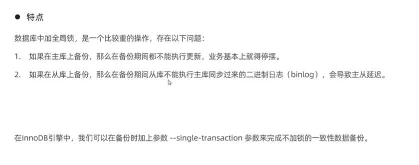

#### 表级锁

##### 表锁

1、表共享读锁（read lock）

可读不可写，其它客户端也是可读不可写

2、表独占写锁（write lock）

可读可写，其它客户端不可读也不可写

语法：

加锁：lock tables 表名 read/write

释放：unlocal tables / 客户端断开连接

##### 元数据锁（MDL）

系统自动控制，在访问表时自动加上的。在表上有操作时不可以改表的元数据，不可以改表结构。

增删改查加MDL读锁（共享），修改表结构时加MDL写锁（排他）

##### 意向锁

解决加表锁时，有没有数据加了行锁的冲突问题。

事务A，先加行锁，再在表上加上意向锁，事务B，再给表加上表锁时先判断表上有没有意向锁。

1、意向共享锁（IS）：select ... lock in share mode 添加

2、意向排他锁（IX）：insert,update,delete,select ... for update 添加

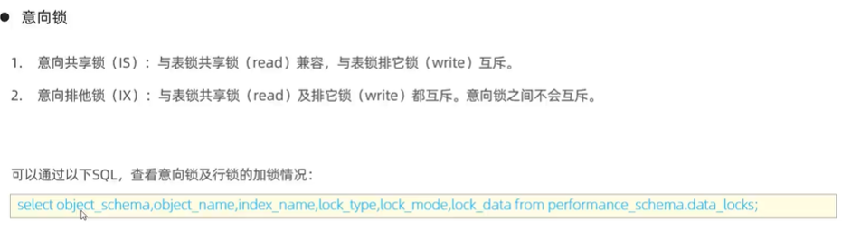


#### 行级锁

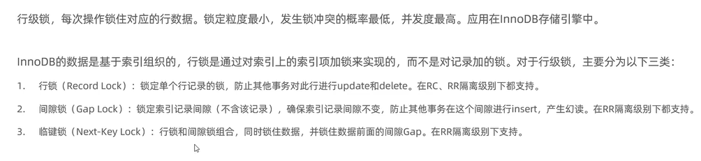

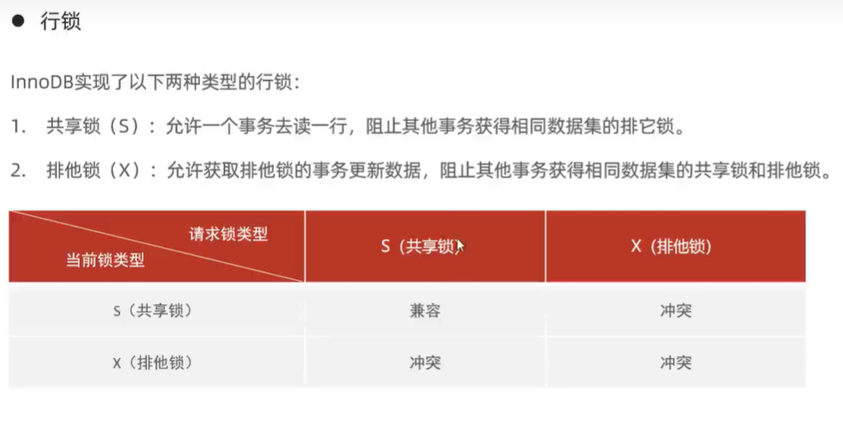

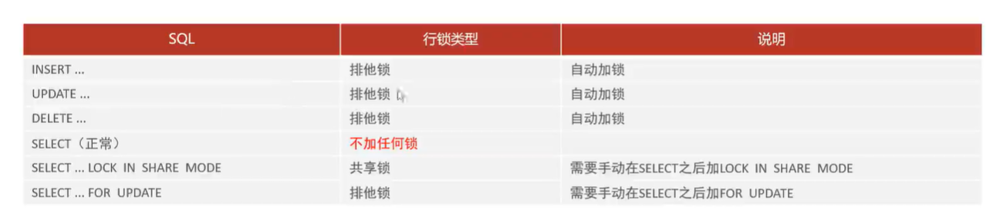

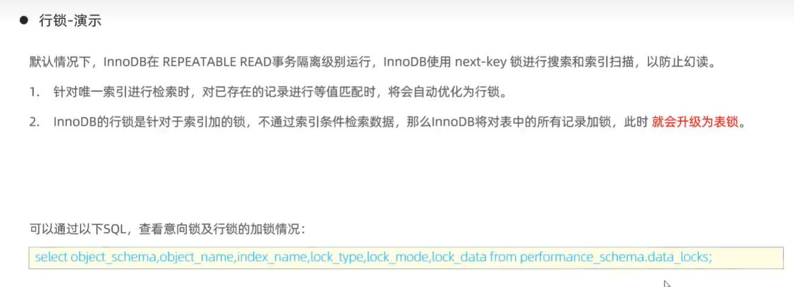

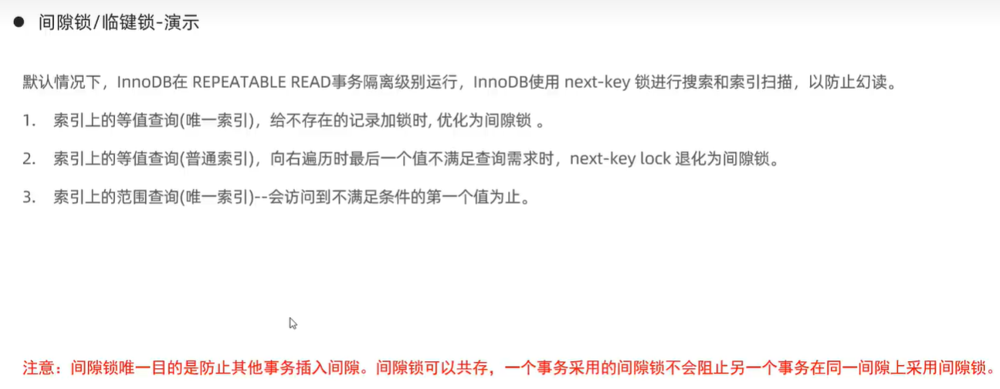


### 隔离级别

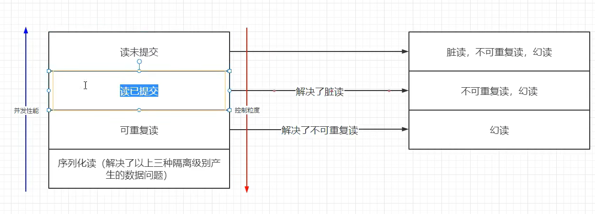

读未提交，B事务中可以select到A事务中还没有提交的修改，就是脏读。

读已提交（解决脏读），B事务中选select一个值，然后执行其它的，期间其它A事务改了这个值，B事务之后又select这个值，发现两个值不一样了，就是不可重复读。

可重复读（解决不可重复读），默认隔离级别，在这个级别下借助MVCC机制可以解决脏读和不可重复读，以及部分幻读。幻读：A事务在B事务两次查询之间插入了一条数据，是因为同一个事务中存在快照读和当前读，数据又被修改了，一个读到的是快照，一个读的是当前数据库的数据。

```mysql
select id from school; # 快照读
select id from school for update; #当前读
```

序列化读，按序列串行执行各个事务


## 性能优化

### 慢sql

explain看是否有合适的索引

索引是帮助mysql高效获取数据的排好序的数据结构

mysql使用b+树来存储数据结构，16阶的B+树

二叉树（自增时，会成链表了），

红黑树(平衡二叉树，自动平衡，为什么不用？因为层级太多了)，

hash表，（不支持范围查询，但是B+树通过双向指针可以，B树不可以，之间没有双向指针）（hash冲突，变链接）（只在memory存储引擎里用）

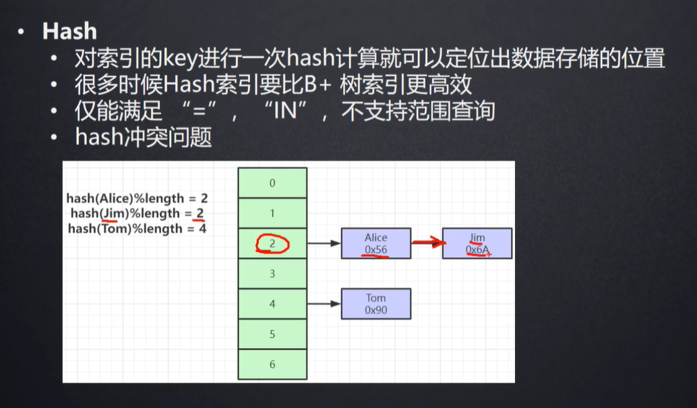

b-tree（红黑树改造了，每层多放几个，下层有几个就是几阶）

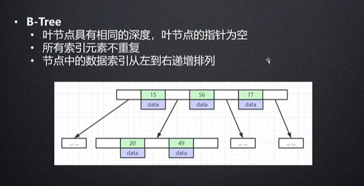

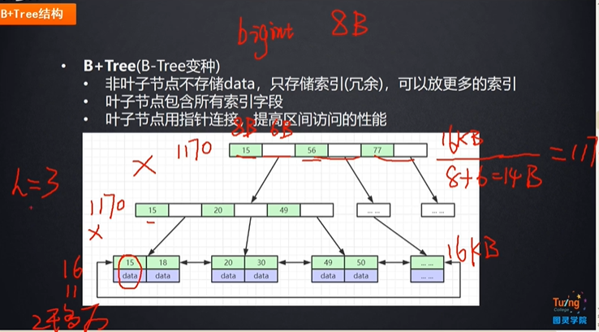

所有的索引都放在叶子节点，把第一个叶子节点放到上层做冗余索引，非叶子节点是放在内存中的，很快，只有叶子节点才会做磁盘IO的加载

最上层默认16Kb，这个3层的，能放2千多万索引


为什么用B+树不用B树？

因为B树没有冗余索引，索引不是都放在叶子节点，非叶子节点不能放很多数据，造成层数变多

### myisam

frm表结构，myd数据，myi索引

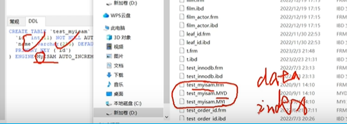

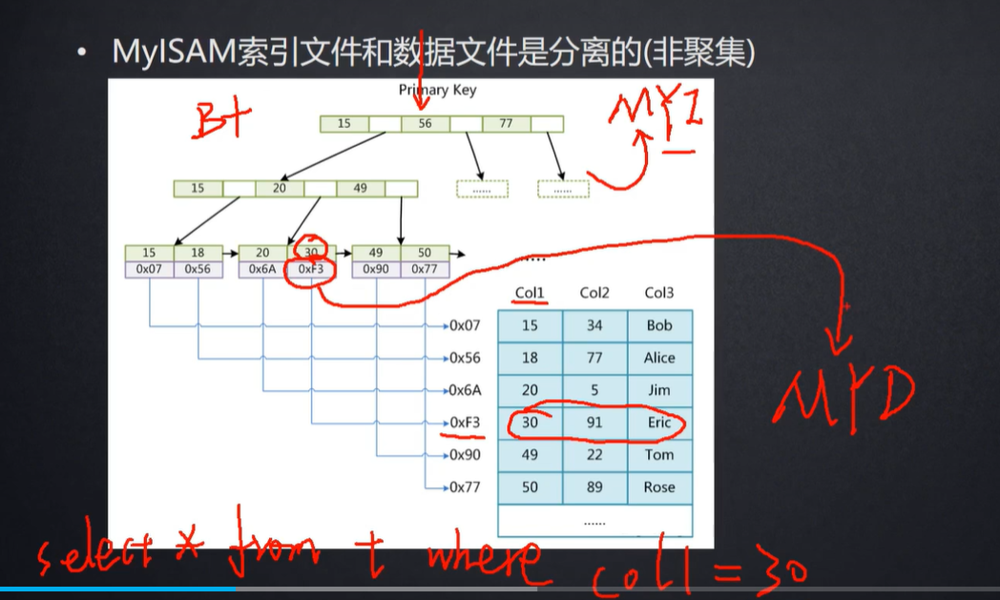


### innodb

frm表结构，ibd索引和数据

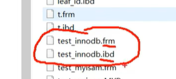

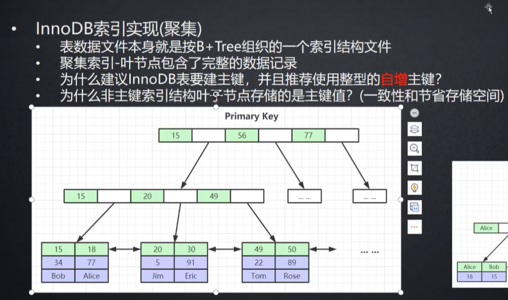

叶子节点存储的不是磁盘文件地址而是这条数据

聚集索引：叶节点包含了完整的数据记录,innodb

非聚集索引：索引和数据分离，myisam

innodb非主键索引：先找到主键再走主键索引

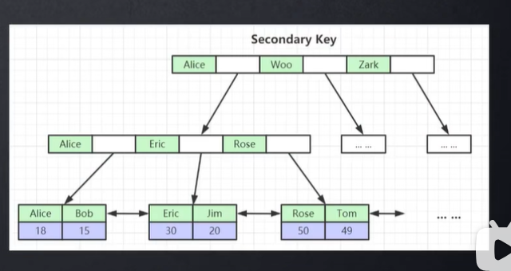

如果自己不弄主键索引，mysql会在表里找唯一索引，如果也找不到，它会默认帮你维护一个rowid，来组织B树。

分库分表时用雪花算法分步式id

为什么要自增？自增可以直接往后插入，如果插在中间，会导致叶节点分裂，插入性能降低


### 索引

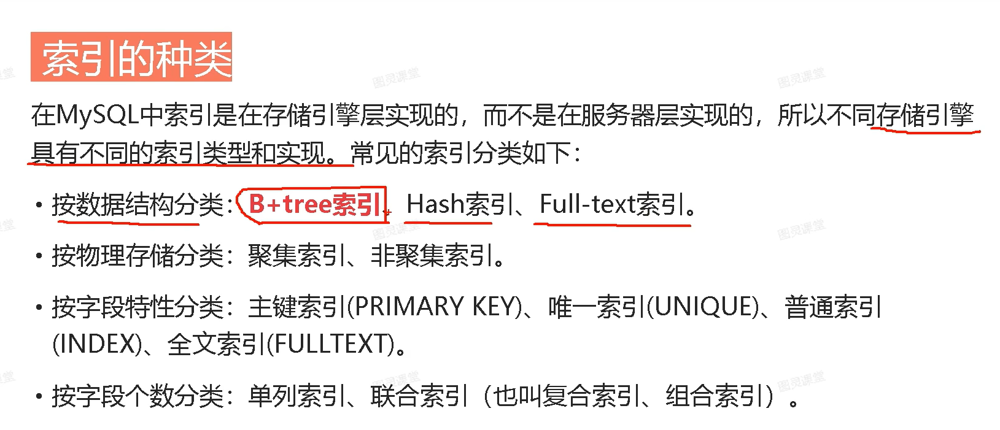

#### 二级索引

所有非主键索引都是二级索引，因为它只存主键的ID,需要回表

#### 覆盖索引

需要查询的字段都在索引列中的情况叫覆盖索引，比如只查ID

#### 索引下推（ICP）

针对扫描二级索引的一项优化改进，用来范围查询减少回表的次数。

以前查到一条数据回一次表，现在查到所有的数据一起回表。

#### 单列索引

#### 联合索引

最左前缀原则

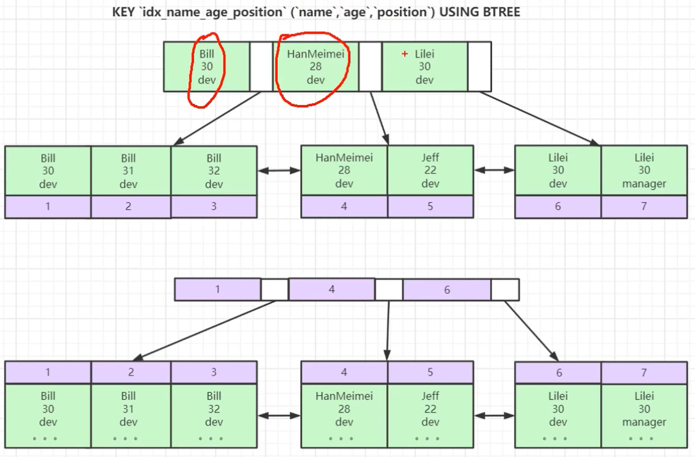

先第一个排，第一个一样，再按第二个


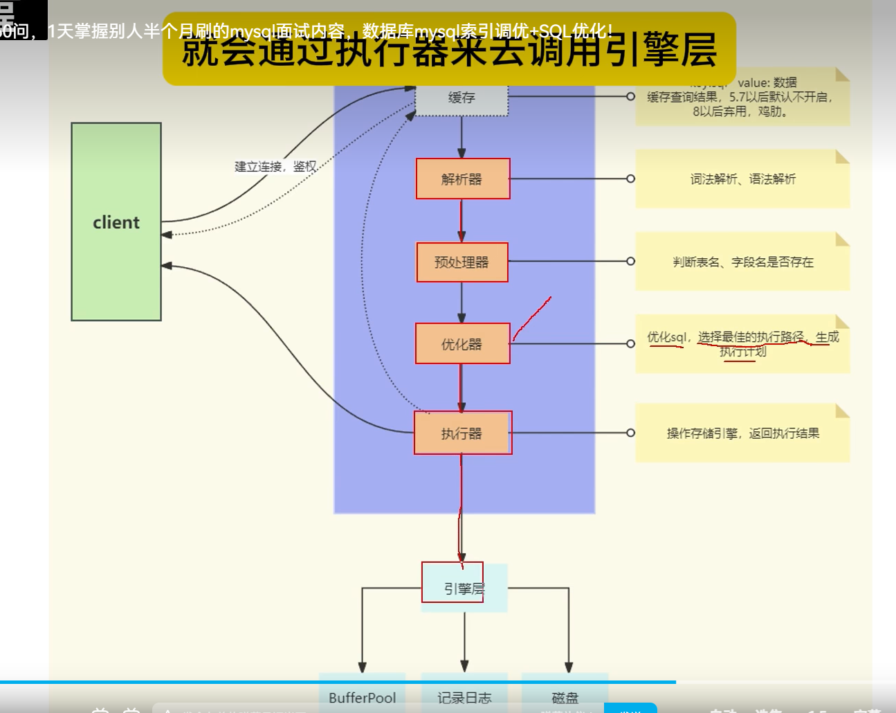

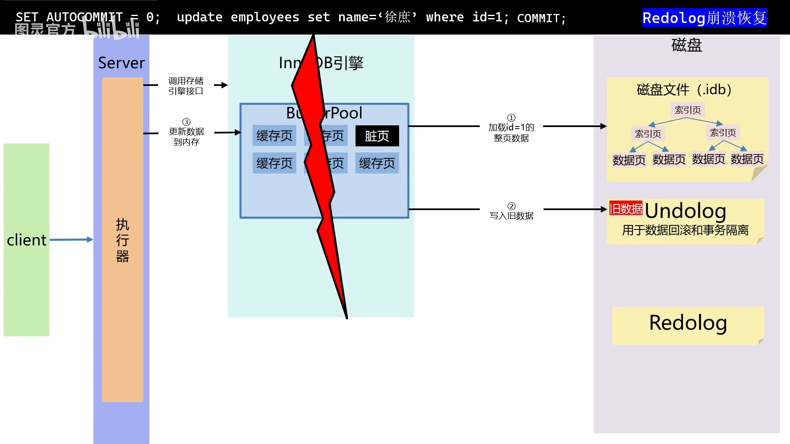

先到bufferpool中找，找到就返回，如果找不到就到idb中找，找到了将数据页放到bufferpool中，然后将旧数据写入undolog，然后改bufferpool中的数据页，这个时候因为和磁盘中的数据不一样，所以叫脏页，同时保存到redolog，然后commit提交。

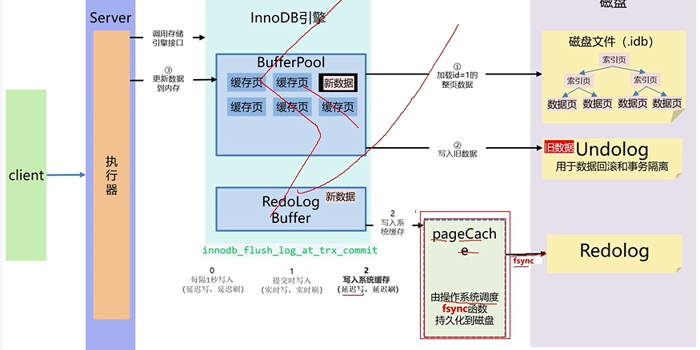

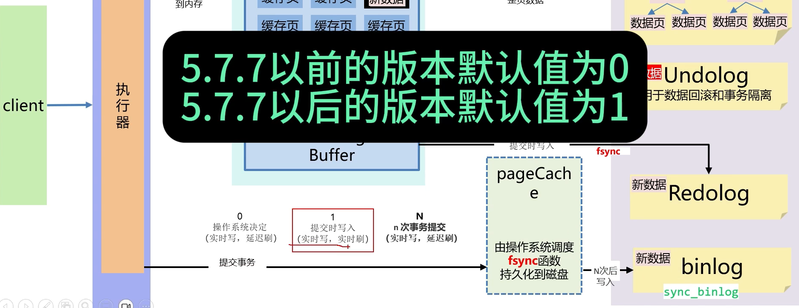

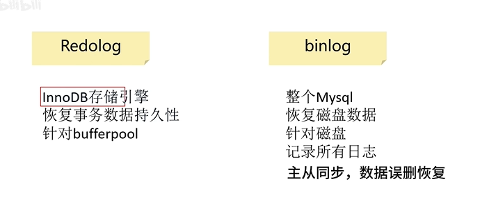

redolog是专门设计出来事务数据恢复的，binlog大而全，记录所有日志，如果要恢复，需要手动


#### 单列索引和联合索引什么时候用？

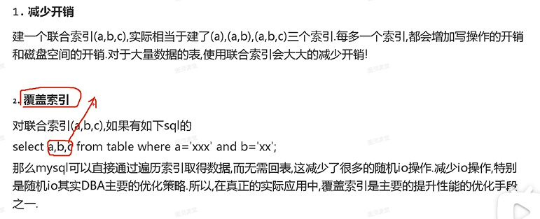

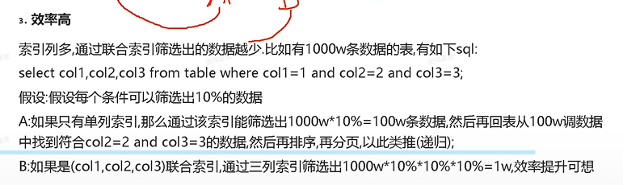


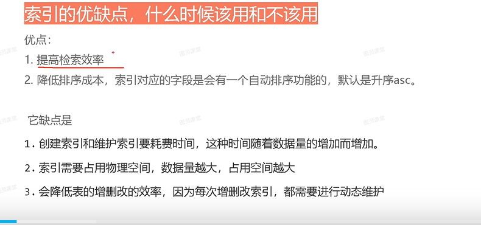


### 索引优化

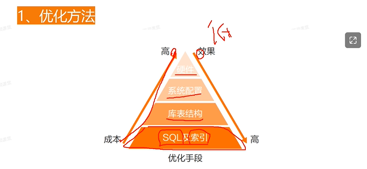

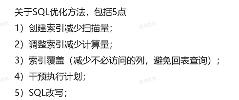

联合索引：最左前缀

索引列上如果计算、函数、类型转换，就会失效，如 left(name,2)='张三'，不行，like '张三%' 可以

联合索引，范围查询后面查失效，可以force index(xxx) 来强制使用索引

联合索引时用覆盖索引，不要用*

不等、null、or等等都不用联全索引，不等和or都可以使用强制使用索引

like写最右，不要写最左

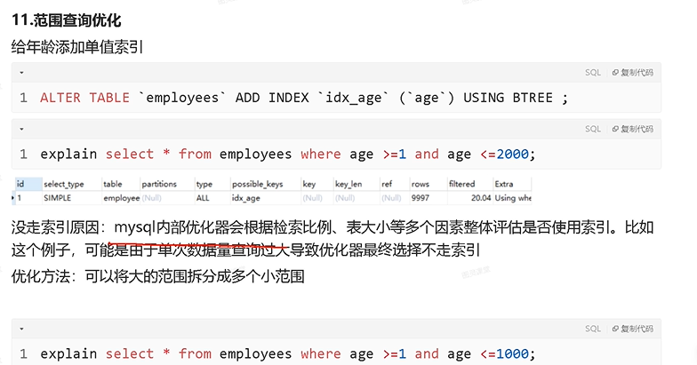


trace工具可以查看当我们执行一条mysql时，底层帮我们做了什么，也可以看到它为什么选择用不用索引

sql优化

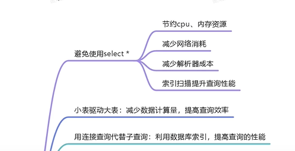

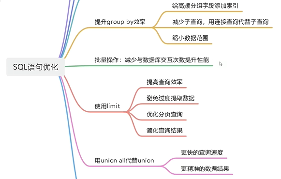


不要用*

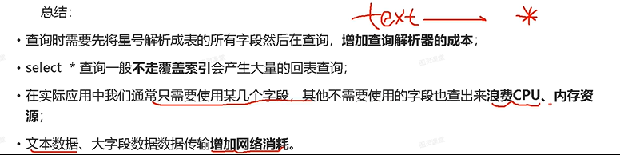

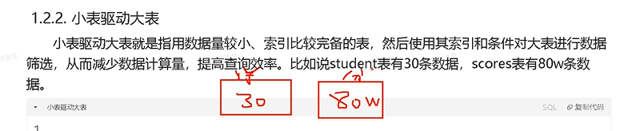

小表join大表

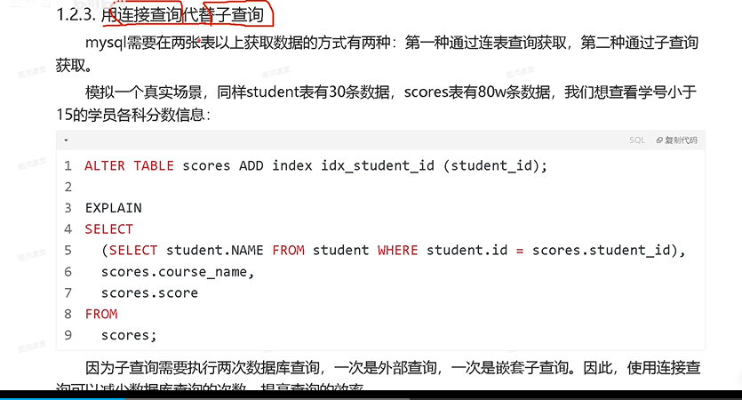

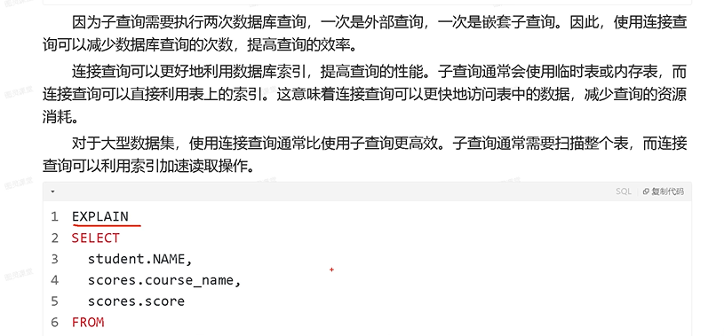

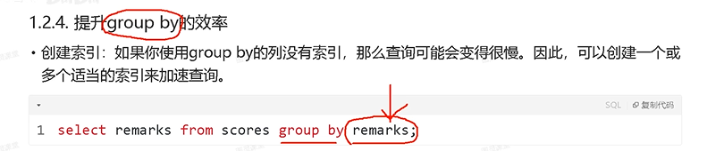

limit优化


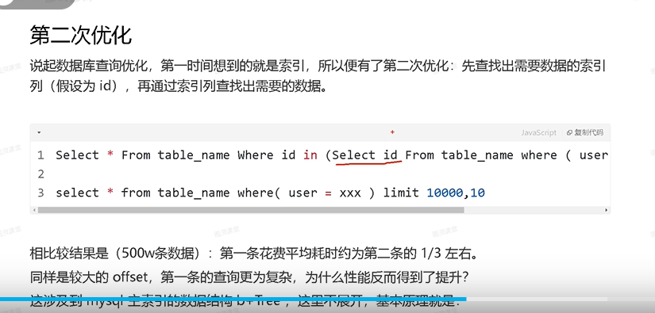

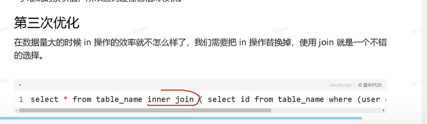

where (user = xxx) limit 1000,10)

先找出ID，因为不需要回表，然后再通过10去看具体数据

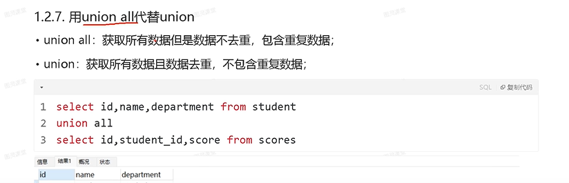