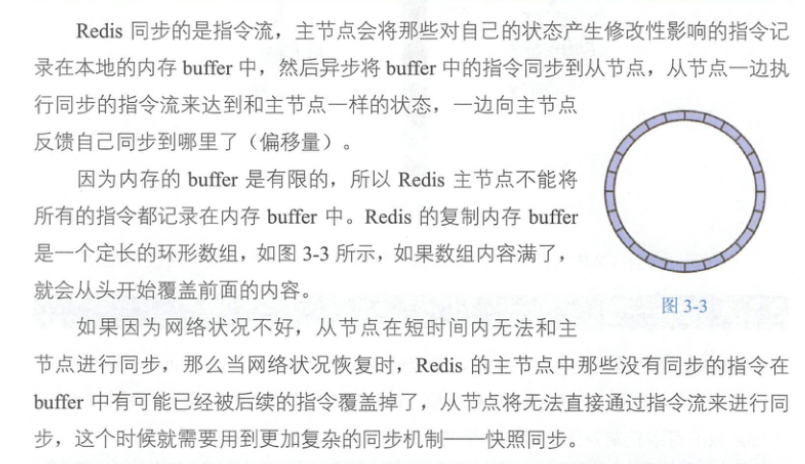
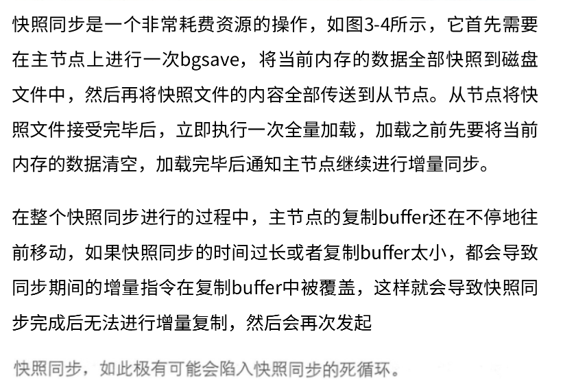
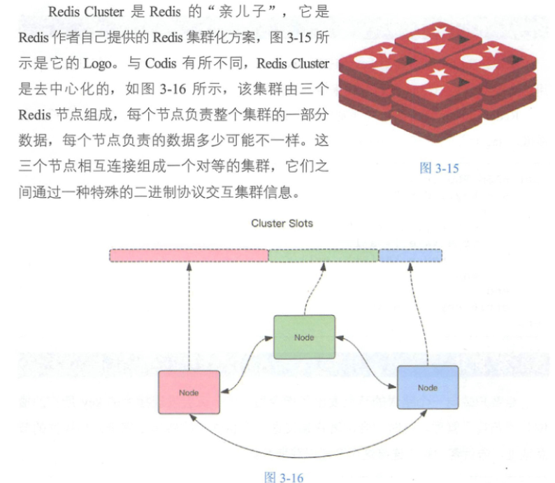

# redis

## 基础

### 安装

```shell
docker pull redis
docker run --name myredis -d -p6379:6379 redis
```

### 基本数据结构

#### string

当字符串长度小于1MB时，扩容都是加倍现有的空间。如果字符串长度超过1MB，扩容时一次只会多扩1MB的空间。需要注意的是字符串最大长度为512MB。

```shell
set name code
get name
exists name
del name

mset name1 boy name2 girl
mget name1 name2 name3

expire name 5 # 5s过期
setex name 5 codehole # 5s过期

setnx name codehole # 不存在就创建返回1，存在就返回0

incr age # 自增1
incrby age 5 # 自增5
incrby age -5 # 自增-5
```

#### list(列表)

是链表不是数组，常用来做异步队列，弹出最后一个元素后，数据结构被自动删除，内存被回收

```shell
# 队列
rpush books python java golang
llen books # 3
lpop books # python
# 栈
rpush books python java golang
rpop books
```

#### hash(字典)

无序字典，数组+链表

不同的是，Redis的字典的值只能是字符串，另外它们rehash的方式不一样，因为Java的HashMap在字典很大时，rehash是个耗时的操作，需要一次性全部rehash。Redis为了追求高性能，不能堵塞服务，所以采用了渐进式rehash策略

渐进式rehash会在rehash的同时，保留新旧两个hash结构。

```shell
hset books java "think in java"
hset books python "python cookbook"
hgetall books
hlen books
hget books java
hset books python "xxx" # 更新，返回0
hmset books java "xxx" python "yyy" # 批量set
hincrby user-mb age 1 # 自增1
```

#### set(集合)

它内部的键值对是无序的、唯一的。

它的内部实现相当于一个特殊的字典，字典中所有的value都是一个值NULL。当集合中最后一个元素被移除之后，数据结构被自动删除，内存被回收。

set结构可以用来存储在某活动中中奖的用户ID，因为有去重功能，可以保证同一个用户不会中奖两次。

```shell
sadd books python
sadd books java golang
smembers books
sismember books java # 是否存在
scard books # 长度
spop books # 弹出一个
```

#### zset(有序集合)

一方面是一个set，保证内部value的唯一性，一方面它可以每个value赋予一个score,代表value的排序权重。

```shell
zadd books 9.0 "think in java"
zadd books 8.9 "java "
zrange books 0 -1 # 按score排序列出
zrevrange books 0 -1 # 逆序列出
zcard books # 长度
zscore books "java" # score
zrank books "java" # 排名
zrangebyscore books 0 8.9 # 0~8.9之间的值
zrangebyscore books -inf 8.91 withscores # inf无穷大，无穷大到8.9的值，带上分值
```

list、set 、hash、zset这四种数据结构是容器型数据结构，它们共享下面两条通用规则。

1.create if not exists:如果容器不存在，那就创建一个，再进行操作。

2.drop ifno elements:如果容器里的元素没有了，那么立即删除容器，释放内存。

redis所有的数据结构都可以设置过期时间，时间到了，Redis会自动删除相应的对象。需要注意的是，过期是以对象为单位的，比如一个hash结构的过期是整个hash对象的过期，而不是其中的某个子key的过期。还有一个需要特别注意的地方，如果一个字符串已经设置了过期时间，然后你调用set方法修改了它，它的过期时间会消失。

### 分布式锁

修改用户状态时，需要先读再改回去，所以需要分布式锁

```shell
setnx lock:codehole ture # 先占了
expire lock:codehole 5 # 锁5秒
del lock:codehole # 释放锁
set lock:codehole true ex 5 nx # 占了时候同时设置占5秒
```

如果5秒还没有执行完怎么办？用Lua脚本，它可以保证连续多个指令的原子性。

如果是异步消息处理，可以用延时队列以后处理

### 延时队列

#### 队列空了怎么办

阻塞读在队列没有数据的时候，会立即进入休眠状态，一旦数据到来，则立刻醒过来。消息的延迟几乎为零。用blpop/brpop替代前面的lpop/rpop，就完美解决了上面的问题。

#### 空闲连接自动断开

如果线程一直阻塞在那里，Redis的客户端连接就成了闲置连接，闲置过久，服务器一般会主动断开连接，减少闲置资源占用。这个时候blpop/brpop会抛出异常

如果线程一直阻塞在那里，Redis的客户端连接就成了闲置连接，闲置过久，服务器一般会主动断开连接，减少闲置资源占用。这个时候blpop/brpop会抛出异常

#### 实现

延时队列可以通过Redis的zset(有序列表)来实现。我们将消息序列化成一个字符串作为zset的value，这个消息的到期处理时间作为score，然后用多个线程轮询zset获取到期的任务进行处理。多个线程是为了保障可用性，万一挂了一个线程还有其他线程可以继续处理。因为有多个线程，所以需要考虑并发争抢任务，确保任务不会被多次执行。

### 位图

Redis 提供了位图数据结构，这样每天的签到记录只占据一个位，365天就是365个位，46个字节(一个稍长一点的字符串)就可以完全容纳下，这就大大节约了存储空间。位图的最小单位是比特(bit)，每个bit的取值只能是0或1

### HyperLogLog

如果统计PV，那非常好办，给每个网页配一个独立的Redis计数器就可以了，把这个计数器的key后缀加上当天的日期。这样来一个请求，执行incrby指令一次，最终就可以统计出所有的PV数据。但

是UV不一样，它要去重，同一个用户一天之内的多次访问请求只能计数一次。这就要求每一个网页请求都需要带上用户的ID，无论是登录用户还是未登录用户都需要一个唯一ID来标识。

统计UV，HyperLogLog提供不精确的去重计数方案，虽然不精确，但是也不是非常离谱，标准误差是0.81%，这样的精确度已经可以满足上面的UV统计需求了。

HyperLogLog提供了两个指令pfadd和pfcount，根据字面意思很好理解，一个是增加计数，一个是获取计数。还提供了第三个指令pfmerge，用于将多个pf计数值累加在一起形成一个新的pf值。

### 布隆过滤器

当布隆过滤器说某个值存在时，这个值可能不存在;当它说某个值不存在时，那就肯定不存在。

```shell
docker pull redislabs/rebloom
docker run -p6379:6379 redislabs/rebloom
```

布隆过滤器有两个基本指令，bfadd和bfexists。bfadd添加元素，bfexists查询元素是否存在，它们的用法和set集合的sadd和sismember差不多。注意bf.add只能一次添加一个元素，如果想要一次添加多个，就需要用到bfmadd指令。同样如果需要一次查询多个元素是否存在，就需要用到bfmexists指令

布隆过滤器的initialsize设置得过大，会浪费存储空间，设置得过小，就会影响准确率，

布隆过滤器的error rate越小，需要的存储空间就越大，对于不需要过于精确的场合，errorrate设置稍大一点也无伤大雅。

### 简单限流

系统要限定用户的某个行为在指定的时间里只能允许发生N次

使用zset，score使用时间戳，同一个用户同一种行为用一个zset记录。

统计窗口内的行为数量和允许发生多少次比较就行。每一个行为到来时，都维护一次时间窗口。将时间窗口外的记录全部清理掉，只保留窗口内的记录。

### 漏斗限流

redis提供了一个限流模块，叫redis-cell

```shell
cl.throttle mb:reply 15 30 60 1
```

15是指漏斗容量，一开始可以直接回复15次

30 60 60秒里最多30次

返回中的第四个值表示还有多久可以操作

### GeoHash

查询指定元素附近的其它元素

### scan

找出特定前缀的key列表来处理数据

```shell
scan 0 match key99* count 1000 # key99开头，从第一个开始拿，1000是指一次遍历的字典槽位数量
scan 12976 match key99 count 1000 # key99开头，将上一个结果返回的一个值放到0的位置
```

zscan 遍历zset \ hscan 遍历hash \ sscan 遍历set

#### 扫描大key处理

```shell
redis-cli - 127.0.0.1 -p 7001 --bigkeys -i 0.1
# 每隔100条scan指令会休眠0.1s
```


## 原理

### 线程IO模型

redis是单线程的，所有数据都在内存中。

#### 非阻塞IO

非阻塞IO在套接字对象上提供了一个选项Non Blocking，当这个选项打开时，读写方法不会阻塞，而是能读多少读多少，能写多少写多少。

#### 多路复用

读了多少写了多少，什么时候能继续读写，需要通知到线程

### 通信协议

RESP 是Redis序列化协议(Redis Serialization Protocol)的简写。

Redis协议将传输的结构数据分为5种最小单元类型，单元结束时统一加上回车换行符号\rln。

1.单行字符串以“+”符号开头。

2.多行字符串以“$”符号开头，后跟字符串长度。

3.整数值以“:”符号开头，后跟整数的字符串形式。

4.错误消息以“_”符号开头。

5.数组以“*”号开头，后跟数组的长度。

### 持久化

Redis的数据全部在内存里，如果突然宕机，数据就会全部丢失，因此必须有一种机制来保证Redis的数据不会因为故障而丢失，这种机制就是Redis的持久化机制。如图2-3所示，Redis的持久化机制有两种，

第一种是快照，第二种是AOF日志。快照是一次全量备份，AOF日志是连续的增量备份。

快照是内存数据的二进制序列化形式，在存储上非常紧凑，而AOF日志记录的是内存数据修改的指令记录文本。AOF日志在长期的运行过程中会变得无比庞大，数据库重启时需要加载AOF日志进行指令重放，这个时间就会无比漫长，所以需要定期进行AOF重写，给AOF日志进行瘦身。

快照：多进程COW（copy on write）父进程fork一个子进程，快照持久化交给子进程做

##### AOF瘦身

开辟一个子进程对内存遍历，换成一系列的redis操作指令，序列化到一个新的AOF日志文件中。完毕后再加操作增加新加的日志追加到新的日志文件中。

#### 混合持久化

先加载rdb的内容，然后再重放增量AOF日志，就可以完全替代之前的AOF全量文件重放，重启效率因此得到大幅提升。

### 管道

Redis管道(Pipeline)本身并不是Redis服务器直接提供的技术，这个技术本质上是由客户端提供的，跟服务器没有什么直接的关系

一请求一回复一请求一回复要2个网络来回

两个请求可以合并成一个，两个结果也合并成一个，只要1个网格来回。

Redis自带了一个压力测试工具redis-benchmark，使用这个工具就可以进行管道测试。

### 事务

```
multi
incr books
incr books
exec
```

redis事务不具备原子性，只是有隔离性-当前执行的事务不被其它事务打断的权利

```shell
get books
multi
incr books
incr books
discard # 丢弃
```

#### watch

自增有incr，那么自乘怎么办？

Redis提供了watch的机制，它就是一种乐观锁。

watch会在事务开始之前盯住一个或多个关键变量，当事务执行时，也就是服务器收到了exec指令要顺序执行缓存的事务队列时，Redis会检查关键变量自watch之后是否被修改了(包括当前事务所在的客户端)。如果关键变量被人动过了，exec 指令就会返回NULL回复告知客户端事务执行失败，这个时候客户端一般会选择重试。

```shell
watch books
incr books
multi
incr books
exec # 会失败，因为watch后，事务前又自增了
```

### PubSub

没啥用，换stream

消息多播允许生产者只生产一次消息，由中间件负责将消息复制到多个消息队列，每个消息队列由相应的消费组进行消费

```shell
subscribe mb.image mb.text mb.blog
```

```shell
publish mb.image xxxx
```

### 小对象压缩

Redis是一个非常耗费内存的数据库，它的所有数据都放在内存里。如果我们不注意节约使用内存，Redis就可能出现内存不足，最终导致崩溃

如果Redis内部管理的集合数据结构很小，它会使用紧凑存储形式压缩存储。

#### 内存回收机制

Redis并不总是将空闲内存立即归还给操作系统。原因是操作系统是以页为单位来回收内存的，这个页上只要还有一个key在使用，那么它就不能被回收。

## 集群

### 主从同步

#### CAP原理

·C:Consistent，一致性

·A:Availability，可用性

·P:Partition tolerance，分区容忍性

用一句话概括CAP原理就是:当网络分区发生时，一致性和可用性两难全。

Redis的主从数据是异步同步的，网络断开后，主节点依旧正常对向，网络修复，从节点会努力追赶。

Redis同步支持主从同步和从从同步





### Sentinel

哨兵

Sentinel负责持续监控主从节点的健康，当主节点挂掉时，自动选择一个最优的从节点切换成为主节点。客户端来连接集群时，会首先连接Sentinel，通过Sentinel来查询主节点的地址，然后再连接主节点进行数据交互。当主节点发生故障时，客户端会重新向Sentinel要地址，Sentinel会将最新的主节点地址告诉客户端。如此应用程序将无须重启即可自动完成节点切换。

### Codis

Codis 是无状态的，它只是一个转发代理中间件，这意味着我们可以启动多个Codis 实例，供客户端使用，每个Codis 节点都是对等的，

Codis默认将所有的key划分为1024个槽位(slot)，先对KEY运算hash值，再取模得到余数，这个余数就是槽位。每个槽位对应后面的redis实例。

### Cluster



## 拓展

### stream

可持久化消息队列

一个stream可以绑定多个消费组，每个消费组会有一个游标ID，表示消费有哪里了，每个消费组里有多个消费者，消费者是竞争关系，消费者内部会有一个状态变量来确定哪些没有ack.

#####  独立消费

我们可以在不定义消费组的情况下进行Stream消息的独立消费，当Stream没有新消息时，甚至可以阻塞等待。Redis设计了一个单独的消费指令xread，可以将Stream当成普通的消息队列(list)来使用。使用xread时，我们可以完全忽略消费组的存在，就好像Stream是一个普通的列表一样。

### Info

Info指令显示的信息繁多，分为9大块

1.Server:服务器运行的环境参数。

2.Clients:客户端相关信息。

3.Memory:服务器运行内存统计数据。

4.Persistence:持久化信息。

5.Stats:通用统计数据。

6.Replication:主从复制相关信息。

7.CPU:CPU使用情况。

8.Cluster:集群信息。

9.KeySpace:键值对统计数量信息。

```shell
info clients # 查看有多少客户端
info memory # 内存
redis-cli info replication | grep backlog # 查看积压缓冲区大小
redis-cli info status | grep sync # sync_partical_err:0 这个就是半同步失败次数，可以决定是否需要扩大积压缓冲区
```

### 分布式锁

集群里分布式锁有问题，需要用到Redlock算法

### 过期策略

Redis会将每个设置了过期时间的key放入一个独立的字典中，以后会定时遍历这个字典来删除到期的key。除了定时遍历之外，它还会使用惰性策略来删除过期的key。所谓惰性策略就是在客户端访问这个key的时候，Redis对key的过期时间进行检查，如果过期了就立即删除。如果说定时删除是集中处理，那么惰性删除就是零散处理。

Redis默认每秒进行10次过期扫描，过期扫描不会遍历过期字典中所有的key，而是采用了一种简单的贪心策略

(1)从过期字典中随机选出20个key。(2)删除这20个key中已经过期的key。(3)如果过期的key的比例超过1/4，那就重复步骤(1)。

从节点不会进行过期扫描，从节点对过期的处理是被动的。主节点在key到期时，会在AOF文件里增加一条del指令，同步到所有的从节点，从节点通过执行这条del指令来删除过期的key。

### LRU

当Redis内存超出物理内存限制时，内存的数据会开始和磁盘产生频繁的交换，交换会让Redis的性能急剧下降。

在生产环境中我们是不允许Redis出现交换行为的，为了限制最大使用内存，Redis提供了配置参数maxmemory来限制内存超出期望大小。当实际内存超出maxmemory时，Redis提供了几种可选策略(maxmemory-policy)来让用户自己决定该如何腾出新的空间以继续提供读写服务。


实现LRU算法除了需要key/value字典外，还需要附加一个链表，链表中的元素按照一定的顺序进行排列。当空间满的时候，会踢掉链表尾部的元素。当字典的某个元素被访问时，它在链表中的位置会被移动到表头，所以链表的元素排列顺序就是元素最近被访问的时间顺序。位于链表尾部的元素就是不被重用的元素，所以会被踢掉。位于表头的元素就是最近刚刚被人用过的元素，所以暂时不会被踢。

Redis为实现近似LRU算法，给每个key增加了一个额外的小字段，这个字段的长度是24个bit，也就是最后一次被访问的时间戳。上一节提到处理key过期方式分为集中处理和懒惰处理，LRU淘汰不一样，它的处理方式只有懒惰处理。当Redis执行写操作时，发现内存超出maxmemory，就会执行一次LRU淘汰算法。这个算法也很简单，就是随机采样出5(该数量可以设置)个key，然后淘汰掉最旧的key，如果淘汰后内存还是超出maxmemory，那就继续随机采样淘汰，直到内存低于maxmemory为止。

### 懒惰删除

Redis内部实际上并不是只有一个主线程，它还有几个异步线程专门用来处理一些耗时的操作。

删除指令del会直接释放对象的内存，大部分情况下，这个指令非常快，没有明显延迟。不过如果被删除的key是一个非常大的对象，比如一个包含了上千万个元素的hash，那么删除操作就会导致单线程卡顿。Redis为了解决这个卡顿问题，在4.0版本里引入了unlink指令，它能对删除操作进行懒处理，丢给后台线程来异步回收内存。

Redis提供了flushdb和flushall指令，用来清空数据库，这也是极其缓慢的操作。Redis4.0同样给这两个指令带来了异步化，在指令后面增加async参数就可以将整棵大树连根拔起，扔给后台线程慢慢“焚烧”。

Redis需要每秒1(该数量可设置)次同步AOF日志到磁盘，确保消息尽量不丢失，需要调用sync函数，这个操作比较耗时，会导致主线程的效率下降，所以Redis也将这个操作移到异步线程来完成。

### 安全

改命令

加鉴权

SSL代理

### 安全通信

spiped


